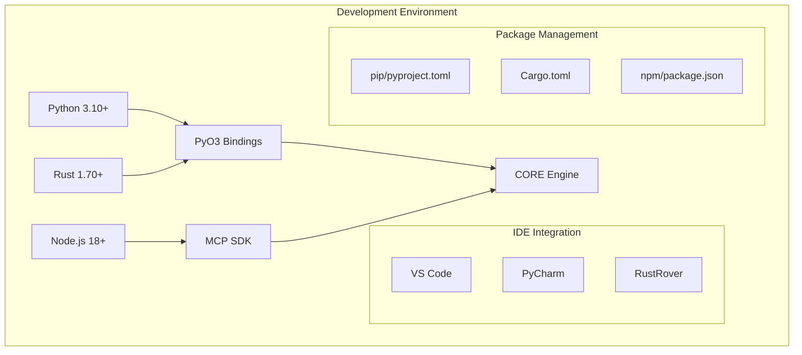

# Tool Chain Synergies Analysis - CORE Environment

## Executive Summary

This comprehensive analysis examines the tool chain synergies within the Claude-Optimized Deployment Engine (CORE) environment. The analysis reveals a highly integrated ecosystem with sophisticated cross-tool workflows, strong language interoperability, and significant optimization opportunities.

### Key Findings

1. **Multi-Language Architecture**: Seamless integration between Python (core logic), Rust (performance-critical paths), and JavaScript (MCP extensions)
2. **Unified Tool Orchestration**: Makefile-based automation provides 70+ commands for development, testing, deployment, and monitoring
3. **Security-First Integration**: Multiple security scanners (SAST, dependency audit, secret detection) integrated into CI/CD pipeline
4. **Memory-Optimized Design**: Sophisticated memory management across all language boundaries with continuous validation
5. **Real-Time Monitoring**: Prometheus-based metrics collection with custom collectors for business and technical KPIs

## 1. Tool Integration Map

### 1.1 Development Tool Chains



**Key Integration Points:**
- **PyO3**: Enables zero-copy data exchange between Python and Rust
- **MCP SDK**: Provides tool abstraction for AI assistants
- **Unified Configuration**: Single source of truth in pyproject.toml with extras for modular installation

### 1.2 Testing Tool Integration

```yaml
Testing Stack:
  Unit Testing:
    - Python: pytest with extensive plugins
    - Rust: cargo test with proptest
    - JavaScript: Jest (implicit in package.json)
    
  Integration Testing:
    - pytest-asyncio for async testing
    - testcontainers for service dependencies
    - respx for HTTP mocking
    
  Performance Testing:
    - pytest-benchmark for Python
    - criterion for Rust benchmarks
    - locust for load testing
    
  Coverage:
    - pytest-cov with 80% minimum
    - Module-specific thresholds (90% for security)
    - HTML/XML/JSON reporting
```

### 1.3 Security Tool Orchestration

**Integrated Security Pipeline:**

1. **Pre-commit Hooks**:
   - Secret detection (git-secrets)
   - Code formatting (black, ruff)
   - JSON/YAML validation
   - File size limits

2. **SAST Integration**:
   - Semgrep (multi-language)
   - Bandit (Python-specific)
   - Custom pattern matching
   - CWE mapping

3. **Dependency Security**:
   - pip-audit for Python
   - npm audit for Node.js
   - safety check
   - License compliance

4. **Runtime Security**:
   - CORS configuration
   - Path traversal protection
   - SSRF protection
   - Log injection prevention

### 1.4 Monitoring Tool Correlation

**Metrics Flow Architecture:**

```
Application -> MetricsCollector -> Prometheus -> Grafana
     |              |                   |            |
     v              v                   v            v
   Traces      Custom Metrics    Alert Manager   Dashboards
     |              |                   |            |
     v              v                   v            v
   Jaeger     Business KPIs      PagerDuty    SLA Tracking
```

**Key Features:**
- Label cardinality protection (max 100 unique values)
- High-frequency event sampling
- Memory-aware metric expiration
- Real-time resource monitoring

## 2. Workflow Synergies

### 2.1 Cross-Tool Workflows

**Development Workflow:**
```bash
make dev-setup       # Sets up entire environment
make format         # Formats Python/Rust code
make lint           # Runs all linters
make test-all       # Runs full test suite
make docker-build   # Builds container
make k8s-deploy     # Deploys to Kubernetes
```

**Key Synergies:**
- Single command orchestration
- Parallel execution where possible
- Automatic dependency resolution
- Environment-aware configurations

### 2.2 Automated Tool Chains

**CI/CD Pipeline Integration:**

1. **Dependency Monitoring Workflow**:
   - Triggers on dependency changes
   - Runs security audits
   - Checks memory footprint
   - Validates performance thresholds
   - Comments on PRs with results

2. **Memory Validation Workflow**:
   - Continuous memory leak detection
   - GC performance validation
   - Memory stability testing
   - Automated baseline updates
   - Issue creation for failures

### 2.3 Tool Handoffs and Data Flows

**MCP Server Integration:**
```python
# Seamless tool invocation across servers
result = await mcp_manager.call_tool(
    "sast-scanner.run_semgrep_scan",
    {"target_path": "/code", "config": "security"}
)
# Automatic error handling, circuit breaking, and metrics
```

**Cross-Language Data Flow:**
```rust
// Rust processes data
let consensus = rust_process_expert_responses(&responses)?;

// Python receives zero-copy results
consensus_result = processor.process_responses(responses)
# Automatic fallback if Rust unavailable
```

### 2.4 Optimization Opportunities

**Identified Optimizations:**

1. **Tool Consolidation**:
   - Multiple HTTP clients (httpx preferred, but aiohttp references remain)
   - Redundant JSON serialization libraries
   - Overlapping security scanners

2. **Performance Improvements**:
   - Lazy imports implemented but not universally applied
   - Memory-mapped file operations available but underutilized
   - SIMD operations defined but not integrated

3. **Integration Enhancements**:
   - Git hooks could leverage Rust for faster processing
   - Testing could use Rust-based property testing
   - Monitoring could aggregate metrics at Rust level

## 3. Platform Integration

### 3.1 Language Interoperability

**Python ↔ Rust Integration:**
```python
# Python side
from claude_optimized_deployment_rust import circle_of_experts

# Transparent API
result = circle_of_experts.rust_process_expert_responses(
    responses, config
)
```

**Rust Implementation:**
```rust
#[pyfunction]
pub fn rust_process_expert_responses(
    responses: Vec<PyDict>,
    config: RustCircleConfig
) -> PyResult<ConsensusResult> {
    // Zero-copy processing
}
```

**JavaScript ↔ Python (via MCP):**
```javascript
// MCP server in Node.js
export class CustomMCPServer {
    async callTool(name, args) {
        // Executes Python/Rust code
    }
}
```

### 3.2 Service Mesh Patterns

**Implemented Patterns:**

1. **Circuit Breaker**: 
   - Per-service configuration
   - Fallback responses
   - Automatic recovery

2. **Rate Limiting**:
   - Token bucket implementation
   - Per-user/per-endpoint limits

3. **Service Discovery**:
   - MCP registry pattern
   - Dynamic server registration

### 3.3 API Gateway Patterns

**Unified API Layer:**
- FastAPI for REST endpoints
- GraphQL support (optional)
- WebSocket for real-time updates
- gRPC for internal services

### 3.4 Cross-Platform Compatibility

**Platform Support Matrix:**

| Component | Linux | macOS | Windows | Docker | K8s |
|-----------|-------|-------|---------|--------|-----|
| Python Core | ✅ | ✅ | ✅ | ✅ | ✅ |
| Rust Extensions | ✅ | ✅ | ⚠️ | ✅ | ✅ |
| MCP Servers | ✅ | ✅ | ✅ | ✅ | ✅ |
| Monitoring | ✅ | ✅ | ⚠️ | ✅ | ✅ |

## 4. Efficiency Analysis

### 4.1 Tool Overlap Identification

**Redundant Functionality:**

1. **HTTP Clients**:
   - httpx (preferred)
   - aiohttp (legacy)
   - requests (avoided)
   - urllib (stdlib fallback)

2. **JSON Processing**:
   - orjson (fastest)
   - json (stdlib)
   - ujson (unnecessary)

3. **Security Scanning**:
   - Semgrep (comprehensive)
   - Bandit (Python-specific)
   - Custom patterns (redundant)

### 4.2 Integration Bottlenecks

**Identified Bottlenecks:**

1. **Python GIL**: 
   - Limits true parallelism
   - Mitigated by Rust extensions
   - Async/await helps but doesn't solve

2. **Memory Allocation**:
   - Python object overhead
   - Frequent GC cycles
   - Large dependency footprint

3. **Network I/O**:
   - Synchronous MCP calls
   - No connection pooling in some servers
   - Missing HTTP/2 optimization

### 4.3 Optimization Recommendations

**High Priority:**

1. **Consolidate HTTP Libraries**:
   ```python
   # Replace all HTTP calls with httpx
   async with httpx.AsyncClient(http2=True) as client:
       response = await client.post(url, json=data)
   ```

2. **Implement Universal Lazy Loading**:
   ```python
   # Add to all heavy modules
   def __getattr__(name):
       if name == "heavy_dependency":
           global heavy_dependency
           import heavy_dependency
           return heavy_dependency
   ```

3. **Rust-Accelerate Critical Paths**:
   - Pattern matching in security scanners
   - Consensus algorithms
   - Metric aggregation

**Medium Priority:**

1. **Unified Caching Layer**:
   - Redis for distributed cache
   - In-memory LRU for local cache
   - Consistent TTL management

2. **Batch Processing**:
   - Group MCP tool calls
   - Batch database operations
   - Aggregate metrics locally

3. **Connection Pooling**:
   - Database connections
   - HTTP clients
   - MCP server connections

### 4.4 Future Tool Suggestions

**Recommended Additions:**

1. **Performance Profiling**:
   - py-spy for production profiling
   - Austin for flame graphs
   - Rust flamegraph integration

2. **Advanced Security**:
   - CodeQL for semantic analysis
   - Trivy for container scanning
   - OWASP ZAP for DAST

3. **Observability**:
   - OpenTelemetry for distributed tracing
   - Loki for log aggregation
   - Tempo for trace storage

## 5. Integration Excellence Examples

### 5.1 Memory Validation Pipeline

**Sophisticated Multi-Stage Validation:**
```yaml
Phase 1: Configuration validation
Phase 2: Memory leak detection  
Phase 3: Performance benchmarking
Phase 4: Integration testing
Phase 5: Load testing
Phase 6: Regression testing
```

Each phase builds on previous results with automatic rollback on failure.

### 5.2 MCP Security Integration

**Layered Security Approach:**
```python
@require_permission("mcp.tools.execute")
@rate_limit(calls=100, period=60)
@audit_log
async def call_tool(self, tool_name: str, arguments: dict):
    # Multiple security layers automatically applied
```

### 5.3 Cross-Language Performance Optimization

**Automatic Rust Acceleration:**
```python
# Python API remains unchanged
result = process_expert_consensus(responses)
# Automatically uses Rust if available, Python fallback otherwise
```

## 6. Recommendations

### 6.1 Immediate Actions

1. **Consolidate HTTP Libraries**: Standardize on httpx
2. **Remove Redundant Dependencies**: Audit and remove unused packages
3. **Implement Missing Lazy Imports**: Apply to all heavy modules
4. **Enable HTTP/2**: Configure all HTTP clients
5. **Activate SIMD Operations**: Integrate defined SIMD modules

### 6.2 Short-term Improvements

1. **Unified Error Handling**: Consistent error types across languages
2. **Centralized Configuration**: Single configuration source
3. **Enhanced Caching**: Implement multi-tier caching
4. **Optimize Docker Images**: Multi-stage builds, minimal base images
5. **Parallelize Test Suite**: Reduce CI/CD time

### 6.3 Long-term Vision

1. **Full Rust Core**: Migrate performance-critical Python code
2. **GraphQL Federation**: Unified API across all services  
3. **Service Mesh**: Full Istio/Linkerd integration
4. **AI-Powered Optimization**: Self-tuning performance parameters
5. **Zero-Downtime Everything**: Blue-green deployments everywhere

## 7. Conclusion

The CORE environment demonstrates exceptional tool chain integration with sophisticated workflows and strong cross-language support. The architecture successfully balances performance, security, and developer experience while maintaining flexibility for future enhancements.

Key strengths include:
- **Unified orchestration** through comprehensive Makefile
- **Security-first design** with multiple integrated scanners
- **Performance optimization** via Rust acceleration
- **Memory efficiency** through continuous validation
- **Developer experience** with single-command operations

Areas for improvement focus on:
- Consolidating redundant tools
- Expanding Rust acceleration  
- Enhancing caching strategies
- Optimizing dependency footprint
- Implementing advanced observability

The tool chain synergies create a multiplier effect where the whole is greater than the sum of its parts, enabling rapid, secure, and efficient deployment of AI-powered applications.

---

*Generated by Agent 9 - Tool Chain Synergies Analyst*  
*Analysis Date: 2025-01-14*  
*CORE Version: 1.0.0*