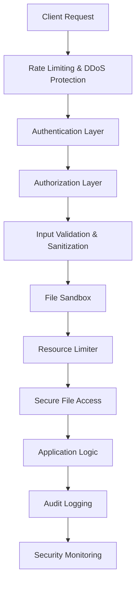

# SYNTHEX Agent 4: Comprehensive Security Architecture Documentation

## Executive Summary

This document describes the comprehensive, multi-layered security architecture designed by SYNTHEX Agent 4 for the Claude Optimized Deployment Engine. The architecture implements defense-in-depth principles following OWASP guidelines to protect against a wide range of security threats while maintaining system usability and performance.

## Table of Contents

1. [Security Architecture Overview](#security-architecture-overview)
2. [Threat Model](#threat-model)
3. [Security Layers](#security-layers)
4. [Implementation Details](#implementation-details)
5. [Security Controls](#security-controls)
6. [Monitoring and Incident Response](#monitoring-and-incident-response)
7. [Compliance and Standards](#compliance-and-standards)
8. [Deployment Guidelines](#deployment-guidelines)
9. [Maintenance and Updates](#maintenance-and-updates)

## Security Architecture Overview

### Design Principles

The security architecture is built on the following core principles:

1. **Defense in Depth**: Multiple overlapping security layers
2. **Zero Trust**: Never trust, always verify
3. **Least Privilege**: Minimal access rights for users and systems
4. **Fail Secure**: Secure defaults and safe failure modes
5. **Security by Design**: Security integrated from the ground up
6. **Continuous Monitoring**: Real-time threat detection and response

### Architecture Components



## Threat Model

### Identified Threats

#### 1. Path Traversal Attacks
- **Description**: Attempts to access files outside authorized directories
- **Impact**: Unauthorized file access, information disclosure
- **Mitigation**: Path validation, sandboxing, access controls

#### 2. Resource Exhaustion (DoS)
- **Description**: Attempts to exhaust system resources
- **Impact**: Service unavailability, performance degradation
- **Mitigation**: Resource limits, rate limiting, circuit breakers

#### 3. Malicious File Uploads
- **Description**: Upload of malware, zip bombs, or other malicious content
- **Impact**: System compromise, data corruption
- **Mitigation**: File scanning, sandboxing, type validation

#### 4. Injection Attacks
- **Description**: SQL injection, command injection, XSS
- **Impact**: Data breach, system compromise
- **Mitigation**: Input validation, parameterized queries, output encoding

#### 5. Information Disclosure
- **Description**: Unauthorized access to sensitive information
- **Impact**: Data breach, privacy violations
- **Mitigation**: Access controls, encryption, data classification

#### 6. Unauthorized Access
- **Description**: Access by unauthenticated or unauthorized users
- **Impact**: Data breach, system compromise
- **Mitigation**: Strong authentication, authorization, session management

## Security Layers

### Layer 1: Network Security

#### Components
- **Rate Limiting**: Prevents brute force and DDoS attacks
- **IP Filtering**: Whitelist/blacklist based on IP reputation
- **DDoS Protection**: Traffic analysis and mitigation
- **Network Segmentation**: Isolated security zones

#### Implementation
```python
# Rate limiting configuration
RATE_LIMITS = {
    'auth_attempt': {'requests': 10, 'window': 60},
    'api_request': {'requests': 1000, 'window': 3600},
    'file_upload': {'requests': 50, 'window': 3600}
}
```

### Layer 2: Authentication & Authorization

#### Multi-Factor Authentication (MFA)
- **Primary**: Username/password, API keys, certificates
- **Secondary**: TOTP, SMS, hardware tokens
- **Risk-based**: Adaptive authentication based on context

#### Role-Based Access Control (RBAC)
- **Roles**: Admin, Developer, Operator, Guest
- **Permissions**: Fine-grained resource and action controls
- **Inheritance**: Hierarchical role structures

#### Zero Trust Model
- **Continuous Verification**: Every request authenticated and authorized
- **Context-Aware**: IP, device, time, behavior analysis
- **Minimal Access**: Just-in-time privilege escalation

### Layer 3: Input Validation & Sanitization

#### Validation Framework
```python
class InputValidator:
    def validate(self, value, value_type, context=None):
        # 1. Sanitize input
        sanitized = self.sanitizer.sanitize(value)
        
        # 2. Type-specific validation
        is_valid, errors = self.validators[value_type](sanitized, context)
        
        # 3. Injection pattern detection
        injection_check = self._check_injection_patterns(sanitized)
        
        return ValidationResult(is_valid, errors, sanitized)
```

#### Supported Validation Types
- **Email**: RFC-compliant email validation
- **URL**: SSRF protection, scheme validation
- **File Path**: Directory traversal prevention
- **SQL Identifier**: Reserved word checking
- **Command**: Dangerous pattern detection

### Layer 4: File Security

#### Sandboxing
- **Isolated Execution**: Temporary sandbox environments
- **Resource Limits**: Memory, CPU, disk, network restrictions
- **Process Isolation**: Separate processes for file operations
- **Docker Integration**: Container-based isolation (optional)

#### Malicious File Detection
```python
class MaliciousFileDetector:
    async def scan_file(self, file_path):
        # 1. Check file headers and magic bytes
        # 2. Detect file type from content
        # 3. Scan for zip bombs
        # 4. Check for XML bombs
        # 5. Analyze image EXIF data
        # 6. Validate PDF structure
        return ValidationResult
```

#### File Type Security
- **Zip Bombs**: Compression ratio analysis, size limits
- **XML Bombs**: Entity expansion limits, external entity blocking
- **Image Files**: EXIF data scanning, steganography detection
- **PDF Files**: JavaScript detection, embedded file scanning

### Layer 5: Resource Management

#### Resource Limits
```python
class ResourceLimiter:
    def __init__(self):
        self.max_memory_mb = 512
        self.max_cpu_seconds = 30
        self.max_file_handles = 100
        self.max_threads = 10
        self.max_disk_usage_mb = 1024
```

#### Memory Protection
- **Pressure Detection**: Automatic GC triggers
- **Circuit Breakers**: Fail-fast on resource exhaustion
- **Monitoring**: Real-time resource usage tracking
- **Cleanup**: Automatic resource cleanup

### Layer 6: Secure Communication

#### Encryption
- **Transport**: TLS 1.3 for all communications
- **Message**: AES-256 encryption for sensitive data
- **Key Management**: Proper key rotation and storage

#### Message Security
```python
class SecureCommunicationProtocol:
    def encrypt_message(self, message, context):
        # 1. Add metadata (timestamp, user_id, client_id)
        # 2. Create signed payload
        # 3. Encrypt with Fernet (AES-128)
        # 4. Return encrypted message
        
    def verify_signature(self, message, signature):
        # 1. Use RSA-PSS signature scheme
        # 2. SHA-256 hashing
        # 3. Verify against public key
```

### Layer 7: Audit & Monitoring

#### Comprehensive Logging
- **Authentication Events**: All login attempts, successes/failures
- **Authorization Events**: Permission checks, denials
- **File Operations**: Uploads, downloads, modifications
- **Security Events**: Attacks, anomalies, policy violations

#### Real-time Monitoring
```python
class MCPSecurityMonitor:
    async def record_security_event(self, event_type, context, details):
        # 1. Store event in Redis/database
        # 2. Analyze for patterns
        # 3. Trigger alerts if necessary
        # 4. Update security metrics
```

## Implementation Details

### Core Security Modules

#### 1. Comprehensive Security Architecture (`comprehensive_security_architecture.py`)
- **Main orchestrator** for all security components
- **Request processing** through security layers
- **Component integration** and configuration

#### 2. Enhanced MCP Authentication (`mcp_enhanced_authentication.py`)
- **Multi-factor authentication** implementation
- **Certificate-based authentication** for mTLS
- **JWT token management** with blacklisting
- **Real-time security monitoring**

#### 3. Existing Security Modules
- **Path Validation** (`path_validation.py`): Directory traversal prevention
- **SSRF Protection** (`ssrf_protection.py`): Server-side request forgery prevention
- **Log Sanitization** (`log_sanitization.py`): Log injection prevention
- **Memory Monitor** (`memory_monitor.py`): Resource exhaustion protection

### Configuration Example

```python
# Security configuration
SECURITY_CONFIG = {
    'sandbox_dir': '/tmp/security_sandbox',
    'max_file_size': 50 * 1024 * 1024,  # 50MB
    'max_memory_mb': 256,
    'max_cpu_seconds': 20,
    'downloads_dir': './secure_downloads',
    'uploads_dir': './secure_uploads',
    'audit_log_dir': './security_audit_logs',
    'encryption_enabled': True,
    'require_signature': True,
    'mfa_required_for_admin': True,
    'session_timeout_minutes': 30,
    'max_failed_attempts': 5,
    'lockout_duration_minutes': 30
}
```

## Security Controls

### OWASP Top 10 Mitigation

#### A01:2021 - Broken Access Control
- **Controls**: RBAC/ABAC implementation, session management, path validation
- **Implementation**: Authorization checks on every request, proper session handling

#### A02:2021 - Cryptographic Failures
- **Controls**: Strong encryption, proper key management, secure protocols
- **Implementation**: TLS 1.3, AES-256, RSA-2048, secure key storage

#### A03:2021 - Injection
- **Controls**: Input validation, parameterized queries, output encoding
- **Implementation**: Comprehensive input sanitization, SQL injection prevention

#### A04:2021 - Insecure Design
- **Controls**: Security by design, threat modeling, secure defaults
- **Implementation**: Defense in depth, fail-secure mechanisms

#### A05:2021 - Security Misconfiguration
- **Controls**: Secure defaults, configuration management, hardening
- **Implementation**: Automated security configuration, regular audits

#### A06:2021 - Vulnerable Components
- **Controls**: Dependency scanning, update management, vulnerability assessment
- **Implementation**: Regular dependency updates, security scanning

#### A07:2021 - Identity and Authentication Failures
- **Controls**: Strong authentication, MFA, session management
- **Implementation**: Multi-factor authentication, secure session handling

#### A08:2021 - Software and Data Integrity Failures
- **Controls**: Code signing, integrity checks, secure CI/CD
- **Implementation**: Digital signatures, checksums, secure deployment

#### A09:2021 - Security Logging and Monitoring Failures
- **Controls**: Comprehensive logging, real-time monitoring, alerting
- **Implementation**: Structured logging, anomaly detection, incident response

#### A10:2021 - Server-Side Request Forgery
- **Controls**: URL validation, network segmentation, allow lists
- **Implementation**: SSRF protection module, network restrictions

### Additional Security Controls

#### File Upload Security
```python
ALLOWED_MIME_TYPES = [
    'text/plain', 'text/csv', 'application/json',
    'application/pdf', 'image/png', 'image/jpeg'
]

MAX_FILE_SIZES = {
    'image': 10 * 1024 * 1024,  # 10MB
    'document': 50 * 1024 * 1024,  # 50MB
    'archive': 100 * 1024 * 1024  # 100MB
}
```

#### API Security
- **Rate Limiting**: Per-IP and per-user limits
- **API Versioning**: Secure version management
- **Request Signing**: HMAC-based request authentication
- **Response Filtering**: Sensitive data masking

## Monitoring and Incident Response

### Security Metrics

#### Key Performance Indicators (KPIs)
- **Authentication Success Rate**: >99%
- **Failed Authentication Rate**: <1%
- **Average Response Time**: <100ms
- **Security Event Response Time**: <5 minutes
- **False Positive Rate**: <5%

#### Monitoring Dashboards
```python
SECURITY_METRICS = {
    'failed_auth_attempts': 0,
    'successful_auths': 0,
    'blocked_requests': 0,
    'suspicious_activities': 0,
    'malware_detected': 0,
    'policy_violations': 0
}
```

### Alerting Framework

#### Alert Severity Levels
- **Critical**: Immediate response required (0-15 minutes)
- **High**: Response required within 1 hour
- **Medium**: Response required within 4 hours
- **Low**: Response required within 24 hours

#### Alert Types
```python
ALERT_TYPES = {
    'brute_force_attack': 'critical',
    'malware_detected': 'critical',
    'privilege_escalation': 'high',
    'data_exfiltration': 'critical',
    'high_failure_rate': 'medium',
    'suspicious_activity': 'medium'
}
```

### Incident Response Process

#### 1. Detection
- **Automated monitoring** detects security events
- **Real-time alerting** notifies security team
- **Event correlation** identifies attack patterns

#### 2. Analysis
- **Log analysis** to understand the scope
- **Threat intelligence** correlation
- **Impact assessment** and risk evaluation

#### 3. Containment
- **Immediate isolation** of affected systems
- **Traffic blocking** for malicious sources
- **Service degradation** to prevent further damage

#### 4. Eradication
- **Root cause analysis** and remediation
- **System patching** and configuration updates
- **Malware removal** and system cleaning

#### 5. Recovery
- **Service restoration** with enhanced monitoring
- **Performance validation** and testing
- **User communication** and transparency

#### 6. Lessons Learned
- **Post-incident review** and documentation
- **Process improvement** recommendations
- **Security control updates** and enhancements

## Compliance and Standards

### Security Standards Compliance

#### NIST Cybersecurity Framework
- **Identify**: Asset management, risk assessment
- **Protect**: Access control, data security, maintenance
- **Detect**: Anomaly detection, continuous monitoring
- **Respond**: Incident response, communications
- **Recover**: Recovery planning, improvements

#### ISO 27001
- **Information Security Management System (ISMS)**
- **Risk management** and treatment
- **Security controls** implementation
- **Continuous improvement** process

#### SOC 2 Type II
- **Security**: Logical and physical access controls
- **Availability**: System availability and performance
- **Processing Integrity**: Complete and accurate processing
- **Confidentiality**: Information classification and handling
- **Privacy**: Personal information protection

### Data Protection Compliance

#### GDPR (General Data Protection Regulation)
- **Data minimization**: Collect only necessary data
- **Purpose limitation**: Use data only for stated purposes
- **Storage limitation**: Retain data only as long as necessary
- **Data subject rights**: Access, rectification, erasure, portability

#### CCPA (California Consumer Privacy Act)
- **Transparency**: Clear privacy policies
- **Consumer rights**: Access, deletion, opt-out
- **Data security**: Reasonable security measures
- **Non-discrimination**: Equal service regardless of privacy choices

## Deployment Guidelines

### Pre-Deployment Security Checklist

#### Infrastructure Security
- [ ] Network segmentation implemented
- [ ] Firewalls configured with deny-all default
- [ ] Load balancers configured with security headers
- [ ] SSL/TLS certificates installed and configured
- [ ] VPN access configured for administrative tasks

#### Application Security
- [ ] Security configuration reviewed and validated
- [ ] Default passwords changed
- [ ] Unnecessary services disabled
- [ ] Security headers configured
- [ ] Error handling configured to not expose sensitive information

#### Database Security
- [ ] Database access restricted to application servers
- [ ] Strong database passwords implemented
- [ ] Database encryption enabled
- [ ] Backup encryption configured
- [ ] Database audit logging enabled

#### Monitoring and Logging
- [ ] Security event logging configured
- [ ] Log aggregation and analysis tools deployed
- [ ] Alert thresholds configured
- [ ] Incident response procedures documented
- [ ] Backup and recovery procedures tested

### Secure Configuration

#### Environment Variables
```bash
# Authentication
export JWT_SECRET_KEY="$(openssl rand -base64 32)"
export API_KEY_SECRET="$(openssl rand -base64 32)"
export MFA_ENCRYPTION_KEY="$(openssl rand -base64 32)"

# Database
export DB_PASSWORD="$(openssl rand -base64 24)"
export DB_ENCRYPTION_KEY="$(openssl rand -base64 32)"

# Redis
export REDIS_PASSWORD="$(openssl rand -base64 24)"

# File Storage
export UPLOAD_ENCRYPTION_KEY="$(openssl rand -base64 32)"
```

#### File Permissions
```bash
# Application files
chmod 755 /app
chmod 644 /app/*.py
chmod 600 /app/config/*

# Log files
chmod 640 /var/log/app/*
chown app:syslog /var/log/app/*

# Certificate files
chmod 600 /etc/ssl/private/*
chmod 644 /etc/ssl/certs/*
```

### Production Hardening

#### System Level
- **OS hardening**: Remove unnecessary packages, disable unused services
- **Kernel parameters**: Configure security-related kernel parameters
- **File system**: Mount with appropriate security options (noexec, nosuid)
- **User accounts**: Disable root login, use sudo for administrative tasks

#### Application Level
- **Process isolation**: Run application with non-root user
- **Resource limits**: Set appropriate ulimits
- **Environment isolation**: Use containers or virtual environments
- **Dependency management**: Keep dependencies updated and secure

## Maintenance and Updates

### Security Maintenance Schedule

#### Daily Tasks
- [ ] Review security logs and alerts
- [ ] Monitor system performance and resource usage
- [ ] Check backup completion and integrity
- [ ] Review failed authentication attempts

#### Weekly Tasks
- [ ] Review and analyze security metrics
- [ ] Update threat intelligence feeds
- [ ] Test incident response procedures
- [ ] Review access permissions and user accounts

#### Monthly Tasks
- [ ] Security configuration review
- [ ] Vulnerability assessment and patching
- [ ] Security training and awareness updates
- [ ] Backup and recovery testing

#### Quarterly Tasks
- [ ] Comprehensive security audit
- [ ] Penetration testing
- [ ] Business continuity testing
- [ ] Security policy review and updates

### Update Management

#### Security Patches
- **Critical patches**: Apply within 24 hours
- **High priority patches**: Apply within 1 week
- **Medium priority patches**: Apply within 1 month
- **Low priority patches**: Apply during next maintenance window

#### Dependency Updates
```bash
# Python dependencies
pip install --upgrade pip
pip install --upgrade -r requirements.txt

# System packages
apt update && apt upgrade -y

# Security scanning
pip audit
npm audit
```

#### Configuration Updates
- **Version control**: All configuration changes tracked in Git
- **Code review**: Security configuration changes require review
- **Testing**: Changes tested in staging environment first
- **Rollback plan**: Documented rollback procedures for all changes

## Conclusion

This comprehensive security architecture provides robust protection against a wide range of threats while maintaining system usability and performance. The multi-layered approach ensures that even if one security control fails, others remain in place to protect the system.

Key strengths of this architecture include:

1. **Defense in Depth**: Multiple overlapping security layers
2. **Zero Trust Model**: Continuous verification and minimal access
3. **Real-time Monitoring**: Immediate threat detection and response
4. **Comprehensive Coverage**: Protection against OWASP Top 10 and beyond
5. **Scalability**: Architecture scales with system growth
6. **Maintainability**: Clear documentation and maintenance procedures

Regular review and updates of this security architecture ensure continued effectiveness against evolving threats and changing requirements.

---

**Document Version**: 1.0  
**Last Updated**: 2025-06-13  
**Author**: SYNTHEX Agent 4  
**Classification**: Internal Use Only