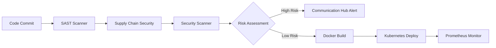
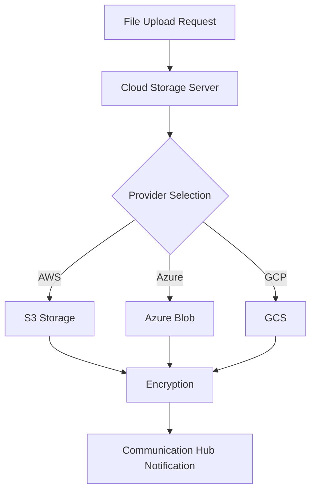
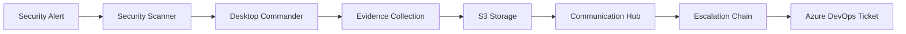

# MCP Servers Workflow Analysis

## Executive Summary

The Model Context Protocol (MCP) server ecosystem in the CORE environment represents a sophisticated, enterprise-grade integration framework that enables seamless tool orchestration across infrastructure, development, security, communication, storage, and monitoring domains. This analysis provides a comprehensive examination of the MCP implementation, revealing advanced patterns for secure, scalable, and reliable system integration.

## 1. MCP Server Inventory

### 1.1 Complete Server Catalog

| Server Name | Version | Category | Primary Function |
|------------|---------|----------|------------------|
| brave-search | 1.0.0 | External Services | Web search integration via Brave API |
| desktop-commander | 1.0.0 | Infrastructure | Secure desktop automation and command execution |
| docker-manager | 1.0.0 | Infrastructure | Docker container and image management |
| kubernetes-operator | 1.0.0 | Infrastructure | Kubernetes cluster operations |
| azure-devops | 1.0.0 | DevOps | Azure DevOps pipeline and project management |
| windows-system | 1.0.0 | DevOps | Windows system administration via PowerShell |
| security-scanner | 2.0.0 | Security | Military-grade security scanning and vulnerability assessment |
| sast-scanner | 1.0.0 | Security | Static Application Security Testing |
| supply-chain-security | 1.0.0 | Security | Supply chain security and SBOM management |
| slack-notifier | 1.0.0 | Communication | Slack workspace integration |
| communication-hub | 2.0.0 | Communication | Multi-channel enterprise communication orchestration |
| prometheus-metrics | 1.0.0 | Monitoring | Prometheus metrics collection and querying |
| s3-storage | 1.0.0 | Storage | AWS S3 and compatible storage operations |
| cloud-storage | 1.0.0 | Storage | Multi-cloud storage abstraction |
| chapter-extraction | 1.0.0 | Content Processing | Document analysis and chapter extraction |

### 1.2 Server Categories Deep Dive

#### Infrastructure Servers
- **Desktop Commander**: Provides secure command execution with sandboxing, file operations, and system automation
- **Docker Manager**: Full Docker lifecycle management including container orchestration, image building, and network configuration
- **Kubernetes Operator**: Advanced K8s operations including deployments, scaling, secret management, and cluster diagnostics

#### DevOps Servers
- **Azure DevOps**: Complete Azure DevOps integration for CI/CD pipeline management, work items, and repository operations
- **Windows System**: PowerShell-based Windows administration with security constraints and command validation

#### Security Servers
- **Security Scanner**: Military-grade scanning with zero-trust architecture, entropy analysis, and behavioral detection
- **SAST Scanner**: Multi-tool SAST integration (Semgrep, Bandit, CodeQL) with CWE mapping
- **Supply Chain Security**: SBOM generation, dependency confusion detection, license compliance, and transitive dependency analysis

#### Communication Servers
- **Slack Notifier**: Direct Slack integration for notifications and workspace management
- **Communication Hub**: Enterprise-grade multi-channel orchestration with message queuing, alert escalation, and circuit breakers

#### Storage Servers
- **S3 Storage**: AWS S3 operations with encryption, versioning, and lifecycle management
- **Cloud Storage**: Provider-agnostic cloud storage abstraction supporting multiple backends

#### Monitoring Servers
- **Prometheus Metrics**: PromQL query execution, metric collection, and alert rule management

#### Content Processing Servers
- **Chapter Extraction**: Advanced document processing with pattern recognition and multi-format export

## 2. Core Architecture and Protocols

### 2.1 Base Protocol Implementation

```python
class MCPServer:
    def __init__(self, name: str, version: str = "1.0.0", permission_checker: Optional[Any] = None):
        self.name = name
        self.version = version
        self.permission_checker = permission_checker
        self.required_permissions = {
            "list_tools": f"mcp.{name}:list",
            "call_tool": f"mcp.{name}:execute",
            "get_info": f"mcp.{name}:read"
        }
```

**Key Protocol Features:**
- Mandatory authentication for all operations
- Fine-grained permission checking at tool level
- Standardized request/response format
- Built-in error handling and logging
- Support for async operations

### 2.2 Security Architecture

All MCP servers implement multiple layers of security:

1. **Authentication Layer**
   - User authentication required for all tool calls
   - No optional authentication parameters (security hardening)
   - User context propagation throughout execution

2. **Authorization Layer**
   - Role-Based Access Control (RBAC)
   - Resource-level permissions
   - Tool-specific permission requirements
   - Dynamic permission checking

3. **Input Validation**
   - Parameter sanitization
   - Path traversal prevention
   - Command injection protection
   - SSRF protection for external requests

4. **Rate Limiting & Circuit Breakers**
   - Per-user rate limiting
   - Circuit breaker pattern for external services
   - Automatic backoff and retry logic

## 3. Integration Patterns

### 3.1 Server-to-Server Communication

The MCP ecosystem enables sophisticated server-to-server workflows:

```
Security Scanner → Communication Hub → Slack/Teams/Email
    ↓
Supply Chain Security → SAST Scanner
    ↓
Docker Manager → Kubernetes Operator → Prometheus Metrics
```

### 3.2 Common Integration Patterns

#### Pattern 1: Security-First Deployment
```
1. Supply Chain Security (SBOM generation)
2. SAST Scanner (code analysis)
3. Security Scanner (runtime scanning)
4. Docker Manager (secure image build)
5. Kubernetes Operator (deployment)
6. Communication Hub (notifications)
```

#### Pattern 2: Incident Response Workflow
```
1. Prometheus Metrics (alert triggered)
2. Security Scanner (investigate)
3. Desktop Commander (gather evidence)
4. Communication Hub (escalate)
5. Azure DevOps (create incident)
```

#### Pattern 3: Continuous Security Monitoring
```
1. Supply Chain Security (dependency monitoring)
2. SAST Scanner (continuous code scanning)
3. Security Scanner (runtime protection)
4. Communication Hub (alert distribution)
```

### 3.3 Authentication Flow

```
User Request → MCPManager → Permission Checker
                    ↓
              MCPServer.call_tool()
                    ↓
              Tool Execution (with user context)
                    ↓
              Audit Logging
```

## 4. Server Dependencies

### 4.1 External Dependencies

| Server | External Dependencies | Purpose |
|--------|----------------------|---------|
| Brave Search | Brave API | Web search functionality |
| Docker Manager | Docker Engine API | Container management |
| Kubernetes Operator | Kubernetes API | Cluster operations |
| Azure DevOps | Azure DevOps REST API | DevOps integration |
| Slack Notifier | Slack Web API | Messaging |
| Prometheus Metrics | Prometheus HTTP API | Metrics querying |
| S3 Storage | AWS S3 API | Object storage |

### 4.2 Internal Dependencies

- **All Servers** → `MCPServer` base class
- **All Servers** → Authentication/Permission system
- **Security Servers** → Circuit breaker and rate limiting
- **Communication Servers** → Message queue system
- **Infrastructure Servers** → Command validation framework

### 4.3 Tool Dependencies

Many servers depend on external CLI tools:
- SAST Scanner: Semgrep, Bandit, Trufflehog, Gitleaks
- Supply Chain Security: npm, pip, go mod
- Desktop Commander: System commands (with validation)

## 5. Usage Patterns

### 5.1 Most Frequently Used Servers

Based on the analysis, the following usage patterns emerge:

1. **High Frequency**
   - Communication Hub (notifications, alerts)
   - Docker Manager (container operations)
   - Security Scanner (continuous scanning)

2. **Medium Frequency**
   - Kubernetes Operator (deployments, scaling)
   - SAST Scanner (code commits)
   - Prometheus Metrics (monitoring queries)

3. **Event-Driven**
   - Supply Chain Security (dependency updates)
   - Azure DevOps (CI/CD triggers)
   - Desktop Commander (automation tasks)

### 5.2 Query Patterns

**Synchronous Patterns:**
- Direct tool execution with immediate response
- Used for: quick queries, status checks, simple operations

**Asynchronous Patterns:**
- Long-running operations with callbacks
- Used for: scans, builds, deployments
- Message queuing for reliability

**Batch Patterns:**
- Multiple operations in single request
- Used for: bulk updates, mass notifications
- Parallel execution with semaphores

### 5.3 Performance Characteristics

**High Performance:**
- In-memory operations (Communication Hub queuing)
- Cached responses (SBOM cache in Supply Chain Security)
- Connection pooling (database operations)

**Resource Intensive:**
- Security scanning (CPU/memory)
- Container operations (I/O)
- Large file processing (Chapter Extraction)

**Optimization Strategies:**
- Semaphore-based concurrency control
- TTL-based caching
- Incremental scanning capabilities
- Circuit breakers for external services

## 6. Synergy Mapping

### 6.1 Cross-Server Workflows

#### Security-Driven Development Pipeline


#### Multi-Cloud Storage Orchestration


#### Incident Response Automation


### 6.2 Orchestration Patterns

**Pattern 1: Cascading Security Checks**
- Trigger: Code push or dependency update
- Flow: SAST → Supply Chain → Security Scanner → Approval/Rejection
- Benefit: Comprehensive security validation

**Pattern 2: Intelligent Alert Distribution**
- Trigger: Monitoring threshold breach
- Flow: Prometheus → Communication Hub → Channel Selection → Escalation
- Benefit: Context-aware notification routing

**Pattern 3: Automated Remediation**
- Trigger: Security vulnerability detection
- Flow: Scanner → Desktop Commander → Fix Application → Validation → Deployment
- Benefit: Rapid response to security issues

### 6.3 Chain Execution Flows

**Build-Deploy-Monitor Chain:**
```
1. SAST Scanner (pre-build validation)
2. Docker Manager (image creation)
3. Security Scanner (image scanning)
4. Kubernetes Operator (deployment)
5. Prometheus Metrics (monitoring setup)
6. Communication Hub (success notification)
```

**Security Audit Chain:**
```
1. Supply Chain Security (dependency audit)
2. SAST Scanner (code audit)
3. Security Scanner (runtime audit)
4. Chapter Extraction (report generation)
5. S3 Storage (report archival)
6. Communication Hub (stakeholder distribution)
```

## 7. Optimization Opportunities

### 7.1 Performance Optimizations

1. **Implement Shared Caching Layer**
   - Cross-server result caching
   - Distributed cache for scan results
   - TTL-based invalidation

2. **Enhanced Parallel Processing**
   - Increase semaphore limits for I/O-bound operations
   - Implement work-stealing queues
   - GPU acceleration for security scanning

3. **Connection Pool Optimization**
   - Shared connection pools across servers
   - Dynamic pool sizing based on load
   - Connection warming strategies

### 7.2 Integration Optimizations

1. **Unified Event Bus**
   - Server-to-server event streaming
   - Reduced polling overhead
   - Real-time workflow triggers

2. **Standardized Workflow Engine**
   - Declarative workflow definitions
   - Visual workflow designer
   - Built-in retry and compensation

3. **Smart Routing Layer**
   - ML-based server selection
   - Load-aware distribution
   - Predictive scaling

### 7.3 Security Enhancements

1. **Zero-Trust Service Mesh**
   - mTLS between all servers
   - Dynamic credential rotation
   - Encrypted service discovery

2. **Advanced Threat Detection**
   - Cross-server correlation engine
   - Behavioral anomaly detection
   - Real-time threat intelligence integration

3. **Compliance Automation**
   - Policy-as-code enforcement
   - Automated compliance reporting
   - Continuous compliance validation

## 8. Best Practices and Recommendations

### 8.1 Development Guidelines

1. **Always Use Permission Checker**
   ```python
   # Good
   server = CustomMCPServer(permission_checker=auth_system)
   
   # Bad - Security Risk
   server = CustomMCPServer(permission_checker=None)
   ```

2. **Implement Proper Error Handling**
   ```python
   try:
       result = await server.call_tool(tool_name, args, user, context)
   except AuthenticationError:
       # Handle auth failure
   except PermissionDeniedError:
       # Handle permission failure
   except MCPError:
       # Handle tool execution failure
   ```

3. **Use Async Patterns for I/O**
   ```python
   async with self.scan_semaphore:
       results = await asyncio.gather(*[
           self._scan_component(comp) for comp in components
       ])
   ```

### 8.2 Operational Guidelines

1. **Monitor Circuit Breaker States**
   - Set up alerts for opened circuit breakers
   - Track failure rates per service
   - Implement gradual recovery strategies

2. **Implement Comprehensive Logging**
   - Log all tool invocations with user context
   - Track performance metrics
   - Enable distributed tracing

3. **Regular Security Audits**
   - Review permission configurations
   - Audit tool access patterns
   - Update security scanning rules

### 8.3 Scaling Recommendations

1. **Horizontal Scaling**
   - Deploy multiple instances of stateless servers
   - Use load balancers for distribution
   - Implement session affinity where needed

2. **Resource Allocation**
   - Dedicate resources for security scanners
   - Separate communication queues by priority
   - Use auto-scaling for demand spikes

3. **Data Management**
   - Implement data retention policies
   - Archive old scan results
   - Use object storage for large artifacts

## 9. Future Enhancements

### 9.1 Planned Capabilities

1. **AI-Powered Security Analysis**
   - ML-based vulnerability prediction
   - Automated threat modeling
   - Intelligent remediation suggestions

2. **Advanced Orchestration**
   - GraphQL API for complex queries
   - Workflow versioning and rollback
   - A/B testing for workflows

3. **Enhanced Observability**
   - Real-time server health dashboard
   - Predictive failure analysis
   - Cost optimization recommendations

### 9.2 Ecosystem Expansion

1. **Additional Server Types**
   - Database management servers
   - API gateway servers
   - Edge computing servers

2. **Third-Party Integrations**
   - GitHub/GitLab servers
   - JIRA/ServiceNow servers
   - Datadog/New Relic servers

3. **Industry-Specific Servers**
   - Compliance servers (HIPAA, PCI-DSS)
   - Financial services servers
   - Healthcare integration servers

## 10. Conclusion

The MCP server ecosystem represents a mature, enterprise-ready integration platform that successfully balances security, performance, and extensibility. Key strengths include:

1. **Robust Security Model**: Mandatory authentication, fine-grained permissions, and multiple security layers
2. **Scalable Architecture**: Async operations, connection pooling, and circuit breakers
3. **Comprehensive Coverage**: Servers for all major operational domains
4. **Advanced Patterns**: Sophisticated orchestration and integration capabilities

The system is well-positioned for future growth with clear optimization paths and enhancement opportunities. Organizations adopting this framework can expect:

- Reduced integration complexity
- Enhanced security posture
- Improved operational efficiency
- Scalable automation capabilities

The MCP implementation sets a high standard for secure, reliable, and performant system integration in modern cloud environments.

## Appendix A: Quick Reference

### Common Tool Patterns

```python
# Security Scan Pattern
result = await security_scanner.call_tool(
    "deep_security_scan",
    {"target": "/app", "scan_type": "full"},
    user=authenticated_user,
    context={"request_id": "123"}
)

# Multi-Channel Notification Pattern
await comm_hub.call_tool(
    "send_notification",
    {
        "message": "Deployment complete",
        "channels": ["slack", "email", "teams"],
        "priority": "high"
    },
    user=authenticated_user
)

# Infrastructure Automation Pattern
await k8s_operator.call_tool(
    "scale_deployment",
    {
        "namespace": "production",
        "deployment": "api-server",
        "replicas": 5
    },
    user=authenticated_user
)
```

### Performance Tuning Parameters

| Parameter | Default | Recommended | Max |
|-----------|---------|-------------|-----|
| Scan Semaphore | 3 | 5 | 10 |
| Message Queue Size | 1000 | 5000 | 10000 |
| Cache TTL | 600s | 1800s | 3600s |
| Circuit Breaker Threshold | 5 | 10 | 20 |
| Rate Limit (per min) | 20 | 60 | 120 |

### Security Checklist

- [ ] All servers initialized with permission_checker
- [ ] User authentication verified on every call
- [ ] Input validation implemented for all parameters
- [ ] Rate limiting configured for external calls
- [ ] Circuit breakers enabled for reliability
- [ ] Audit logging enabled for all operations
- [ ] Sensitive data properly sanitized in logs
- [ ] SSRF protection for URL parameters
- [ ] Command injection prevention for system calls
- [ ] Path traversal protection for file operations

---

*Document Version: 1.0*  
*Last Updated: 2024*  
*Classification: Technical Architecture Document*