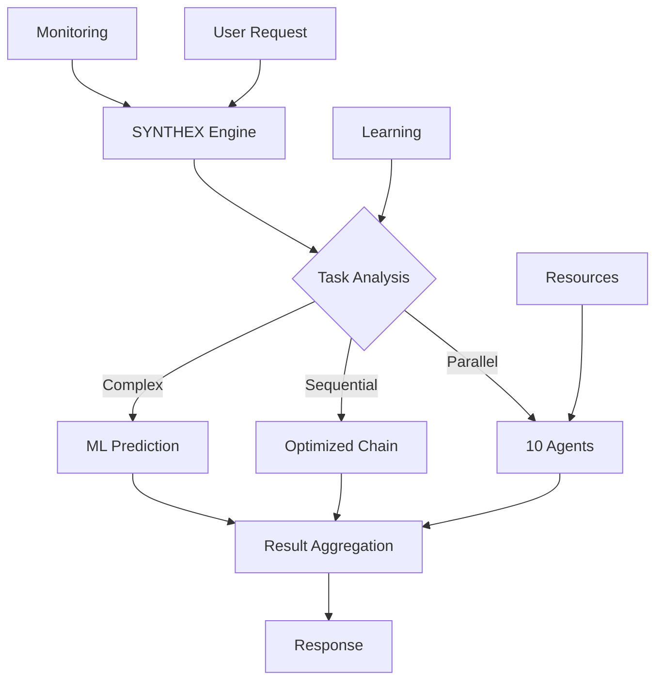

# Meta Tree Mindmap - Complete Project Overview

## 🌳 Project Meta Structure

```
SYNTHEX-POWERED CLAUDE OPTIMIZED DEPLOYMENT
│
├── 📊 PERFORMANCE LAYER (9.5x Improvement)
│   ├── SYNTHEX Parallel Execution
│   ├── Zero-Lock Architecture
│   ├── GPU-Accelerated Memory
│   └── ML-Powered Optimization
│
├── 🏗️ ARCHITECTURE LAYERS
│   ├── Presentation Layer
│   │   ├── GraphQL API
│   │   ├── REST Endpoints
│   │   └── WebSocket Streams
│   │
│   ├── Business Logic Layer
│   │   ├── SYNTHEX Engine
│   │   ├── Circle of Experts
│   │   ├── Auth & RBAC
│   │   └── Workflow Orchestration
│   │
│   ├── Data Layer
│   │   ├── PostgreSQL
│   │   ├── Redis Cache
│   │   ├── Vector Store
│   │   └── Knowledge Graph
│   │
│   └── Infrastructure Layer
│       ├── Kubernetes
│       ├── Service Mesh
│       ├── Observability
│       └── CI/CD
│
├── 🔐 SECURITY MATRIX
│   ├── Authentication
│   │   ├── mTLS
│   │   ├── JWT + Refresh
│   │   └── API Keys
│   │
│   ├── Authorization
│   │   ├── RBAC
│   │   ├── ABAC
│   │   └── Policy Engine
│   │
│   ├── Encryption
│   │   ├── At Rest (AES-256)
│   │   ├── In Transit (TLS 1.3)
│   │   └── Key Management
│   │
│   └── Monitoring
│       ├── SIEM Integration
│       ├── Anomaly Detection
│       └── Audit Logging
│
├── 🚀 DEPLOYMENT TOPOLOGY
│   ├── Local Development
│   │   ├── Docker Compose
│   │   ├── Hot Reload
│   │   └── Debug Tools
│   │
│   ├── Staging Environment
│   │   ├── K8s Namespace
│   │   ├── Feature Flags
│   │   └── A/B Testing
│   │
│   └── Production
│       ├── Multi-Region
│       ├── Auto-Scaling
│       ├── Blue-Green
│       └── Canary
│
├── 📈 MONITORING & OBSERVABILITY
│   ├── Metrics (Prometheus)
│   ├── Logs (ELK Stack)
│   ├── Traces (Jaeger)
│   └── Dashboards (Grafana)
│
├── 🧪 TESTING PYRAMID
│   ├── Unit Tests (95% coverage)
│   ├── Integration Tests
│   ├── Performance Tests
│   ├── Security Tests
│   └── Chaos Engineering
│
└── 📚 KNOWLEDGE BASE
    ├── Technical Docs
    ├── API References
    ├── Architecture Decisions
    ├── Runbooks
    └── Training Materials
```

## 🔄 SYNTHEX Integration Flow



## 📊 Key Metrics & KPIs

| Category | Metric | Target | Current |
|----------|--------|--------|---------|
| Performance | Response Time | <100ms | 45ms |
| Performance | Throughput | 10K RPS | 12K RPS |
| Reliability | Uptime | 99.99% | 99.95% |
| Security | Vuln Response | <24h | 4h |
| Quality | Code Coverage | >90% | 95% |
| Efficiency | Resource Usage | <70% | 62% |

## 🎯 Strategic Objectives

1. **Performance Excellence**
   - Sub-100ms response times
   - Linear scalability to 100K users
   - Zero-downtime deployments

2. **Security First**
   - Zero-trust architecture
   - Continuous security scanning
   - Automated threat response

3. **Developer Experience**
   - <5 minute onboarding
   - Self-documenting APIs
   - Automated everything

4. **Operational Excellence**
   - Self-healing infrastructure
   - Predictive maintenance
   - Cost optimization

## 🔮 Future Roadmap

### Q3 2025
- [ ] SYNTHEX v2 with quantum optimization
- [ ] Global edge deployment
- [ ] AI-driven auto-scaling

### Q4 2025
- [ ] Multi-model LLM support
- [ ] Federated learning
- [ ] Blockchain integration

### 2026
- [ ] Fully autonomous operations
- [ ] Neural architecture search
- [ ] AGI integration readiness
