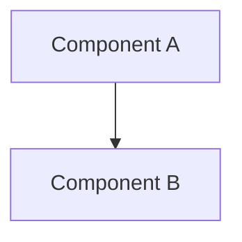

# AI Documentation Structure - CODE Project

**Last Updated**: May 30, 2025  
**Purpose**: Centralized AI-generated documentation repository  
**Status**: Active

## 📁 Directory Structure

```
ai_docs/
├── 00_AI_DOCS_INDEX.md          # Master index (this file)
├── 01_INFRASTRUCTURE_*.md       # Infrastructure patterns
├── 02_PERFORMANCE_*.md          # Performance optimizations
├── 03_RUST_PYTHON_*.md          # Language integration
│
├── architecture/                # System design documents
│   ├── system_overview.md       # High-level architecture
│   ├── microservices_design.md  # Service boundaries
│   ├── api_contracts.md         # API specifications
│   ├── data_flow.md            # Data flow diagrams
│   └── security_architecture.md # Security design
│
├── research/                    # Research and analysis
│   ├── deployment_strategies.md # Deployment research
│   ├── ai_integration.md       # AI/ML integration patterns
│   ├── cloud_providers.md      # Cloud comparison
│   ├── performance_studies.md  # Performance research
│   └── security_analysis.md    # Security research
│
├── implementation/              # Implementation guides
│   ├── rust_core/              # Rust implementation docs
│   ├── python_services/        # Python service docs
│   ├── integration_guides/     # Integration documentation
│   ├── deployment_guides/      # Deployment procedures
│   └── troubleshooting/        # Common issues & solutions
│
├── decisions/                   # Architecture Decision Records
│   ├── ADR_001_language_choice.md
│   ├── ADR_002_microservices.md
│   ├── ADR_003_deployment_strategy.md
│   └── ADR_template.md
│
├── analysis/                    # System analysis
│   ├── performance_analysis.md  # Performance metrics
│   ├── cost_analysis.md        # Cost projections
│   ├── risk_analysis.md        # Risk assessment
│   └── scalability_analysis.md # Scaling strategies
│
├── optimization/                # Optimization strategies
│   ├── code_optimization.md    # Code-level optimizations
│   ├── deployment_optimization.md
│   ├── resource_optimization.md
│   └── cost_optimization.md
│
├── testing/                     # Testing documentation
│   ├── test_strategies.md      # Testing approach
│   ├── test_plans/            # Detailed test plans
│   ├── performance_tests/     # Performance test results
│   └── security_tests/        # Security test documentation
│
└── deployment/                  # Deployment documentation
    ├── deployment_checklist.md  # Pre-deployment checks
    ├── rollout_strategies.md    # Deployment strategies
    ├── rollback_procedures.md   # Rollback plans
    └── monitoring_setup.md      # Monitoring configuration
```

## 📚 Document Naming Convention

### File Naming Rules
1. **Prefix with numbers** for ordered documents (00-99)
2. **Use UPPER_SNAKE_CASE** for main topics
3. **Use lowercase_snake_case** for subtopics
4. **Include dates** for time-sensitive docs: `YYYY-MM-DD_topic.md`

### Examples
- `00_AI_DOCS_INDEX.md` - Index files
- `01_INFRASTRUCTURE_AUTOMATION_COMMANDS.md` - Main topic files
- `ADR_001_language_choice.md` - Decision records
- `2025-05-30_performance_analysis.md` - Dated analysis

## 🔍 Quick Navigation

### By Purpose
- **🏗️ Architecture**: [architecture/](./architecture/)
- **🔬 Research**: [research/](./research/)
- **💻 Implementation**: [implementation/](./implementation/)
- **📊 Analysis**: [analysis/](./analysis/)
- **⚡ Optimization**: [optimization/](./optimization/)

### By Technology
- **🦀 Rust Documentation**: [implementation/rust_core/](./implementation/rust_core/)
- **🐍 Python Documentation**: [implementation/python_services/](./implementation/python_services/)
- **🐳 Docker/K8s**: [deployment/](./deployment/)
- **☁️ Cloud Services**: [research/cloud_providers.md](./research/cloud_providers.md)

### By Phase
- **Phase 1 - Foundation**: Current focus documents
- **Phase 2 - Integration**: Upcoming integration docs
- **Phase 3 - Intelligence**: AI/ML integration docs

## 📝 Document Templates

### Architecture Document Template
```markdown
# [Component Name] Architecture

## Overview
Brief description of the component.

## Design Principles
- Principle 1
- Principle 2

## Architecture Diagram


## API Specification
### Endpoints
- `GET /api/v1/resource`
- `POST /api/v1/resource`

## Data Flow
Description of how data flows through the system.

## Security Considerations
- Authentication
- Authorization
- Data encryption

## Performance Considerations
- Caching strategy
- Scaling approach

## Dependencies
- External services
- Internal services
```

### Decision Record Template
```markdown
# ADR-XXX: [Title]

## Status
[Proposed | Accepted | Deprecated | Superseded]

## Context
What is the issue we're addressing?

## Decision
What have we decided to do?

## Consequences
What are the positive and negative outcomes?

## Alternatives Considered
What other options were evaluated?
```

## 🔄 Document Lifecycle

### Creation
1. Claude creates initial draft in appropriate folder
2. Assigns appropriate naming convention
3. Links from this index

### Review
1. Technical review by team
2. Update based on feedback
3. Mark as reviewed with date

### Maintenance
1. Regular reviews (monthly)
2. Update with implementation changes
3. Archive outdated documents

## 🎯 Current Focus Areas

### Immediate Priorities
1. **Rust Core Architecture** - Define core engine structure
2. **Docker Integration** - POC deployment documentation
3. **API Design** - REST/gRPC interface specifications
4. **State Management** - State tracking design

### Next Sprint
1. **Terraform Integration** - Wrapper design
2. **CLI Design** - Command structure
3. **Error Handling** - Comprehensive error strategy
4. **Testing Strategy** - Test plan documentation

## 📊 Documentation Metrics

### Coverage
- Architecture: 40% complete
- Implementation: 15% complete
- Testing: 10% complete
- Deployment: 20% complete

### Quality Metrics
- Reviews completed: 5/20
- Diagrams included: 12/30
- Examples provided: 8/25
- Templates used: 15/20

## 🔗 Cross-References

### Related Documentation
- [Project README](../README.md)
- [Claude Configuration](../.claude/Claude.md)
- [Prime Directive](../.claude/prime.md)
- [Git Optimization](../docs/git-optimization/)

### External Resources
- [Rust Documentation](https://doc.rust-lang.org/)
- [Python Best Practices](https://docs.python-guide.org/)
- [Kubernetes Docs](https://kubernetes.io/docs/)
- [Terraform Docs](https://www.terraform.io/docs/)

## 🤖 AI Documentation Guidelines

### When Creating Documents
1. **Be specific and actionable**
2. **Include code examples**
3. **Add diagrams where helpful**
4. **Cross-reference related docs**
5. **Update this index**

### Quality Standards
- ✅ Clear problem statement
- ✅ Concrete solutions
- ✅ Implementation examples
- ✅ Testing considerations
- ✅ Performance implications

## 📈 Progress Tracking

### Documentation Roadmap
- [x] Create folder structure
- [x] Establish naming conventions
- [ ] Complete architecture docs (40%)
- [ ] Write implementation guides (15%)
- [ ] Create test plans (10%)
- [ ] Document deployment procedures (20%)

### Next Actions
1. Complete Rust core architecture document
2. Write Docker POC implementation guide
3. Create API contract specifications
4. Document state management design

---

*This index is maintained by Claude and updated with each new document creation.*
