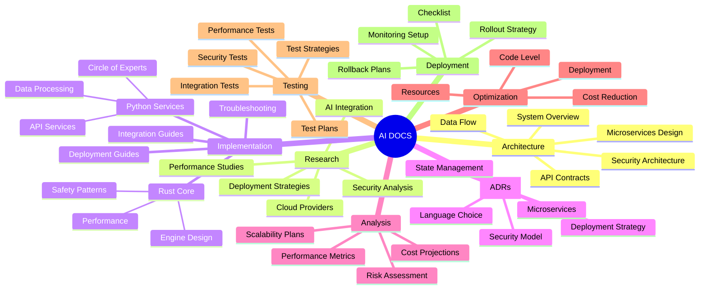
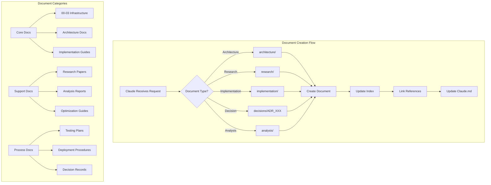
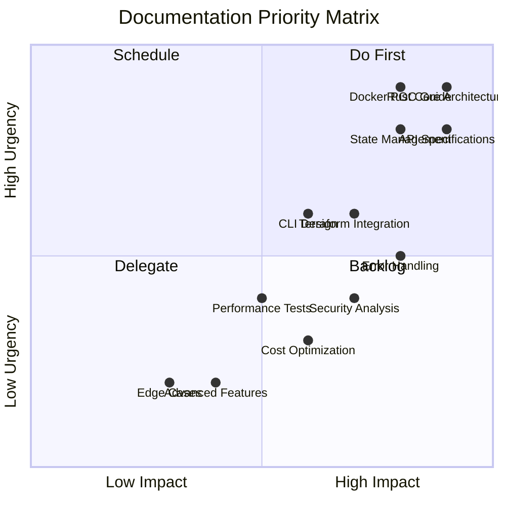
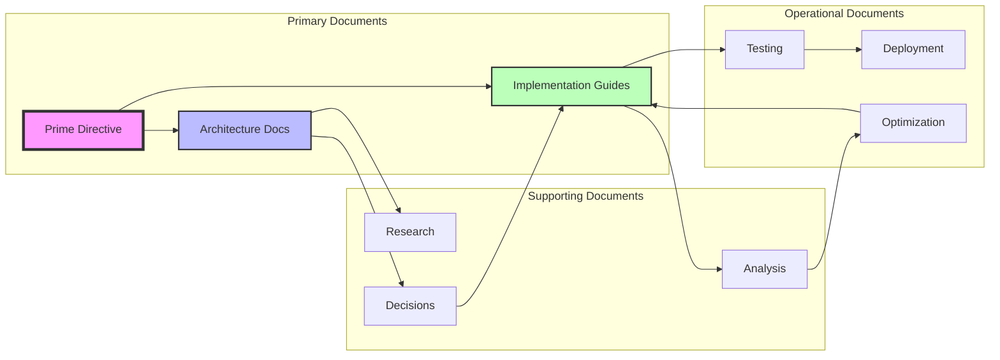
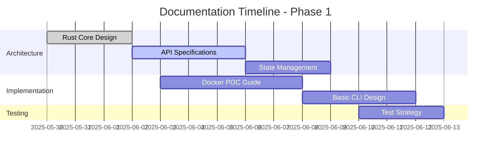

# AI Documentation Mind Map - CODE Project

## 📊 Documentation Flow Diagram

## 🎯 Documentation Priority Matrix

## 🔄 Document Relationships

## 📈 Documentation Coverage Heatmap

| Category | Architecture | Implementation | Testing | Deployment |
|----------|-------------|----------------|---------|------------|
| **Rust Core** | 🟡 40% | 🔴 10% | 🔴 5% | 🔴 10% |
| **Python Services** | 🟢 70% | 🟡 60% | 🟡 40% | 🟡 30% |
| **Integration** | 🟡 30% | 🔴 15% | 🔴 10% | 🔴 15% |
| **Cloud/Infra** | 🟡 35% | 🔴 20% | 🔴 15% | 🟡 25% |
| **Security** | 🟡 40% | 🔴 20% | 🔴 10% | 🔴 20% |

Legend: 🟢 >60% | 🟡 30-60% | 🔴 <30%

## 🎯 Documentation Targets

### Phase 1 (Current Sprint)

### Key Documentation Milestones
1. **Week 1**: Core architecture documents
2. **Week 2**: Implementation guides for POC
3. **Week 3**: Testing and deployment procedures
4. **Week 4**: Optimization and analysis reports

---

*This mind map provides a visual overview of the AI documentation structure and relationships.*
