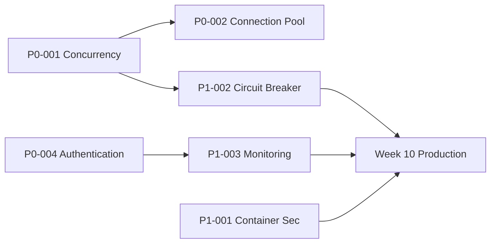

# AGENT 10: IMPLEMENTATION TIMELINE & MILESTONES
**Claude-Optimized Deployment Engine (CODE) Project**  
**Date: 2025-06-07**  
**Duration: 16 Weeks**  
**Status: DETAILED SCHEDULE WITH DEPENDENCIES**

---

## 📅 MASTER TIMELINE OVERVIEW

```
2025 Timeline
━━━━━━━━━━━━━━━━━━━━━━━━━━━━━━━━━━━━━━━━━━━━━━━━━━━━━━━━━━━━━━━━━━━━━━━━━━
JUNE          JULY          AUGUST        SEPTEMBER     OCTOBER
Week: 1-2     3-4-5-6       7-8-9-10      11-12-13-14   15-16

Phase 1: CRITICAL FIXES    ████
Phase 2: HARDENING              ████████████
Phase 3: OPERATIONS                         ████████████
Phase 4: ENTERPRISE                                      ████████████
━━━━━━━━━━━━━━━━━━━━━━━━━━━━━━━━━━━━━━━━━━━━━━━━━━━━━━━━━━━━━━━━━━━━━━━━━━

Key Milestones:
🚨 Week 2:  All blockers fixed
🛡️ Week 6:  Infrastructure hardened  
🚀 Week 10: Production ready
✅ Week 16: Enterprise ready
```

---

## 🚨 PHASE 1: CRITICAL FIXES (Weeks 1-2)
**Start**: June 7, 2025 | **End**: June 20, 2025  
**Goal**: Remove all blockers preventing production deployment

### Week 1 (June 7-13)
#### Monday, June 7 - Emergency Response Kickoff
- [ ] **09:00** - All-hands meeting: Crisis briefing
- [ ] **10:00** - P0-003: Start command injection fixes (Security Team)
- [ ] **10:00** - P0-005: Start dependency updates (DevSecOps)
- [ ] **14:00** - P0-001: Begin MCP concurrency fixes (Platform Team)

#### Tuesday, June 8 - Performance Focus
- [ ] **EOD** - P0-003: Command injection fixes complete
- [ ] **EOD** - P0-005: Critical dependencies updated
- [ ] **Start** - P0-002: Connection pooling implementation

#### Wednesday, June 9 - Integration Day
- [ ] **10:00** - P0-001: Semaphore implementation complete
- [ ] **14:00** - First integration tests with fixes
- [ ] **16:00** - Performance benchmarking begins

#### Thursday, June 10 - Testing & Validation
- [ ] **EOD** - P0-002: Connection pooling deployed
- [ ] **All Day** - Concurrent operation testing (target: 200+)
- [ ] **16:00** - Security validation scans

#### Friday, June 11 - Week 1 Checkpoint
- [ ] **10:00** - Demo: Performance improvements
- [ ] **14:00** - Retrospective & planning
- [ ] **Milestone**: 50% of critical fixes complete

### Week 2 (June 14-20)
#### Monday, June 14 - Authentication Sprint
- [ ] **Start** - P0-004: MCP authentication implementation
- [ ] **Teams**: Security Team leads, Platform supports

#### Tuesday-Thursday, June 15-17 - Auth Implementation
- [ ] JWT middleware deployment
- [ ] Per-tool authorization matrix
- [ ] Rate limiting configuration
- [ ] Audit logging activation

#### Friday, June 18 - Integration Testing
- [ ] Full system integration tests
- [ ] Security penetration testing
- [ ] Performance validation

#### June 20 - Phase 1 Complete 🎯
- [ ] **Milestone**: All P0 items complete
- [ ] **Gate Review**: Go/No-Go for Phase 2
- [ ] **Deliverables**:
  - ✅ Zero concurrency failures
  - ✅ Response time <500ms (p95)
  - ✅ All tools authenticated
  - ✅ Critical vulnerabilities patched

---

## 🛡️ PHASE 2: INFRASTRUCTURE HARDENING (Weeks 3-6)
**Start**: June 21, 2025 | **End**: July 18, 2025  
**Goal**: Production-grade infrastructure security and reliability

### Week 3 (June 21-27) - Reliability Patterns
- [ ] **Monday** - P1-002: Circuit breaker implementation starts
- [ ] **Tuesday** - P1-004: Health check system design
- [ ] **Wednesday** - Circuit breaker integration
- [ ] **Thursday** - Health endpoint deployment
- [ ] **Friday** - Reliability testing & demo

### Week 4 (June 28-July 4) - Container Security
- [ ] **Monday** - P1-001: Secure Dockerfile creation
- [ ] **Tuesday** - Non-root user implementation
- [ ] **Wednesday** - Security scanning integration
- [ ] **Thursday** - Pod security policies
- [ ] **Friday** - Container penetration testing
- [ ] **Note**: July 4 holiday (US) - reduced capacity

### Week 5 (July 5-11) - Monitoring Deployment
- [ ] **Monday** - P1-003: Prometheus deployment
- [ ] **Tuesday** - Grafana dashboard creation
- [ ] **Wednesday** - AlertManager configuration
- [ ] **Thursday** - Log aggregation setup
- [ ] **Friday** - Full monitoring demo

### Week 6 (July 12-18) - Operational Readiness
- [ ] **Monday-Wednesday** - P1-005: Runbook creation
- [ ] **Thursday** - Team training on procedures
- [ ] **Friday** - Phase 2 gate review
- [ ] **Milestone**: Infrastructure production-ready 🎯

### Phase 2 Deliverables
- ✅ Container security hardened
- ✅ Circuit breakers preventing cascades
- ✅ Health monitoring active
- ✅ Full observability stack deployed
- ✅ Basic runbooks documented

---

## 🚀 PHASE 3: OPERATIONAL EXCELLENCE (Weeks 7-10)
**Start**: July 19, 2025 | **End**: August 15, 2025  
**Goal**: Achieve operational maturity for production

### Week 7 (July 19-25) - Testing Framework
- [ ] **Monday-Tuesday** - P2-004: Performance test suite
- [ ] **Wednesday-Thursday** - Load testing scenarios
- [ ] **Friday** - Baseline performance established

### Week 8 (July 26-August 1) - Incident Response
- [ ] **Monday-Tuesday** - P2-005: Incident procedures
- [ ] **Wednesday** - On-call rotation setup
- [ ] **Thursday** - Alerting chain configuration
- [ ] **Friday** - First fire drill exercise

### Week 9 (August 2-8) - Scaling & Automation
- [ ] **Monday-Tuesday** - P2-002: Auto-scaling config
- [ ] **Wednesday-Thursday** - HPA/VPA tuning
- [ ] **Friday** - Scaling tests

### Week 10 (August 9-15) - Production Preparation
- [ ] **Monday-Tuesday** - P2-003: DR procedures
- [ ] **Wednesday** - Full DR drill
- [ ] **Thursday** - Production readiness review
- [ ] **Friday** - Go/No-Go decision
- [ ] **Milestone**: Production deployment approved 🎯

### Phase 3 Deliverables
- ✅ Performance testing automated
- ✅ Incident response operational
- ✅ Auto-scaling configured
- ✅ DR tested successfully
- ✅ Team trained and ready

---

## ✅ PHASE 4: ENTERPRISE FEATURES (Weeks 11-16)
**Start**: August 16, 2025 | **End**: September 26, 2025  
**Goal**: Enterprise-grade capabilities and compliance

### Week 11-12 (August 16-29) - Advanced Security
- [ ] Network segmentation implementation
- [ ] Zero-trust architecture planning
- [ ] Advanced threat detection setup

### Week 13-14 (August 30-September 12) - Compliance
- [ ] P3-001: GDPR framework implementation
- [ ] P3-004: Supply chain security
- [ ] External security audit

### Week 15-16 (September 13-26) - Final Polish
- [ ] P3-002: Zero-trust deployment
- [ ] P3-003: ML anomaly detection
- [ ] P3-005: Cost optimization
- [ ] **September 26**: Project completion 🎯

---

## 🎯 KEY MILESTONES & GATES

### Critical Decision Points

| Week | Milestone | Success Criteria | Decision |
|------|-----------|------------------|----------|
| 2 | Phase 1 Complete | All P0 items done, system stable | Proceed to Phase 2 |
| 6 | Infrastructure Ready | Security hardened, monitoring active | Proceed to Phase 3 |
| 10 | Production Ready | All operational procedures tested | Approve deployment |
| 14 | Security Audit | External audit passed | Enterprise features |
| 16 | Project Complete | All requirements met | General availability |

### Dependency Management



---

## 📊 RESOURCE ALLOCATION TIMELINE

### Team Utilization by Week

```
Week:     1  2  3  4  5  6  7  8  9 10 11 12 13 14 15 16
Security: ██ ██ ▓▓ ▓▓ ▓▓ ▓▓ ░░ ░░ ░░ ░░ ▓▓ ▓▓ ██ ██ ▓▓ ▓▓
Platform: ██ ██ ██ ▓▓ ▓▓ ░░ ▓▓ ▓▓ ██ ▓▓ ░░ ░░ ░░ ░░ ▓▓ ▓▓
DevOps:   ▓▓ ▓▓ ██ ██ ██ ██ ▓▓ ▓▓ ▓▓ ██ ▓▓ ▓▓ ░░ ░░ ░░ ░░
SRE:      ░░ ░░ ░░ ░░ ▓▓ ██ ██ ██ ██ ██ ▓▓ ▓▓ ░░ ░░ ░░ ░░

Legend: ██ Heavy (>30h/week) ▓▓ Moderate (15-30h) ░░ Light (<15h)
```

---

## 🚦 RISK MITIGATION SCHEDULE

### Critical Risk Windows

| Week | Risk | Mitigation | Contingency |
|------|------|------------|-------------|
| 1-2 | Performance fixes fail | Parallel approaches | External consultant |
| 4 | July 4 holiday impact | Plan ahead | Extend deadline |
| 6 | Security audit findings | Reserved time | Priority reprioritization |
| 10 | Production go-live | Rollback ready | Phased deployment |
| 14 | External audit | Pre-audit prep | Address findings |

---

## 📈 TRACKING & REPORTING

### Weekly Cadence
- **Monday**: Week kickoff & planning
- **Wednesday**: Mid-week checkpoint
- **Friday**: Demo & retrospective

### Reporting Schedule
- **Daily**: Standup (Phase 1 only)
- **Weekly**: Status report to stakeholders
- **Bi-weekly**: Executive briefing
- **Monthly**: Board update

### Success Metrics Tracking

| Week | Target | Metric |
|------|--------|--------|
| 2 | 100% | P0 completion rate |
| 4 | 0 | Security vulnerabilities |
| 6 | <500ms | Response time (p95) |
| 8 | 100% | Runbook coverage |
| 10 | >99% | Availability in staging |
| 12 | 100% | Team training completion |
| 14 | Pass | Security audit |
| 16 | 100% | Project completion |

---

## 🎊 CELEBRATION MILESTONES

### Team Recognition Points
- **Week 2**: Pizza party for P0 completion
- **Week 6**: Team dinner for Phase 2
- **Week 10**: Production launch party
- **Week 16**: Project completion celebration

### Success Sharing
- Blog post after each phase
- Internal demo days
- Conference talk proposals
- Open source contributions

---

## 📋 TIMELINE ASSUMPTIONS

### Dependencies
1. Team availability as planned
2. No major security incidents
3. Infrastructure provisioning on schedule
4. No significant scope changes
5. Vendor tools available

### Constraints
1. Budget approved and available
2. Team members dedicated
3. Environments accessible
4. Stakeholder availability
5. No competing priorities

---

**Timeline Status**: ✅ **APPROVED FOR EXECUTION**  
**Timeline Owner**: Project Manager  
**Next Update**: Weekly progress reviews  
**Escalation**: 2-day delay triggers executive review  

*This timeline provides clear milestones with dependencies and risk mitigation to ensure successful delivery within 16 weeks.*