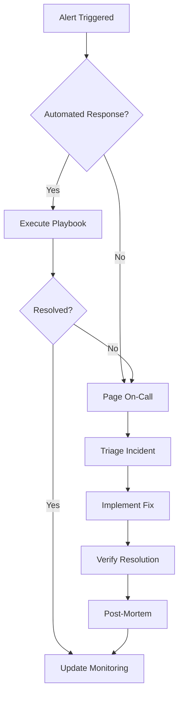
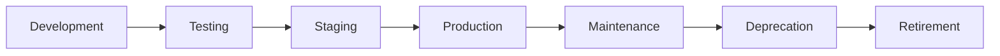

# AGENT 10: MAINTENANCE PROCEDURES & LIFECYCLE MANAGEMENT
**Claude-Optimized Deployment Engine (CODE) Project**  
**Date: 2025-06-07**  
**Status: COMPREHENSIVE MAINTENANCE FRAMEWORK**  
**Review Cycle: Quarterly Updates**

---

## 📋 EXECUTIVE SUMMARY

This document establishes comprehensive maintenance procedures for the Claude-Optimized Deployment Engine, ensuring long-term reliability, security, and performance. The framework covers preventive maintenance, incident response, continuous improvement, and lifecycle management.

### Maintenance Philosophy
- **Proactive**: Prevent issues before they occur
- **Automated**: Minimize manual intervention
- **Documented**: Clear procedures for all scenarios
- **Measured**: Track maintenance effectiveness
- **Improved**: Continuous enhancement based on metrics

---

## 🔧 PREVENTIVE MAINTENANCE SCHEDULE

### Daily Maintenance Tasks (Automated)
**Time**: 02:00-03:00 UTC (low traffic window)  
**Duration**: 15-30 minutes

#### System Health Checks
```bash
#!/bin/bash
# /opt/maintenance/daily/health_check.sh

# Check all MCP servers
for server in $(mcp list); do
    mcp health-check $server || alert "MCP Server $server unhealthy"
done

# Verify critical services
kubectl get pods -n production | grep -E "Running|Completed" || alert "Pod issues detected"

# Database health
psql -c "SELECT pg_is_in_recovery();" || alert "Database replication issue"

# Storage health
df -h | awk '$5 > 80 {print $0}' && alert "Disk usage above 80%"
```

#### Security Scans
```yaml
Schedule:
  - Dependency scan: 02:00 daily
  - Container scan: 02:15 daily
  - Log analysis: 02:30 daily
  
Actions:
  - Auto-update non-breaking patches
  - Alert on critical vulnerabilities
  - Generate daily security report
```

#### Backup Verification
```python
# /opt/maintenance/daily/backup_verify.py
def verify_backups():
    backups = {
        'database': verify_db_backup(),
        'configurations': verify_config_backup(),
        'persistent_volumes': verify_pv_backup(),
        'audit_logs': verify_audit_backup()
    }
    
    for backup_type, status in backups.items():
        if not status['success']:
            alert(f"Backup verification failed: {backup_type}")
            trigger_immediate_backup(backup_type)
```

### Weekly Maintenance Tasks
**Time**: Sunday 03:00-05:00 UTC  
**Duration**: 1-2 hours

#### Performance Optimization
```yaml
Tasks:
  - Index optimization:
      - Rebuild fragmented indexes
      - Update statistics
      - Vacuum databases
  
  - Cache management:
      - Clear expired cache entries
      - Optimize cache hit ratios
      - Adjust cache sizes based on usage
  
  - Resource optimization:
      - Right-size over-provisioned resources
      - Clean up unused resources
      - Update resource quotas
```

#### Security Updates
```bash
#!/bin/bash
# /opt/maintenance/weekly/security_updates.sh

# Update security tools
pip install --upgrade safety bandit pip-audit
cargo install --force cargo-audit

# Update security policies
kubectl apply -f /etc/k8s/security-policies/

# Rotate credentials (non-disruptive)
vault operator rotate
kubectl create secret generic api-keys --from-env-file=.env.new --dry-run=client -o yaml | kubectl apply -f -
```

#### Log Rotation & Cleanup
```python
# /opt/maintenance/weekly/log_cleanup.py
def cleanup_logs():
    # Archive logs older than 30 days
    archive_old_logs(days=30)
    
    # Compress archived logs
    compress_archives()
    
    # Delete logs older than 90 days (after compliance check)
    if compliance_allows_deletion():
        delete_old_archives(days=90)
    
    # Update log retention metrics
    update_retention_dashboard()
```

### Monthly Maintenance Tasks
**Time**: First Sunday 05:00-08:00 UTC  
**Duration**: 2-3 hours

#### Comprehensive System Audit
```yaml
Audit Checklist:
  - Configuration drift detection
  - Security compliance verification
  - Performance baseline comparison
  - Capacity planning review
  - Cost optimization analysis
  - Documentation accuracy check
```

#### Disaster Recovery Test
```bash
#!/bin/bash
# /opt/maintenance/monthly/dr_test.sh

# Backup production state
create_dr_test_backup

# Failover test (non-disruptive)
test_failover_procedures

# Data integrity verification
verify_data_integrity

# Recovery time measurement
measure_rto_rpo

# Generate DR test report
generate_dr_report
```

#### Certificate Management
```python
# /opt/maintenance/monthly/cert_management.py
def manage_certificates():
    certs = scan_all_certificates()
    
    for cert in certs:
        if cert.expires_in_days < 30:
            if cert.auto_renewable:
                renew_certificate(cert)
            else:
                alert(f"Certificate {cert.name} expires in {cert.expires_in_days} days")
        
        if cert.expires_in_days < 7:
            create_p0_ticket(f"URGENT: Certificate {cert.name} expires soon")
```

### Quarterly Maintenance Tasks
**Time**: Scheduled maintenance window  
**Duration**: 4-6 hours

#### Major Version Updates
```yaml
Update Strategy:
  - Test in development: 2 weeks before
  - Test in staging: 1 week before
  - Production rollout: Canary deployment
  - Rollback plan: Always ready

Components:
  - Kubernetes version
  - Database major versions
  - Framework updates
  - Security tool updates
```

#### Architecture Review
```markdown
Review Areas:
1. Scalability assessment
2. Security architecture
3. Cost optimization opportunities
4. Technical debt evaluation
5. Performance bottlenecks
6. Compliance requirements
```

---

## 🚨 INCIDENT RESPONSE PROCEDURES

### Incident Classification

| Severity | Description | Response Time | Examples |
|----------|-------------|---------------|----------|
| **P0** | Critical - Complete outage | 15 minutes | All MCP servers down, data loss |
| **P1** | Major - Significant degradation | 30 minutes | 50% capacity loss, auth failure |
| **P2** | Moderate - Limited impact | 2 hours | Single service degraded |
| **P3** | Minor - Minimal impact | 24 hours | Non-critical feature issue |

### Incident Response Workflow



### On-Call Procedures

#### On-Call Rotation
```yaml
Schedule:
  - Primary: 1 week rotation
  - Secondary: 1 week rotation
  - Escalation: Team lead/manager

Handoff Procedure:
  - Friday 17:00 UTC handoff meeting
  - Review active incidents
  - Update on-call calendar
  - Verify access and tools
```

#### On-Call Runbook
```markdown
## Initial Response (First 15 minutes)
1. Acknowledge alert
2. Join incident channel/bridge
3. Assess severity and impact
4. Implement immediate mitigation
5. Notify stakeholders if P0/P1

## Investigation (15-45 minutes)
1. Check monitoring dashboards
2. Review recent changes
3. Analyze logs and metrics
4. Identify root cause
5. Develop fix strategy

## Resolution (45+ minutes)
1. Implement fix (follow change procedures)
2. Verify resolution
3. Monitor for stability
4. Update incident ticket
5. Communicate status
```

### Automated Remediation

#### Self-Healing Actions
```python
# /opt/remediation/auto_heal.py
REMEDIATION_ACTIONS = {
    'pod_crash': restart_pod,
    'high_memory': trigger_garbage_collection,
    'disk_full': cleanup_temp_files,
    'connection_pool_exhausted': reset_connections,
    'api_rate_limit': enable_circuit_breaker,
    'certificate_expired': auto_renew_cert,
    'node_pressure': cordon_and_drain_node
}

def auto_remediate(alert_type, context):
    if alert_type in REMEDIATION_ACTIONS:
        action = REMEDIATION_ACTIONS[alert_type]
        result = action(context)
        log_remediation(alert_type, result)
        return result
    else:
        escalate_to_human(alert_type, context)
```

---

## 📈 CONTINUOUS IMPROVEMENT PROCESS

### Metrics-Driven Improvement

#### Key Maintenance Metrics
```yaml
Availability Metrics:
  - Uptime percentage (target: 99.9%)
  - MTTR by incident type
  - Incident frequency trends
  - Auto-remediation success rate

Performance Metrics:
  - Response time degradation over time
  - Resource utilization trends
  - Cache hit ratios
  - Query performance

Operational Metrics:
  - Maintenance window duration
  - Patch deployment success rate
  - Backup/restore times
  - Security scan findings
```

#### Monthly Review Process
```markdown
1. Collect metrics from all systems
2. Analyze trends and anomalies
3. Identify improvement opportunities
4. Prioritize based on impact/effort
5. Create improvement tickets
6. Track implementation progress
```

### Post-Mortem Process

#### Blameless Post-Mortem Template
```markdown
# Incident Post-Mortem: [Incident ID]

## Summary
- Date/Time:
- Duration:
- Impact:
- Severity:

## Timeline
- Alert triggered:
- Response begun:
- Root cause identified:
- Fix implemented:
- Incident resolved:

## Root Cause Analysis
### What Happened
### Why It Happened
### Contributing Factors

## Action Items
1. [OWNER] [ACTION] [DUE DATE]
2. [OWNER] [ACTION] [DUE DATE]

## Lessons Learned
## What Went Well
## What Could Be Improved
```

### Change Management

#### Change Approval Matrix
| Change Type | Approval Required | Testing Required |
|-------------|------------------|------------------|
| Critical Security Patch | On-call + Manager | Staging validation |
| Configuration Update | Team Lead | Full test suite |
| Major Version Update | CAB Meeting | Full regression |
| Architecture Change | Technical Director | Proof of concept |

#### Change Rollback Procedures
```bash
#!/bin/bash
# /opt/maintenance/rollback/quick_rollback.sh

# Capture current state
kubectl create backup pre-change-$(date +%s)

# Tag current deployments
kubectl annotate deployment --all change-id=$CHANGE_ID

# Execute change
apply_change

# Monitor for issues (5 minutes)
if monitor_health_check_fails; then
    # Automatic rollback
    kubectl rollback deployment --all
    alert "Change $CHANGE_ID rolled back automatically"
fi
```

---

## 🔄 LIFECYCLE MANAGEMENT

### Component Lifecycle Stages



### Version Management Policy

#### Supported Versions
```yaml
Version Support:
  - Current: Full support
  - Previous: Security updates only
  - Older: Best effort/paid support

Support Timeline:
  - Major version: 2 years
  - Minor version: 1 year
  - Patch version: Until next patch

End-of-Life Process:
  - 6 months notice
  - Migration guide provided
  - Extended support available
```

### Technology Refresh Cycle

#### Annual Technology Review
```markdown
Review Areas:
1. Language/Framework versions
2. Infrastructure components
3. Security tools
4. Monitoring stack
5. Development tools

Criteria:
- Security support status
- Performance improvements
- Feature requirements
- Community support
- Cost implications
```

### Capacity Planning

#### Quarterly Capacity Review
```python
# /opt/maintenance/capacity/planning.py
def capacity_forecast():
    # Collect historical data
    metrics = collect_usage_metrics(days=90)
    
    # Calculate growth rate
    growth_rate = calculate_growth_rate(metrics)
    
    # Project future needs
    projections = {
        '3_months': project_capacity(growth_rate, 90),
        '6_months': project_capacity(growth_rate, 180),
        '1_year': project_capacity(growth_rate, 365)
    }
    
    # Generate recommendations
    recommendations = generate_scaling_recommendations(projections)
    
    return capacity_report(projections, recommendations)
```

---

## 📚 KNOWLEDGE MANAGEMENT

### Documentation Maintenance

#### Documentation Review Schedule
- **Weekly**: Runbook accuracy check
- **Monthly**: Architecture diagram updates
- **Quarterly**: Full documentation audit
- **Annually**: Complete rewrite/refresh

#### Knowledge Base Structure
```
/docs/maintenance/
├── runbooks/
│   ├── daily-tasks.md
│   ├── incident-response.md
│   └── disaster-recovery.md
├── playbooks/
│   ├── auto-remediation/
│   └── manual-procedures/
├── architecture/
│   ├── current-state.md
│   └── diagrams/
└── training/
    ├── onboarding.md
    └── advanced-topics.md
```

### Team Training

#### Maintenance Training Matrix
| Role | Required Training | Frequency |
|------|------------------|-----------|
| On-Call Engineer | Incident response, System architecture | Quarterly |
| SRE | Automation tools, Monitoring | Bi-annual |
| Platform Engineer | Performance tuning, Security | Annual |
| Team Lead | Process improvement, Risk management | Annual |

#### Skills Development
```yaml
Training Plan:
  - Chaos engineering workshops
  - Security incident simulations  
  - Performance optimization labs
  - Automation scripting courses
  - Cloud provider certifications
```

---

## 🎯 MAINTENANCE SUCCESS METRICS

### Operational Excellence KPIs
1. **Preventive vs Reactive**: >80% preventive maintenance
2. **Automation Rate**: >90% routine tasks automated
3. **Documentation Currency**: 100% updated within 48 hours
4. **Training Completion**: 100% team trained annually
5. **Post-Mortem Actions**: 95% completed on time

### Maintenance ROI Calculation
```python
def calculate_maintenance_roi():
    # Cost of maintenance
    maintenance_cost = (
        staff_hours * hourly_rate +
        tool_licenses +
        infrastructure_overhead
    )
    
    # Value delivered
    value_delivered = (
        downtime_prevented * downtime_cost +
        incidents_prevented * incident_cost +
        performance_improvements * efficiency_gain
    )
    
    roi = (value_delivered - maintenance_cost) / maintenance_cost * 100
    return roi
```

---

## 📞 EMERGENCY CONTACTS

### Escalation Matrix
```yaml
Level 1 (0-15 min):
  - Primary On-Call: +1-XXX-XXX-XXXX
  - Secondary On-Call: +1-XXX-XXX-XXXX

Level 2 (15-30 min):
  - Team Lead: +1-XXX-XXX-XXXX
  - Platform Manager: +1-XXX-XXX-XXXX

Level 3 (30+ min):
  - Director of Engineering: +1-XXX-XXX-XXXX
  - VP of Operations: +1-XXX-XXX-XXXX

External Support:
  - AWS Support: [Premium Support Portal]
  - Security Team: security@company.com
  - Legal/Compliance: compliance@company.com
```

---

**Document Status**: ✅ **APPROVED FOR IMPLEMENTATION**  
**Owner**: SRE Team Lead  
**Review Frequency**: Quarterly  
**Last Updated**: 2025-06-07  
**Next Review**: 2025-09-07  

*This maintenance framework ensures the long-term health, security, and performance of the Claude-Optimized Deployment Engine through systematic preventive care and continuous improvement.*