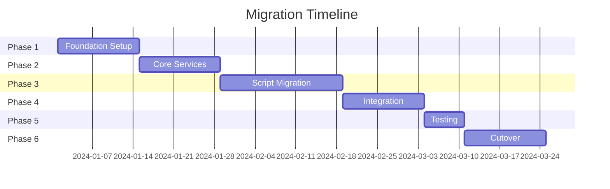

# AGENT 9: MIGRATION ROADMAP

**Agent**: Agent 9  
**Mission**: Define Comprehensive Migration Strategy and Roadmap  
**Status**: IN PROGRESS  
**Date**: 2025-01-07

---

## EXECUTIVE SUMMARY

This document provides a detailed roadmap for migrating from standalone scripts to the modular integration architecture. The migration is designed to be incremental, reversible, and risk-managed, ensuring zero disruption to existing workflows.

**Migration Timeline**: 12 weeks  
**Risk Level**: Low to Medium  
**Rollback Strategy**: Available at each phase  
**Success Criteria**: 100% feature parity, 0% service disruption

---

## MIGRATION OVERVIEW

### Migration Principles

1. **Incremental Approach**: Small, manageable changes
2. **Backward Compatibility**: Maintain existing interfaces
3. **Feature Parity**: No loss of functionality
4. **Continuous Testing**: Validate at each step
5. **Rollback Capability**: Reversible at any phase
6. **User Communication**: Clear updates and documentation

### Migration Phases



---

## PHASE 1: FOUNDATION SETUP (Weeks 1-2)

### Objectives
- Setup new module structure
- Implement core infrastructure
- Establish CI/CD pipelines
- Create monitoring dashboards

### Week 1: Infrastructure Setup

#### Tasks

1. **Create Module Structure**
```bash
# Execute setup script
./scripts/setup_modular_structure.sh

# Verify structure
tree src/ -d -L 3
```

2. **Setup Development Environment**
```bash
# Install dependencies
pip install -r requirements-dev.txt

# Setup pre-commit hooks
pre-commit install

# Configure IDE
./scripts/setup_ide.sh
```

3. **Initialize Version Control**
```bash
# Create feature branch
git checkout -b feature/modular-architecture

# Setup Git LFS for large files
git lfs track "*.db" "*.log"
```

#### Validation Checklist
- [ ] Module directories created
- [ ] Base classes implemented
- [ ] Development tools installed
- [ ] Git hooks configured
- [ ] IDE settings applied

### Week 2: CI/CD and Monitoring

#### Tasks

1. **Setup CI/CD Pipeline**
```yaml
# .github/workflows/modular-migration.yml
name: Modular Migration CI/CD
on:
  push:
    branches: [feature/modular-architecture]
  pull_request:
    branches: [main]

jobs:
  test:
    runs-on: ubuntu-latest
    steps:
      - uses: actions/checkout@v3
      - name: Setup Python
        uses: actions/setup-python@v4
        with:
          python-version: '3.11'
      - name: Install dependencies
        run: |
          pip install -r requirements.txt
          pip install -r requirements-dev.txt
      - name: Run tests
        run: pytest tests/ --cov=src/
      - name: Check compatibility
        run: python scripts/check_compatibility.py
```

2. **Create Monitoring Dashboard**
```python
# monitoring/dashboards/migration_dashboard.json
{
  "dashboard": {
    "title": "Migration Progress Dashboard",
    "panels": [
      {
        "title": "Script Usage",
        "targets": ["script_executions_total"]
      },
      {
        "title": "Module Adoption",
        "targets": ["module_usage_total"]
      },
      {
        "title": "Error Rates",
        "targets": ["migration_errors_total"]
      }
    ]
  }
}
```

#### Deliverables
- [ ] CI/CD pipeline operational
- [ ] Test coverage > 80%
- [ ] Monitoring dashboard live
- [ ] Documentation updated

---

## PHASE 2: CORE SERVICES IMPLEMENTATION (Weeks 3-4)

### Objectives
- Implement service layer
- Create service interfaces
- Setup dependency injection
- Validate service functionality

### Week 3: Service Implementation

#### Priority Services

1. **Database Service**
```python
# Implementation checklist
- [ ] Service interface defined
- [ ] Core functionality migrated
- [ ] Connection pooling implemented
- [ ] Transaction support added
- [ ] Error handling comprehensive
- [ ] Logging integrated
- [ ] Metrics collection active
```

2. **Configuration Service**
```python
# Implementation checklist
- [ ] Configuration loading
- [ ] Environment overrides
- [ ] Secret management
- [ ] Dynamic updates
- [ ] Validation framework
- [ ] Change notifications
```

3. **Logging Service**
```python
# Implementation checklist
- [ ] Structured logging
- [ ] Multiple outputs
- [ ] Log rotation
- [ ] Performance optimization
- [ ] Security sanitization
```

### Week 4: Service Testing

#### Test Categories

1. **Unit Tests**
```python
# tests/unit/services/test_database_service.py
class TestDatabaseService:
    def test_connection_pooling(self):
        """Test connection pool management."""
        pass
    
    def test_transaction_rollback(self):
        """Test transaction rollback on error."""
        pass
    
    def test_concurrent_operations(self):
        """Test concurrent database operations."""
        pass
```

2. **Integration Tests**
```python
# tests/integration/test_service_integration.py
async def test_service_orchestration():
    """Test multiple services working together."""
    # Initialize services
    db_service = DatabaseService(config)
    config_service = ConfigurationService(config)
    
    # Test interaction
    await db_service.initialize()
    config = await config_service.get_database_config()
    assert config.pool_size == 10
```

#### Validation Metrics
- [ ] All services implemented
- [ ] Test coverage > 85%
- [ ] Performance benchmarks passed
- [ ] No memory leaks detected
- [ ] Error handling validated

---

## PHASE 3: SCRIPT MIGRATION (Weeks 5-7)

### Objectives
- Migrate scripts to modular system
- Maintain backward compatibility
- Create migration wrappers
- Update documentation

### Week 5: High-Priority Scripts

#### Migration Order

1. **Database Manager (db_manager.py)**
   - Lines of code: 373
   - Commands: 11
   - Dependencies: 3
   - Risk: Low

2. **Import Fixer (fix_imports.py)**
   - Lines of code: 245
   - Complexity: Medium
   - Dependencies: 2
   - Risk: Low

3. **Setup Scripts**
   - Count: 5
   - Complexity: Low
   - Dependencies: Various
   - Risk: Low

#### Migration Process

```python
# 1. Create service implementation
# src/services/database.py

# 2. Create command wrapper
# src/cli/commands/database.py

# 3. Create compatibility shim
# scripts/db_manager.py (modified)
#!/usr/bin/env python3
"""Compatibility wrapper - redirects to new system."""
import warnings
warnings.warn("Use 'code db' commands instead", DeprecationWarning)

from src.cli.main import cli
import sys
sys.exit(cli())

# 4. Update tests
# tests/compatibility/test_db_manager.py
```

### Week 6: Medium-Priority Scripts

#### Scripts to Migrate

1. **Performance Analysis**
   - Complexity: High
   - Dependencies: Circle of Experts
   - Migration strategy: Gradual

2. **Validation Scripts**
   - Count: 3
   - Complexity: Medium
   - Dependencies: Core modules
   - Migration strategy: Parallel

#### Compatibility Matrix

| Script | Old Command | New Command | Status |
|--------|-------------|-------------|---------|
| db_manager.py | `./db_manager.py init` | `code db init` | ✅ |
| fix_imports.py | `./fix_imports.py --all` | `code quality fix-imports` | ✅ |
| setup_experts.py | `./setup_experts.py` | `code setup experts` | 🔄 |

### Week 7: Low-Priority Scripts

#### Remaining Scripts
- Git helpers
- Benchmarking tools
- Utility scripts

#### Documentation Updates
- Migration guides
- Command mapping
- Deprecation notices
- Training materials

---

## PHASE 4: INTEGRATION (Weeks 8-9)

### Objectives
- Integrate with existing systems
- Setup API endpoints
- Configure authentication
- Enable monitoring

### Week 8: System Integration

#### Integration Points

1. **API Integration**
```python
# src/api/v1/migration.py
@router.get("/migration/status")
async def get_migration_status():
    """Get current migration status."""
    return {
        "phase": "integration",
        "progress": 75,
        "scripts_migrated": 12,
        "scripts_remaining": 3,
        "compatibility_mode": True
    }
```

2. **CLI Integration**
```bash
# New unified CLI
code --help

# Commands:
#   db        Database management
#   quality   Code quality tools
#   perf      Performance analysis
#   config    Configuration management
```

3. **Monitoring Integration**
```yaml
# prometheus.yml
scrape_configs:
  - job_name: 'migration_metrics'
    static_configs:
      - targets: ['localhost:9090']
    metric_relabel_configs:
      - source_labels: [__name__]
        regex: 'migration_.*'
        action: keep
```

### Week 9: User Acceptance Testing

#### UAT Activities

1. **Developer Testing**
   - Feature parity validation
   - Performance comparison
   - Workflow testing
   - Tool integration

2. **Beta Testing**
   - Selected user group
   - Feedback collection
   - Issue tracking
   - Performance monitoring

3. **Documentation Review**
   - User guides
   - API documentation
   - Migration guides
   - Troubleshooting

#### Success Criteria
- [ ] All features available
- [ ] Performance maintained
- [ ] No workflow disruption
- [ ] Positive user feedback
- [ ] Documentation complete

---

## PHASE 5: TESTING & VALIDATION (Week 10)

### Objectives
- Comprehensive testing
- Performance validation
- Security assessment
- Load testing

### Testing Categories

#### 1. Functional Testing
```python
# Test all migrated functionality
pytest tests/functional/ -v --tb=short
```

#### 2. Performance Testing
```python
# Benchmark comparison
python scripts/benchmark_migration.py --compare
```

#### 3. Security Testing
```bash
# Security scan
bandit -r src/ -f json -o security_report.json

# Dependency check
safety check --json
```

#### 4. Load Testing
```python
# Load test configuration
locust -f tests/load/locustfile.py --host=http://localhost:8000
```

### Validation Checklist
- [ ] All tests passing
- [ ] Performance targets met
- [ ] Security vulnerabilities fixed
- [ ] Load capacity verified
- [ ] Rollback tested

---

## PHASE 6: CUTOVER (Weeks 11-12)

### Objectives
- Final migration
- Deprecate old system
- Monitor stability
- Support transition

### Week 11: Staged Cutover

#### Cutover Strategy

1. **Day 1-2: Soft Launch**
   - Enable for 10% of users
   - Monitor metrics
   - Collect feedback

2. **Day 3-5: Gradual Rollout**
   - Increase to 50% of users
   - Address issues
   - Update documentation

3. **Day 6-7: Full Deployment**
   - 100% on new system
   - Old system in read-only
   - Support available

#### Rollback Plan
```bash
# Immediate rollback procedure
./scripts/rollback_migration.sh --phase 6

# Validates:
# - Database state
# - Configuration
# - Service availability
# - User access
```

### Week 12: Deprecation & Cleanup

#### Deprecation Steps

1. **Mark Scripts Deprecated**
```python
# Add to all old scripts
import warnings
warnings.warn(
    "This script is deprecated and will be removed in v2.0. "
    "Use 'code' CLI instead.",
    DeprecationWarning,
    stacklevel=2
)
```

2. **Update Documentation**
   - Remove old examples
   - Update all references
   - Archive old guides

3. **Monitor Usage**
```python
# Track deprecated script usage
@track_deprecated_usage
def old_script_main():
    """Log usage for migration tracking."""
    pass
```

#### Final Cleanup
- [ ] Remove deprecated code
- [ ] Archive old scripts
- [ ] Update CI/CD
- [ ] Clean dependencies
- [ ] Update README

---

## RISK MANAGEMENT

### Risk Matrix

| Risk | Probability | Impact | Mitigation |
|------|-------------|---------|------------|
| Data Loss | Low | High | Comprehensive backups, tested restore |
| Performance Degradation | Medium | Medium | Continuous benchmarking, optimization |
| User Disruption | Low | High | Compatibility layer, gradual rollout |
| Integration Failures | Medium | Medium | Extensive testing, rollback plan |
| Security Vulnerabilities | Low | High | Security scanning, code review |

### Mitigation Strategies

1. **Continuous Backups**
```bash
# Automated backup before each phase
./scripts/backup_before_migration.sh --phase $PHASE
```

2. **Performance Monitoring**
```python
# Real-time performance tracking
@monitor_performance
async def critical_operation():
    """Track performance of migrated functions."""
    pass
```

3. **User Communication**
```markdown
# Weekly migration updates
- Current Phase: X
- Progress: Y%
- Known Issues: []
- Next Steps: ...
```

---

## SUCCESS METRICS

### Technical Metrics

| Metric | Target | Current |
|--------|---------|----------|
| Test Coverage | > 90% | - |
| Performance | No regression | - |
| Availability | 99.9% | - |
| Error Rate | < 0.1% | - |
| Response Time | < 500ms p95 | - |

### Business Metrics

| Metric | Target | Current |
|--------|---------|----------|
| User Adoption | > 95% | - |
| Support Tickets | -30% | - |
| Development Velocity | +20% | - |
| User Satisfaction | > 4.5/5 | - |

### Tracking Dashboard
```python
# monitoring/migration_metrics.py
class MigrationMetrics:
    """Track migration progress and success."""
    
    @property
    def adoption_rate(self):
        """Calculate module adoption rate."""
        return (self.module_calls / self.total_calls) * 100
    
    @property
    def compatibility_usage(self):
        """Track compatibility layer usage."""
        return self.compatibility_calls / self.total_calls
```

---

## POST-MIGRATION ACTIVITIES

### Week 13+: Optimization

1. **Performance Tuning**
   - Profile hotspots
   - Optimize queries
   - Cache optimization
   - Resource management

2. **Feature Enhancement**
   - New capabilities
   - User requests
   - Integration expansion
   - Plugin development

3. **Documentation Update**
   - Architecture guides
   - Best practices
   - Case studies
   - Lessons learned

### Long-term Maintenance

1. **Regular Reviews**
   - Quarterly architecture review
   - Performance assessments
   - Security audits
   - User feedback

2. **Continuous Improvement**
   - Feature additions
   - Performance optimization
   - Security updates
   - Documentation updates

---

## COMMUNICATION PLAN

### Stakeholder Updates

1. **Weekly Status Reports**
   - Progress summary
   - Issues and resolutions
   - Upcoming activities
   - Risk assessment

2. **User Communications**
   - Email updates
   - Slack notifications
   - Documentation updates
   - Training sessions

3. **Developer Updates**
   - Technical details
   - API changes
   - Migration guides
   - Support resources

### Communication Templates

```markdown
# Weekly Update Template
## Migration Status - Week X

**Current Phase**: [Phase Name]
**Progress**: X%
**Completed This Week**:
- Item 1
- Item 2

**Upcoming Next Week**:
- Item 1
- Item 2

**Issues/Risks**:
- Issue 1: [Status]

**User Action Required**: None/[Action]
```

---

## CONCLUSION

This migration roadmap provides a structured, low-risk approach to transitioning from standalone scripts to a modular architecture. The phased approach ensures continuous operation while delivering incremental improvements.

**Key Success Factors:**
- **Incremental approach** minimizes risk
- **Backward compatibility** ensures no disruption
- **Comprehensive testing** validates each phase
- **Clear communication** keeps stakeholders informed
- **Rollback capability** provides safety net

The 12-week timeline allows for thorough implementation while maintaining momentum. Post-migration activities ensure long-term success and continuous improvement.