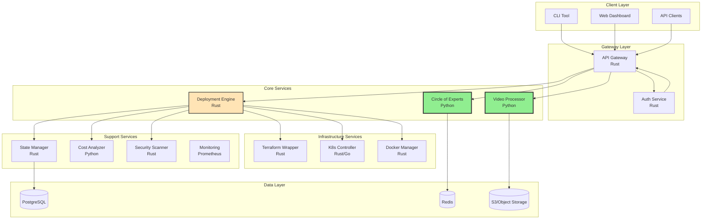
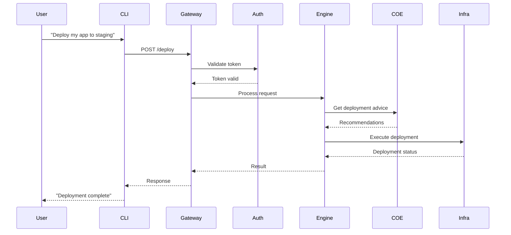
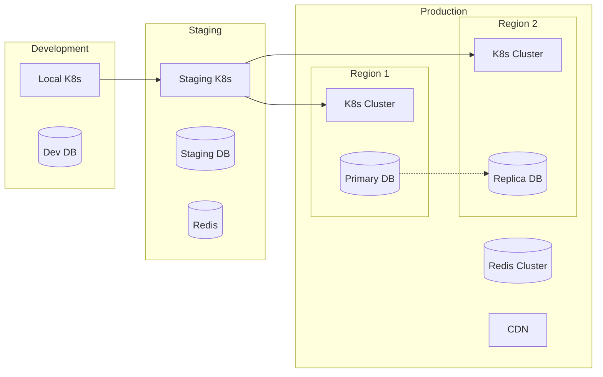

# CODE Project - System Overview Architecture

**Version**: 1.0.0  
**Last Updated**: May 30, 2025  
**Status**: In Development

## Executive Summary

The Claude-Optimized Deployment Engine (CODE) is a microservices-based system designed to simplify infrastructure deployment through natural language interfaces. Currently at 15% completion with the Circle of Experts feature operational.

## Architecture Principles

1. **Microservices First**: Independent, deployable services
2. **Language Optimized**: Rust for performance, Python for AI/ML
3. **API-Driven**: Clear contracts between all services
4. **Cloud Native**: Containerized, scalable, resilient
5. **Security by Design**: Zero-trust architecture

## High-Level Architecture



## Component Details

### Operational Components (Green)

#### Circle of Experts (Python)
- **Status**: ✅ Fully operational
- **Purpose**: Multi-AI consultation system
- **Technology**: FastAPI, AsyncIO
- **Features**:
  - Parallel AI model queries
  - Consensus building
  - Cost estimation
  - Google Drive integration

#### Video Processor (Python)
- **Status**: ✅ Functional
- **Purpose**: Convert video tutorials to documentation
- **Technology**: Python, AI transcription
- **Features**:
  - Video download
  - Transcription
  - Documentation generation

### In Development Components (Orange)

#### Deployment Engine (Rust)
- **Status**: 🟡 In design phase
- **Purpose**: Core orchestration engine
- **Technology**: Rust, Tokio
- **Planned Features**:
  - Natural language processing
  - Deployment orchestration
  - State management
  - Resource optimization

### Planned Components

#### API Gateway (Rust)
- **Purpose**: Single entry point, routing, rate limiting
- **Features**: JWT validation, request routing, rate limiting

#### Infrastructure Services
- **Terraform Wrapper**: Safe Terraform execution
- **K8s Controller**: Kubernetes deployments
- **Docker Manager**: Container lifecycle management

## Data Flow



## Security Architecture

### Authentication & Authorization
- JWT-based authentication
- Role-Based Access Control (RBAC)
- API key management for services

### Network Security
```yaml
network_policies:
  - ingress: API Gateway only
  - service_mesh: mTLS between services
  - egress: Restricted by service role
```

### Data Security
- Encryption at rest (AES-256)
- Encryption in transit (TLS 1.3)
- Secrets management via HashiCorp Vault

## Deployment Architecture



## Technology Stack

### Languages
- **Rust**: Core engine, performance-critical services
- **Python**: AI/ML services, data processing
- **Go**: Kubernetes operators (if needed)
- **TypeScript**: Web dashboard

### Infrastructure
- **Container**: Docker
- **Orchestration**: Kubernetes
- **IaC**: Terraform
- **CI/CD**: GitHub Actions

### Data Stores
- **PostgreSQL**: Primary database
- **Redis**: Caching, pub/sub
- **S3**: Object storage

### Monitoring
- **Metrics**: Prometheus + Grafana
- **Logs**: ELK Stack
- **Traces**: Jaeger
- **Alerts**: AlertManager

## Scalability Design

### Horizontal Scaling
- All services stateless where possible
- Auto-scaling based on metrics
- Load balancing at gateway

### Performance Targets
- API Response: <100ms p95
- Deployment Time: <5 minutes
- Availability: 99.9%

## Development Phases

### Phase 1: Foundation (Current)
- [x] Circle of Experts
- [x] Video Processor
- [ ] Rust core structure
- [ ] Docker POC

### Phase 2: Integration
- [ ] Terraform wrapper
- [ ] Basic K8s support
- [ ] CLI tool
- [ ] State management

### Phase 3: Intelligence
- [ ] NLP integration
- [ ] Deployment optimization
- [ ] Cost analysis
- [ ] Security scanning

## Next Steps

1. **Complete Rust core design**
2. **Implement Docker POC**
3. **Design state management**
4. **Create API specifications**

---

*This architecture is a living document and will evolve as the project progresses.*
