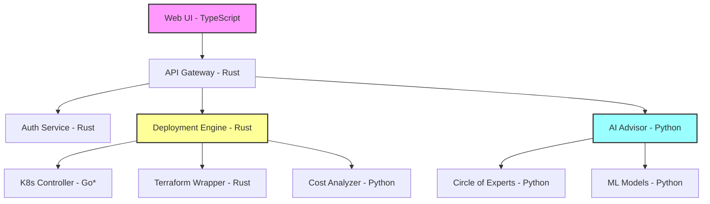

# Programming Language Guidelines for CODE Project

## 🥇 Gold Standard Languages

### Rust 🦀 - Performance & Safety
**Primary Use Cases:**
- Core deployment engine
- Performance-critical components
- Security-sensitive modules
- System-level integrations
- CLI tools

**When to Choose Rust:**
- Need memory safety without GC
- Performance is critical
- Building long-running services
- Handling concurrent operations
- Creating standalone binaries

### Python 🐍 - AI/ML & Rapid Development
**Primary Use Cases:**
- Circle of Experts AI system
- Data processing pipelines
- Cloud automation scripts
- API development (FastAPI)
- Integration glue code

**When to Choose Python:**
- AI/ML functionality needed
- Rapid prototyping required
- Rich library ecosystem needed
- Data manipulation tasks
- Quick iteration cycles

## 🔄 Language Integration Patterns

### Rust + Python Integration
```toml
# Cargo.toml
[dependencies]
pyo3 = "0.19"

[lib]
name = "code_core"
crate-type = ["cdylib"]
```

```python
# Python using Rust module
import code_core

# Fast Rust function from Python
result = code_core.optimize_deployment(
    resources=resources,
    constraints=constraints
)
```

### Microservice Communication
```yaml
# docker-compose.yml
services:
  deployment-engine:
    build: ./rust_core
    environment:
      - SERVICE_TYPE=grpc
      - PORT=50051
  
  ai-advisor:
    build: ./src/circle_of_experts
    environment:
      - SERVICE_TYPE=rest
      - PORT=8000
  
  api-gateway:
    build: ./api_gateway
    depends_on:
      - deployment-engine
      - ai-advisor
```

## 📋 Decision Matrix

| Criteria | Rust | Python | Go | TypeScript | C++ |
|----------|------|--------|-----|------------|-----|
| Performance | ⭐⭐⭐⭐⭐ | ⭐⭐ | ⭐⭐⭐⭐ | ⭐⭐ | ⭐⭐⭐⭐⭐ |
| Safety | ⭐⭐⭐⭐⭐ | ⭐⭐⭐ | ⭐⭐⭐⭐ | ⭐⭐⭐ | ⭐⭐ |
| Development Speed | ⭐⭐⭐ | ⭐⭐⭐⭐⭐ | ⭐⭐⭐⭐ | ⭐⭐⭐⭐ | ⭐⭐ |
| Ecosystem | ⭐⭐⭐⭐ | ⭐⭐⭐⭐⭐ | ⭐⭐⭐⭐ | ⭐⭐⭐⭐⭐ | ⭐⭐⭐ |
| Team Knowledge | ⭐⭐⭐ | ⭐⭐⭐⭐⭐ | ⭐⭐⭐ | ⭐⭐⭐⭐ | ⭐⭐ |
| Cloud Native | ⭐⭐⭐⭐ | ⭐⭐⭐⭐ | ⭐⭐⭐⭐⭐ | ⭐⭐⭐ | ⭐⭐ |

## 🎯 Component Language Mapping

### Current Components
- **Circle of Experts**: Python (FastAPI + AI libraries)
- **CLI Tool**: Python (with Rust optimization planned)
- **Video Processor**: Python (for AI transcription)
- **Core Engine**: Rust (planned)

### Future Components
- **Deployment Orchestrator**: Rust
- **Resource Optimizer**: Rust
- **Web Dashboard**: TypeScript + React
- **K8s Operators**: Go (if needed)
- **API Gateway**: Rust or Go
- **ML Pipeline**: Python

## ✅ Language Selection Checklist

Before choosing a language for a new component:

- [ ] Can it be implemented effectively in Rust or Python?
- [ ] Does an alternative provide significant advantages?
- [ ] How will it integrate with existing services?
- [ ] What's the deployment and containerization strategy?
- [ ] Do we have team expertise in this language?
- [ ] What are the long-term maintenance implications?
- [ ] Does it align with our microservices architecture?
- [ ] Are the required libraries/frameworks mature?

## 📊 Example Architecture



*Note: Go only if Rust k8s libraries prove insufficient

## 🔧 Integration Best Practices

1. **Use gRPC for Rust ↔ Python communication**
2. **RESTful APIs for web-facing services**
3. **Message queues for async processing**
4. **Shared schemas (protobuf/OpenAPI)**
5. **Containerize everything**
6. **Version APIs properly**
7. **Monitor language boundaries**

## 📝 Notes

- Rust and Python are our defaults - deviate only with strong justification
- Consider ease of integration before introducing new languages
- Modularity is key - services should be independently deployable
- Performance-critical paths should be in Rust
- AI/ML and data processing should be in Python
- Document language choices in ADRs (Architecture Decision Records)

---
*Last Updated: May 30, 2025*
