# SYNTHEX Data Flow Diagrams

## Overall System Data Flow

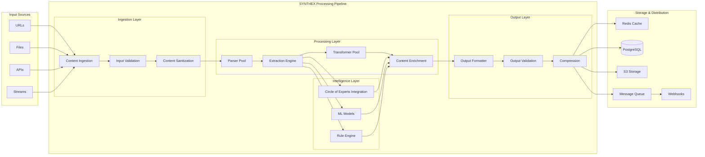

## Authentication & Authorization Flow

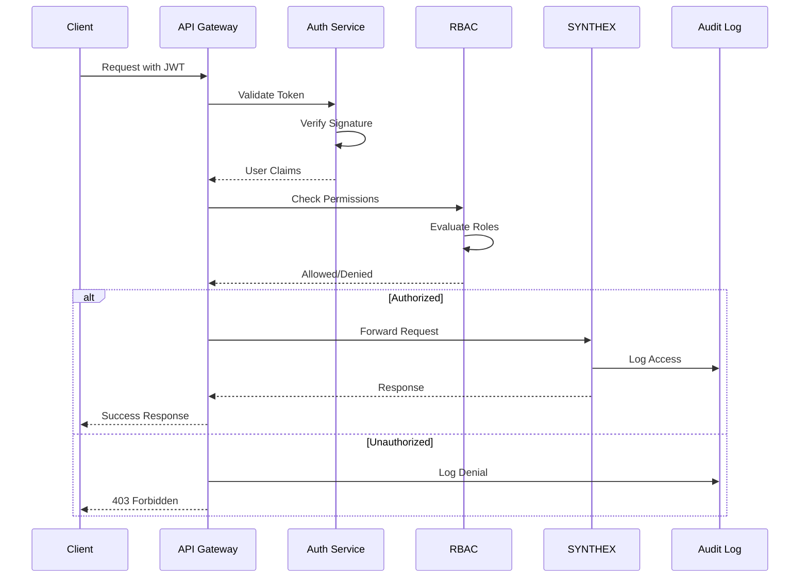

## Memory-Optimized Processing Flow

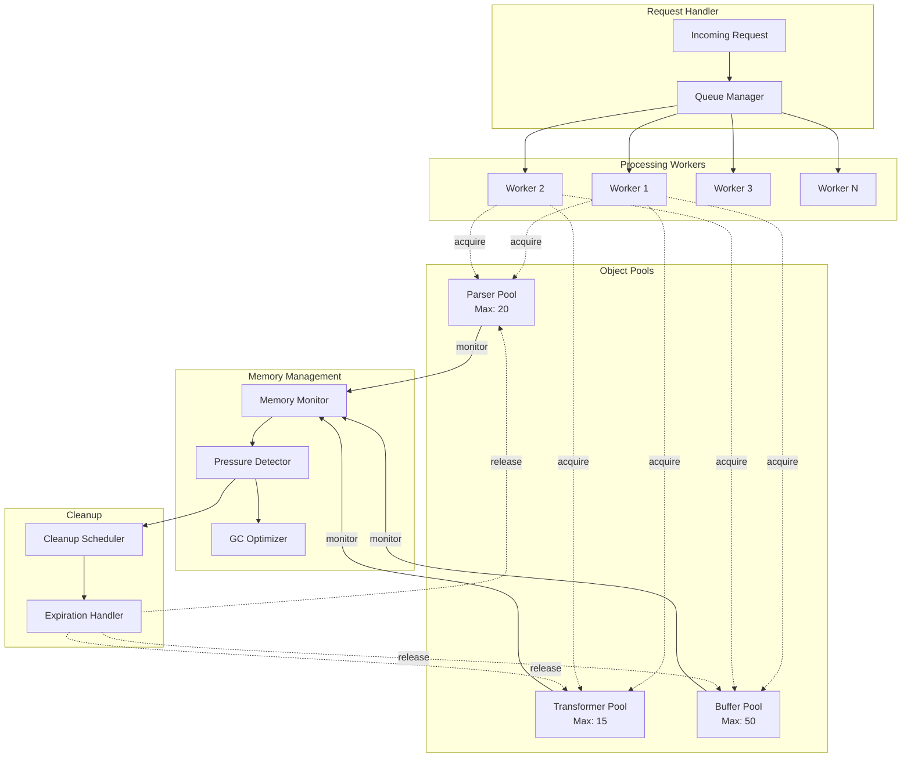

## Event-Driven Notification Flow

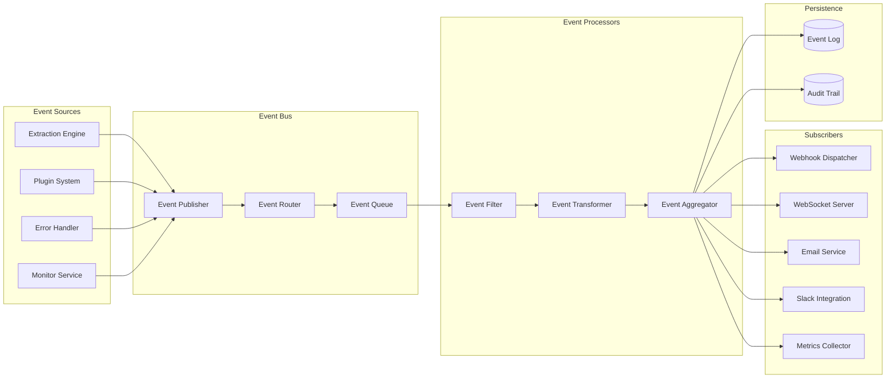

## Circle of Experts Integration Flow

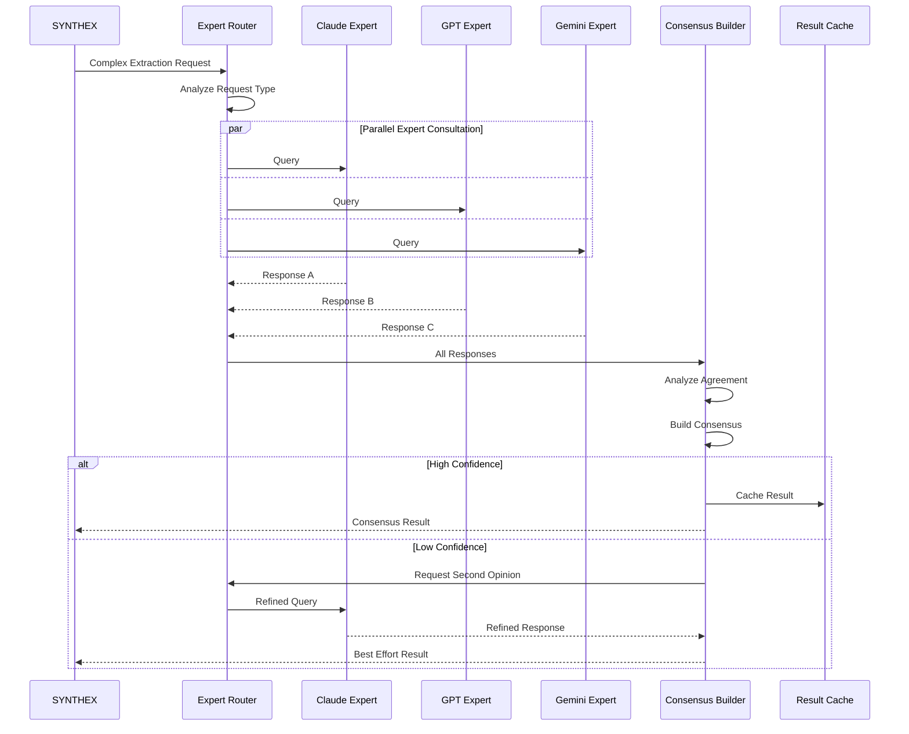

## Plugin Execution Flow

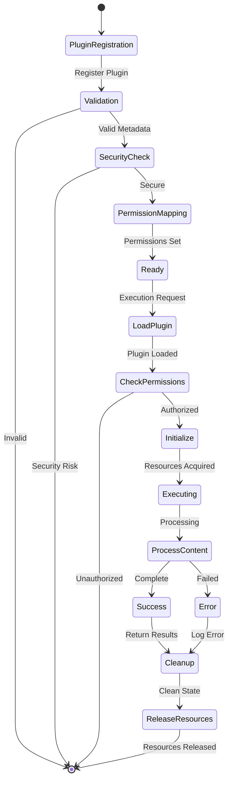

## Connection Pool Management Flow

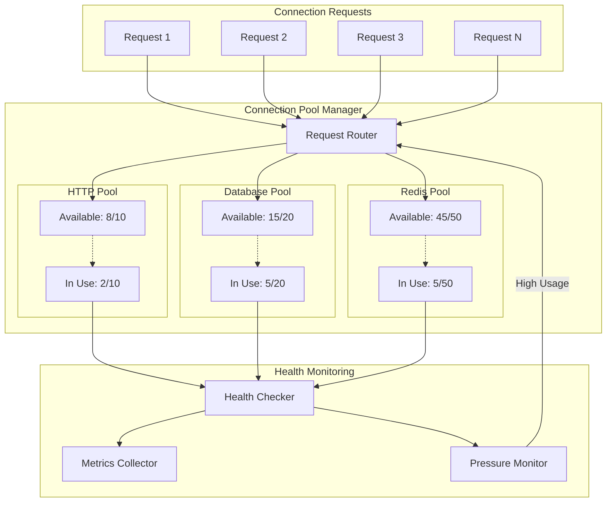

## Error Handling and Recovery Flow

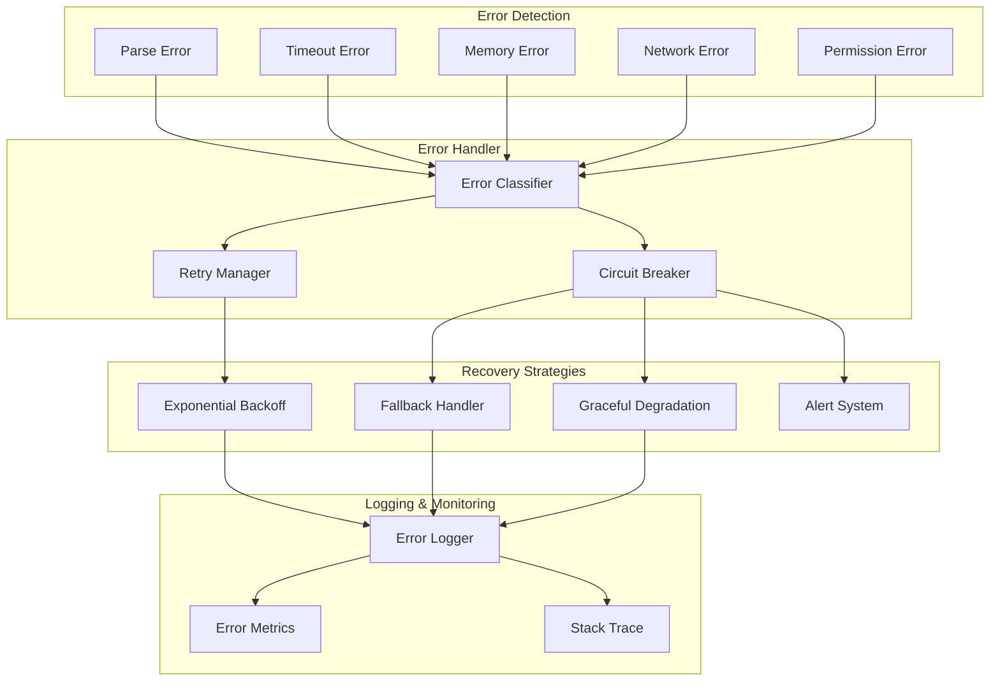

## Monitoring Dashboard Data Flow

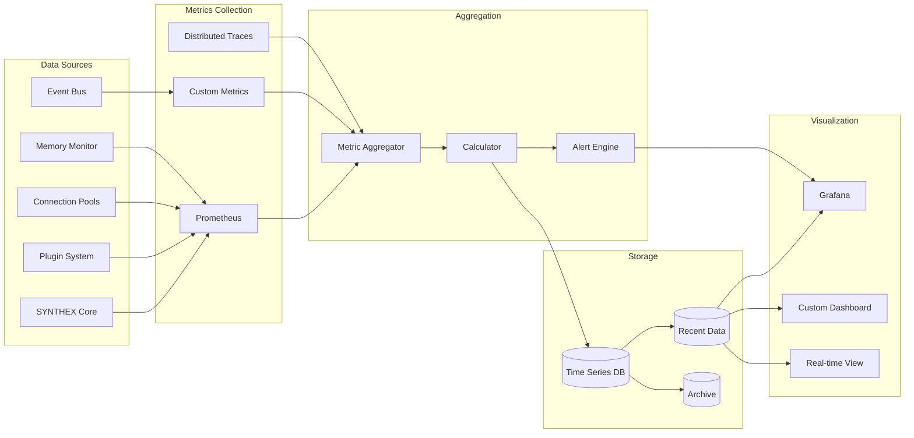

## Deployment Pipeline Flow

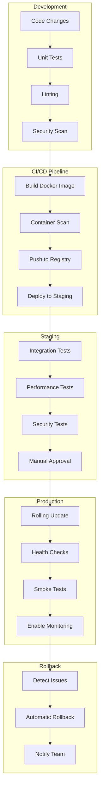

## Data Privacy & Compliance Flow

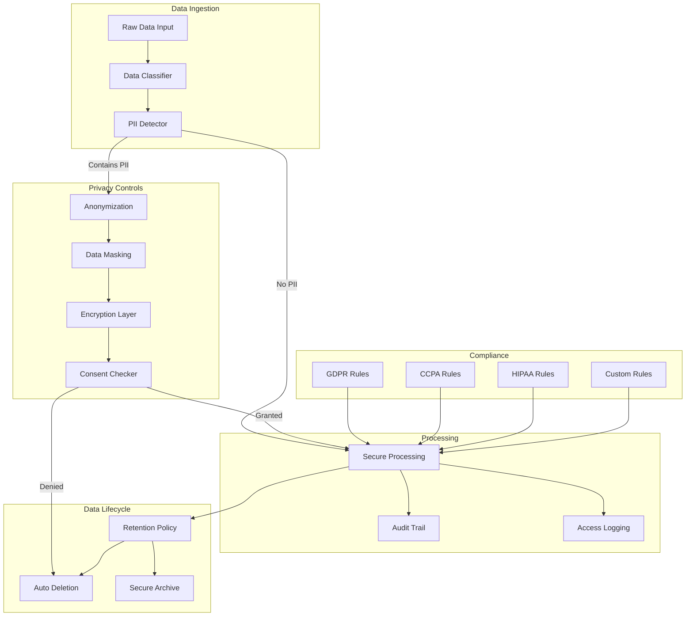

## Performance Optimization Flow

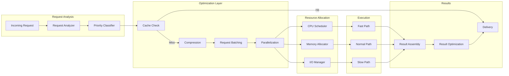

These diagrams illustrate the comprehensive data flow throughout the SYNTHEX system, showing how it integrates with CODE's existing infrastructure while maintaining security, performance, and reliability.