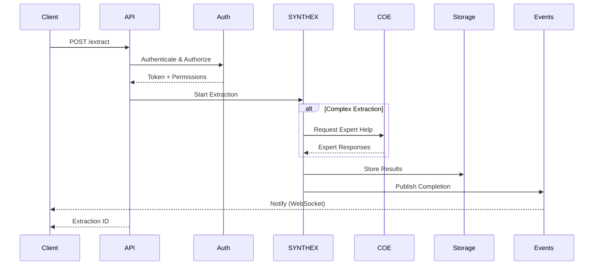
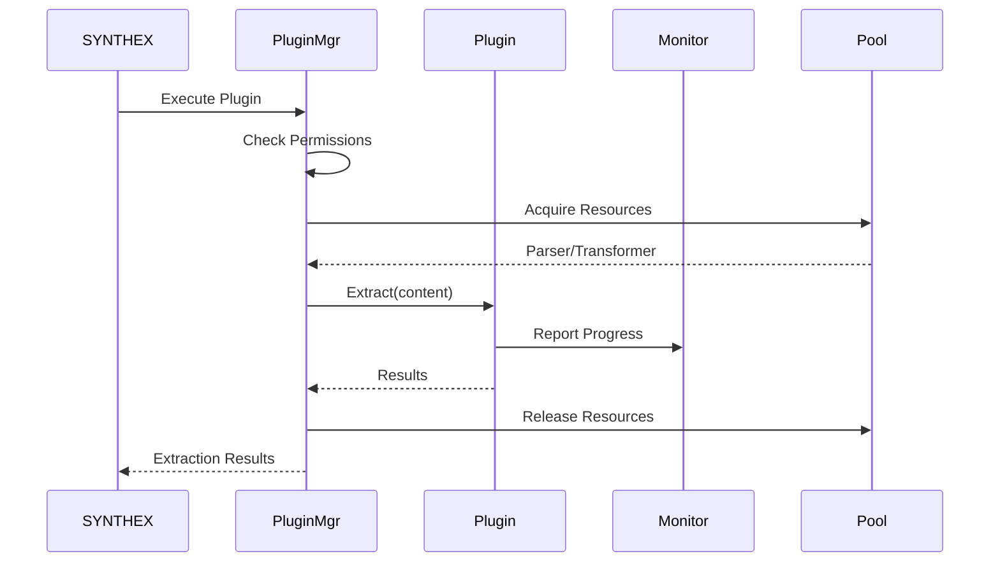

# SYNTHEX Integration Architecture

## Executive Summary

SYNTHEX (Synthetic Content Extraction System) is designed as a fully integrated component of the CODE infrastructure, leveraging existing services for authentication, monitoring, connection management, and expert coordination. This architecture ensures loose coupling, extensibility, and seamless integration with the existing ecosystem.

## Architecture Overview

```mermaid
graph TB
    subgraph "External Systems"
        WEB[Web Sources]
        API[External APIs]
        DOCS[Document Sources]
        MEDIA[Media Sources]
    end

    subgraph "SYNTHEX Core"
        subgraph "API Layer"
            REST[REST API]
            GQL[GraphQL API]
            GRPC[gRPC Service]
        end

        subgraph "Extraction Engine"
            EXT[Extraction Manager]
            PARSE[Parser Pool]
            TRANS[Transformer Pool]
            VALID[Validator Pool]
        end

        subgraph "Plugin System"
            PLUG[Plugin Manager]
            PAPI[Plugin API]
            PREG[Plugin Registry]
        end
    end

    subgraph "CODE Infrastructure Integration"
        subgraph "Authentication & Security"
            RBAC[RBAC Manager]
            AUTH[Auth Middleware]
            AUDIT[Audit Logger]
        end

        subgraph "Expert Coordination"
            COE[Circle of Experts]
            EXPERT[Expert Manager]
            QUERY[Query Handler]
        end

        subgraph "Resource Management"
            CONN[Connection Pool Manager]
            OBJ[Object Pool Manager]
            MEM[Memory Monitor]
        end

        subgraph "Monitoring & Logging"
            PROM[Prometheus Metrics]
            LOG[Centralized Logging]
            TRACE[Distributed Tracing]
        end

        subgraph "Event System"
            BUS[Event Bus]
            NOTIFY[Notification Service]
            STREAM[Event Streams]
        end
    end

    subgraph "Data Layer"
        CACHE[Redis Cache]
        DB[(PostgreSQL)]
        S3[S3 Storage]
        QUEUE[Message Queue]
    end

    %% External connections
    WEB --> REST
    API --> REST
    DOCS --> REST
    MEDIA --> REST

    %% API to Engine
    REST --> EXT
    GQL --> EXT
    GRPC --> EXT

    %% Engine components
    EXT --> PARSE
    EXT --> TRANS
    EXT --> VALID
    EXT --> PLUG

    %% Plugin connections
    PLUG --> PAPI
    PAPI --> PREG

    %% Authentication flow
    REST --> AUTH
    GQL --> AUTH
    GRPC --> AUTH
    AUTH --> RBAC
    AUTH --> AUDIT

    %% Expert coordination
    EXT --> COE
    COE --> EXPERT
    EXPERT --> QUERY

    %% Resource management
    EXT --> CONN
    PARSE --> OBJ
    TRANS --> OBJ
    VALID --> OBJ
    EXT --> MEM

    %% Monitoring
    EXT --> PROM
    EXT --> LOG
    EXT --> TRACE

    %% Event system
    EXT --> BUS
    BUS --> NOTIFY
    BUS --> STREAM

    %% Data layer
    EXT --> CACHE
    EXT --> DB
    EXT --> S3
    BUS --> QUEUE
```



## Component Integration Details

### 1. Authentication & Security Integration

```python
# synthex/auth/integration.py
from src.auth.rbac import RBACManager, Permission
from src.auth.middleware import authenticate, require_permissions
from src.auth.audit import AuditLogger

class SynthexAuthIntegration:
    """Integration with CODE's authentication system"""
    
    def __init__(self, rbac_manager: RBACManager, audit_logger: AuditLogger):
        self.rbac = rbac_manager
        self.audit = audit_logger
        self._register_permissions()
    
    def _register_permissions(self):
        """Register SYNTHEX-specific permissions"""
        # Define SYNTHEX resources
        resources = [
            "synthex.extraction",
            "synthex.plugin",
            "synthex.config",
            "synthex.result"
        ]
        
        # Define actions
        actions = ["create", "read", "update", "delete", "execute"]
        
        # Register permissions
        for resource in resources:
            for action in actions:
                perm = Permission(resource=resource, action=action)
                # Permissions are automatically available
```

### 2. Circle of Experts Integration

```python
# synthex/experts/integration.py
from src.circle_of_experts.core.expert_manager import ExpertManager
from src.circle_of_experts.models.query import QueryType, QueryPriority

class SynthexExpertIntegration:
    """Integration with Circle of Experts for complex extractions"""
    
    def __init__(self, expert_manager: ExpertManager):
        self.expert_manager = expert_manager
    
    async def request_expert_extraction(
        self,
        content: str,
        extraction_type: str,
        context: dict
    ):
        """Request expert assistance for complex extraction"""
        return await self.expert_manager.consult_experts(
            title=f"SYNTHEX Extraction: {extraction_type}",
            content=content,
            requester="synthex_system",
            query_type=QueryType.TECHNICAL,
            priority=QueryPriority.HIGH,
            context={
                "extraction_type": extraction_type,
                "synthex_context": context
            },
            wait_for_responses=True,
            min_responses=2
        )
```

### 3. Connection Management Integration

```python
# synthex/connections/integration.py
from src.core.connections import ConnectionPoolManager, HTTPConnectionPool
from src.core.circuit_breaker_config import CircuitBreakerConfig

class SynthexConnectionManager:
    """Manage connections for external data sources"""
    
    def __init__(self, pool_manager: ConnectionPoolManager):
        self.pool_manager = pool_manager
        self.http_pool = pool_manager.http_pool
        
    async def fetch_external_content(self, url: str, **kwargs):
        """Fetch content using managed connection pool"""
        async with self.http_pool.get_session(url) as session:
            return await session.get(url, **kwargs)
```

### 4. Memory Optimization Integration

```python
# synthex/memory/integration.py
from src.core.object_pool import ObjectPool, PooledObject
from src.core.memory_monitor import get_memory_monitor
from src.monitoring.memory_monitor import MemoryMonitor

class SynthexParser(PooledObject):
    """Pooled parser for memory efficiency"""
    
    def __init__(self):
        super().__init__()
        self.parser = None
        self.buffer = []
    
    def reset(self):
        """Reset parser state for reuse"""
        super().reset()
        self.buffer.clear()
        if self.parser:
            self.parser.reset()

class SynthexMemoryIntegration:
    """Memory-optimized SYNTHEX components"""
    
    def __init__(self):
        # Create object pools
        self.parser_pool = ObjectPool(
            factory=SynthexParser,
            max_size=20,
            name="synthex_parsers"
        )
        
        # Register with memory monitor
        monitor = get_memory_monitor()
        monitor.register_component("synthex", self)
    
    def get_memory_usage(self) -> int:
        """Report memory usage for monitoring"""
        # Implementation to calculate SYNTHEX memory usage
        return 0
```

### 5. Monitoring & Metrics Integration

```python
# synthex/monitoring/integration.py
from src.monitoring.metrics import get_metrics_collector
from src.core.logging_config import get_logger, get_performance_logger

class SynthexMonitoring:
    """Integration with monitoring infrastructure"""
    
    def __init__(self):
        self.metrics = get_metrics_collector()
        self.logger = get_logger("synthex")
        self.perf_logger = get_performance_logger("synthex.performance")
    
    def record_extraction(
        self,
        extraction_type: str,
        source: str,
        duration: float,
        success: bool,
        items_extracted: int = 0
    ):
        """Record extraction metrics"""
        self.metrics.business_operations_total.labels(
            operation=f"synthex_extraction_{extraction_type}",
            status="success" if success else "error"
        ).inc()
        
        self.metrics.business_operation_duration_seconds.labels(
            operation=f"synthex_extraction_{extraction_type}"
        ).observe(duration)
        
        # Custom SYNTHEX metrics
        if not hasattr(self.metrics, 'synthex_items_extracted'):
            from prometheus_client import Counter
            self.metrics.synthex_items_extracted = Counter(
                'synthex_items_extracted_total',
                'Total items extracted by SYNTHEX',
                ['extraction_type', 'source']
            )
        
        if success and items_extracted > 0:
            self.metrics.synthex_items_extracted.labels(
                extraction_type=extraction_type,
                source=source
            ).inc(items_extracted)
```

### 6. Event Bus Integration

```python
# synthex/events/integration.py
import asyncio
from typing import Dict, Any, Callable, List
from dataclasses import dataclass
from datetime import datetime

@dataclass
class SynthexEvent:
    """Base event for SYNTHEX operations"""
    event_type: str
    timestamp: datetime
    source: str
    data: Dict[str, Any]

class SynthexEventBus:
    """Event bus for SYNTHEX notifications"""
    
    def __init__(self):
        self._subscribers: Dict[str, List[Callable]] = {}
        self._event_queue: asyncio.Queue = asyncio.Queue()
        self._running = False
    
    async def start(self):
        """Start event processing"""
        self._running = True
        asyncio.create_task(self._process_events())
    
    async def stop(self):
        """Stop event processing"""
        self._running = False
    
    async def publish(self, event: SynthexEvent):
        """Publish event to bus"""
        await self._event_queue.put(event)
    
    def subscribe(self, event_type: str, handler: Callable):
        """Subscribe to event type"""
        if event_type not in self._subscribers:
            self._subscribers[event_type] = []
        self._subscribers[event_type].append(handler)
    
    async def _process_events(self):
        """Process events from queue"""
        while self._running:
            try:
                event = await asyncio.wait_for(
                    self._event_queue.get(),
                    timeout=1.0
                )
                
                # Notify subscribers
                handlers = self._subscribers.get(event.event_type, [])
                for handler in handlers:
                    try:
                        await handler(event)
                    except Exception as e:
                        # Log error but continue processing
                        pass
                        
            except asyncio.TimeoutError:
                continue
```

### 7. Logging Integration

```python
# synthex/logging/integration.py
from src.core.logging_config import (
    log_with_context,
    correlation_context,
    get_security_logger
)

class SynthexLogging:
    """Centralized logging for SYNTHEX"""
    
    def __init__(self):
        self.logger = get_logger("synthex")
        self.security_logger = get_security_logger("synthex.security")
    
    def log_extraction_start(
        self,
        extraction_id: str,
        source: str,
        extraction_type: str,
        user: str
    ):
        """Log extraction start with correlation"""
        with correlation_context(extraction_id):
            log_with_context(
                self.logger,
                logging.INFO,
                "Starting extraction",
                extraction_id=extraction_id,
                source=source,
                extraction_type=extraction_type,
                user=user
            )
            
            # Security audit
            self.security_logger.log_access(
                resource=f"synthex:{source}",
                action="extract",
                user=user,
                result="started"
            )
```

### 8. Plugin Architecture

```python
# synthex/plugins/base.py
from abc import ABC, abstractmethod
from typing import Dict, Any, List
from dataclasses import dataclass

@dataclass
class PluginMetadata:
    """Plugin metadata"""
    name: str
    version: str
    author: str
    description: str
    supported_types: List[str]
    required_permissions: List[str]

class SynthexPlugin(ABC):
    """Base class for SYNTHEX plugins"""
    
    @abstractmethod
    def get_metadata(self) -> PluginMetadata:
        """Get plugin metadata"""
        pass
    
    @abstractmethod
    async def extract(
        self,
        content: Any,
        options: Dict[str, Any]
    ) -> Dict[str, Any]:
        """Extract data from content"""
        pass
    
    @abstractmethod
    def validate_options(self, options: Dict[str, Any]) -> bool:
        """Validate extraction options"""
        pass

class PluginManager:
    """Manage SYNTHEX plugins"""
    
    def __init__(self, rbac_manager: RBACManager):
        self.plugins: Dict[str, SynthexPlugin] = {}
        self.rbac = rbac_manager
    
    def register_plugin(self, plugin: SynthexPlugin):
        """Register a plugin"""
        metadata = plugin.get_metadata()
        
        # Validate permissions
        for perm in metadata.required_permissions:
            if not self.rbac.validate_permission(*perm.split(':')):
                raise ValueError(f"Invalid permission: {perm}")
        
        self.plugins[metadata.name] = plugin
    
    async def execute_plugin(
        self,
        plugin_name: str,
        content: Any,
        options: Dict[str, Any],
        user_roles: List[str]
    ):
        """Execute plugin with permission check"""
        plugin = self.plugins.get(plugin_name)
        if not plugin:
            raise ValueError(f"Plugin not found: {plugin_name}")
        
        # Check permissions
        metadata = plugin.get_metadata()
        for perm in metadata.required_permissions:
            resource, action = perm.split(':')
            if not self.rbac.check_permission(user_roles, resource, action):
                raise PermissionError(f"Missing permission: {perm}")
        
        # Validate options
        if not plugin.validate_options(options):
            raise ValueError("Invalid plugin options")
        
        # Execute extraction
        return await plugin.extract(content, options)
```

## Data Flow

### 1. Extraction Request Flow



### 2. Plugin Execution Flow



## API Design

### REST API Endpoints

```yaml
openapi: 3.0.0
info:
  title: SYNTHEX API
  version: 1.0.0

paths:
  /api/v1/synthex/extract:
    post:
      summary: Create extraction job
      security:
        - bearerAuth: []
      requestBody:
        content:
          application/json:
            schema:
              type: object
              properties:
                source:
                  type: string
                  enum: [url, file, text]
                content:
                  type: string
                extraction_type:
                  type: string
                options:
                  type: object
                priority:
                  type: string
                  enum: [low, medium, high]
      responses:
        201:
          description: Extraction job created
          content:
            application/json:
              schema:
                type: object
                properties:
                  job_id:
                    type: string
                  status:
                    type: string
                  estimated_completion:
                    type: string
                    format: date-time

  /api/v1/synthex/jobs/{job_id}:
    get:
      summary: Get extraction job status
      security:
        - bearerAuth: []
      parameters:
        - name: job_id
          in: path
          required: true
          schema:
            type: string
      responses:
        200:
          description: Job status
          content:
            application/json:
              schema:
                type: object
                properties:
                  job_id:
                    type: string
                  status:
                    type: string
                    enum: [pending, processing, completed, failed]
                  progress:
                    type: integer
                  results:
                    type: object
                  errors:
                    type: array

  /api/v1/synthex/plugins:
    get:
      summary: List available plugins
      security:
        - bearerAuth: []
      responses:
        200:
          description: Plugin list
          content:
            application/json:
              schema:
                type: array
                items:
                  type: object
                  properties:
                    name:
                      type: string
                    version:
                      type: string
                    supported_types:
                      type: array
                      items:
                        type: string
```

### GraphQL Schema

```graphql
type Query {
  extraction(id: ID!): Extraction
  extractions(
    filter: ExtractionFilter
    pagination: PaginationInput
  ): ExtractionConnection!
  
  plugin(name: String!): Plugin
  plugins: [Plugin!]!
}

type Mutation {
  createExtraction(input: CreateExtractionInput!): Extraction!
  cancelExtraction(id: ID!): Extraction!
  
  installPlugin(input: InstallPluginInput!): Plugin!
  uninstallPlugin(name: String!): Boolean!
}

type Subscription {
  extractionProgress(id: ID!): ExtractionProgress!
  extractionCompleted(userId: ID): Extraction!
}

type Extraction {
  id: ID!
  source: String!
  type: String!
  status: ExtractionStatus!
  progress: Int!
  results: JSON
  errors: [Error!]
  createdAt: DateTime!
  completedAt: DateTime
  user: User!
}

enum ExtractionStatus {
  PENDING
  PROCESSING
  COMPLETED
  FAILED
  CANCELLED
}

type Plugin {
  name: String!
  version: String!
  author: String!
  description: String!
  supportedTypes: [String!]!
  requiredPermissions: [String!]!
  installed: Boolean!
}
```

## Deployment Architecture

### Kubernetes Deployment

```yaml
apiVersion: apps/v1
kind: Deployment
metadata:
  name: synthex
  namespace: code-system
spec:
  replicas: 3
  selector:
    matchLabels:
      app: synthex
  template:
    metadata:
      labels:
        app: synthex
    spec:
      serviceAccountName: synthex-sa
      containers:
      - name: synthex
        image: code-system/synthex:latest
        env:
        - name: ENVIRONMENT
          value: production
        - name: REDIS_URL
          valueFrom:
            secretKeyRef:
              name: synthex-secrets
              key: redis-url
        - name: DATABASE_URL
          valueFrom:
            secretKeyRef:
              name: synthex-secrets
              key: database-url
        resources:
          requests:
            memory: "512Mi"
            cpu: "500m"
          limits:
            memory: "2Gi"
            cpu: "2000m"
        livenessProbe:
          httpGet:
            path: /health
            port: 8080
          initialDelaySeconds: 30
          periodSeconds: 10
        readinessProbe:
          httpGet:
            path: /ready
            port: 8080
          initialDelaySeconds: 5
          periodSeconds: 5
```

### Service Configuration

```yaml
apiVersion: v1
kind: Service
metadata:
  name: synthex-service
  namespace: code-system
spec:
  selector:
    app: synthex
  ports:
  - name: http
    port: 80
    targetPort: 8080
  - name: grpc
    port: 9090
    targetPort: 9090
  type: ClusterIP
```

## Security Considerations

### 1. Authentication & Authorization
- All API endpoints require authentication via JWT tokens
- Fine-grained permissions using RBAC
- Audit logging for all extraction operations

### 2. Input Validation
- Strict input validation for all extraction requests
- Content sanitization to prevent injection attacks
- File type and size restrictions

### 3. Resource Limits
- CPU and memory limits per extraction job
- Rate limiting per user/API key
- Timeout configurations for long-running extractions

### 4. Data Protection
- Encryption at rest for stored extraction results
- TLS for all network communications
- Temporary data cleanup after processing

## Performance Optimization

### 1. Caching Strategy
- Redis cache for frequently accessed content
- LRU cache for parsed documents
- Result caching with TTL

### 2. Resource Pooling
- Object pools for parsers and transformers
- Connection pooling for external sources
- Worker pool for parallel processing

### 3. Async Processing
- Non-blocking I/O for all operations
- Background job processing with Celery
- Event-driven architecture for scalability

## Monitoring & Observability

### 1. Metrics
- Extraction success/failure rates
- Processing time percentiles
- Resource utilization metrics
- Plugin performance metrics

### 2. Logging
- Structured JSON logging
- Correlation IDs for request tracing
- Security audit trails

### 3. Alerting
- Memory pressure alerts
- Failed extraction alerts
- SLA violation alerts
- Security incident alerts

## Extensibility

### 1. Plugin Development
- Well-defined plugin API
- Plugin scaffolding tools
- Testing framework for plugins

### 2. Custom Extractors
- Base classes for common patterns
- Helper utilities for parsing
- Validation frameworks

### 3. Integration Points
- Webhook notifications
- Custom event handlers
- External processing pipelines

## Migration Strategy

### Phase 1: Core Integration
1. Integrate authentication and RBAC
2. Set up monitoring and logging
3. Implement connection pooling

### Phase 2: Feature Development
1. Build extraction engine
2. Implement plugin system
3. Add expert coordination

### Phase 3: Production Readiness
1. Performance optimization
2. Security hardening
3. Documentation and training

## Conclusion

The SYNTHEX integration architecture leverages all existing CODE infrastructure components while maintaining loose coupling and extensibility. This design ensures:

1. **Seamless Integration**: Native support for CODE's authentication, monitoring, and resource management
2. **Scalability**: Horizontal scaling with Kubernetes and async processing
3. **Extensibility**: Plugin architecture for custom extractors
4. **Observability**: Comprehensive monitoring and logging
5. **Security**: Fine-grained access control and audit trails

The architecture is designed to grow with the system's needs while maintaining the high standards of the CODE platform.