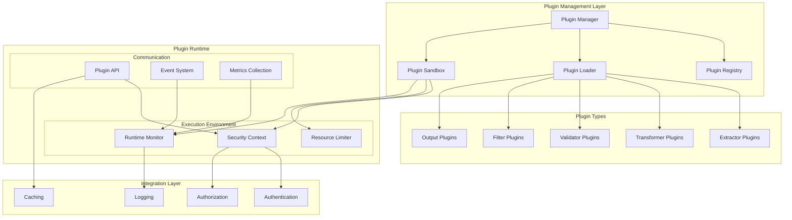

# SYNTHEX Plugin Architecture

## Overview

The SYNTHEX Plugin Architecture provides a comprehensive framework for extending extraction capabilities while maintaining security, performance, and reliability. The architecture supports multiple plugin types, sandboxed execution, and seamless integration with CODE's existing infrastructure.

## Plugin System Architecture



## Plugin Types and Interfaces

### 1. Base Plugin Interface

```python
# synthex/plugins/base.py
from abc import ABC, abstractmethod
from typing import Dict, Any, List, Optional, AsyncIterator
from dataclasses import dataclass
from enum import Enum

class PluginType(Enum):
    EXTRACTOR = "extractor"
    TRANSFORMER = "transformer"
    VALIDATOR = "validator"
    FILTER = "filter"
    OUTPUT = "output"

class ExecutionMode(Enum):
    SYNC = "sync"
    ASYNC = "async"
    STREAMING = "streaming"

@dataclass
class PluginCapability:
    """Plugin capability definition"""
    name: str
    version: str
    description: str
    input_types: List[str]
    output_types: List[str]
    parameters: Dict[str, Any]

@dataclass
class PluginMetadata:
    """Complete plugin metadata"""
    name: str
    version: str
    author: str
    description: str
    homepage: str
    license: str
    
    # Technical specifications
    plugin_type: PluginType
    execution_mode: ExecutionMode
    capabilities: List[PluginCapability]
    
    # Requirements
    python_version: str
    dependencies: List[str]
    required_permissions: List[str]
    resource_limits: Dict[str, Any]
    
    # Integration
    supported_platforms: List[str]
    config_schema: Dict[str, Any]
    health_check_endpoint: Optional[str]

class PluginContext:
    """Runtime context for plugin execution"""
    
    def __init__(
        self,
        request_id: str,
        user_id: str,
        permissions: List[str],
        config: Dict[str, Any],
        logger: Any,
        metrics: Any
    ):
        self.request_id = request_id
        self.user_id = user_id
        self.permissions = permissions
        self.config = config
        self.logger = logger
        self.metrics = metrics
        self._shared_data: Dict[str, Any] = {}
    
    def get_shared_data(self, key: str) -> Any:
        """Get shared data between plugins"""
        return self._shared_data.get(key)
    
    def set_shared_data(self, key: str, value: Any) -> None:
        """Set shared data for other plugins"""
        self._shared_data[key] = value

class SynthexPlugin(ABC):
    """Base class for all SYNTHEX plugins"""
    
    @abstractmethod
    def get_metadata(self) -> PluginMetadata:
        """Get plugin metadata"""
        pass
    
    @abstractmethod
    async def initialize(self, config: Dict[str, Any]) -> None:
        """Initialize plugin with configuration"""
        pass
    
    @abstractmethod
    async def execute(
        self,
        input_data: Any,
        context: PluginContext,
        options: Dict[str, Any]
    ) -> Any:
        """Execute plugin operation"""
        pass
    
    @abstractmethod
    async def validate_input(
        self,
        input_data: Any,
        options: Dict[str, Any]
    ) -> bool:
        """Validate input data"""
        pass
    
    @abstractmethod
    async def cleanup(self) -> None:
        """Cleanup plugin resources"""
        pass
    
    async def health_check(self) -> Dict[str, Any]:
        """Plugin health check"""
        return {
            "status": "healthy",
            "timestamp": datetime.utcnow().isoformat()
        }
```

### 2. Extractor Plugin Interface

```python
# synthex/plugins/extractors.py
from typing import AsyncIterator, Union
from .base import SynthexPlugin, PluginType

class ExtractorPlugin(SynthexPlugin):
    """Base class for extraction plugins"""
    
    @abstractmethod
    async def extract(
        self,
        source: Union[str, bytes, Any],
        context: PluginContext,
        options: Dict[str, Any]
    ) -> AsyncIterator[Dict[str, Any]]:
        """
        Extract structured data from source.
        
        Args:
            source: Input data (URL, file content, raw data)
            context: Execution context
            options: Extraction options
            
        Yields:
            Extracted data items
        """
        pass
    
    @abstractmethod
    def get_supported_formats(self) -> List[str]:
        """Get list of supported input formats"""
        pass
    
    @abstractmethod
    def estimate_processing_time(
        self,
        source_size: int,
        options: Dict[str, Any]
    ) -> float:
        """Estimate processing time in seconds"""
        pass

# Example: Web Scraper Plugin
class WebScraperPlugin(ExtractorPlugin):
    """Plugin for extracting data from web pages"""
    
    def get_metadata(self) -> PluginMetadata:
        return PluginMetadata(
            name="web_scraper",
            version="1.0.0",
            author="CODE Team",
            description="Extract structured data from web pages",
            homepage="https://code-system.dev/plugins/web-scraper",
            license="MIT",
            plugin_type=PluginType.EXTRACTOR,
            execution_mode=ExecutionMode.ASYNC,
            capabilities=[
                PluginCapability(
                    name="html_extraction",
                    version="1.0",
                    description="Extract data from HTML content",
                    input_types=["text/html", "application/xhtml+xml"],
                    output_types=["application/json"],
                    parameters={
                        "selectors": {"type": "object", "required": True},
                        "follow_links": {"type": "boolean", "default": False},
                        "max_depth": {"type": "integer", "default": 1, "min": 1, "max": 5}
                    }
                )
            ],
            python_version=">=3.8",
            dependencies=["beautifulsoup4>=4.9.0", "requests>=2.25.0"],
            required_permissions=["synthex.extraction:execute", "network:access"],
            resource_limits={
                "max_memory_mb": 256,
                "max_cpu_percent": 50,
                "max_execution_time": 300
            },
            supported_platforms=["linux", "darwin", "windows"],
            config_schema={
                "type": "object",
                "properties": {
                    "user_agent": {"type": "string"},
                    "timeout": {"type": "integer", "default": 30},
                    "headers": {"type": "object"}
                }
            }
        )
    
    async def initialize(self, config: Dict[str, Any]) -> None:
        """Initialize web scraper"""
        import aiohttp
        self.session = aiohttp.ClientSession(
            timeout=aiohttp.ClientTimeout(total=config.get("timeout", 30)),
            headers=config.get("headers", {})
        )
    
    async def extract(
        self,
        source: str,
        context: PluginContext,
        options: Dict[str, Any]
    ) -> AsyncIterator[Dict[str, Any]]:
        """Extract data from web page"""
        from bs4 import BeautifulSoup
        
        # Fetch page content
        async with self.session.get(source) as response:
            content = await response.text()
        
        # Parse HTML
        soup = BeautifulSoup(content, 'html.parser')
        
        # Extract data based on selectors
        selectors = options.get("selectors", {})
        
        for name, selector in selectors.items():
            elements = soup.select(selector)
            for element in elements:
                yield {
                    "field": name,
                    "value": element.get_text(strip=True),
                    "attributes": dict(element.attrs),
                    "source_url": source
                }
    
    def get_supported_formats(self) -> List[str]:
        return ["text/html", "application/xhtml+xml"]
    
    def estimate_processing_time(
        self,
        source_size: int,
        options: Dict[str, Any]
    ) -> float:
        # Estimate based on content size and complexity
        base_time = 2.0  # Base overhead
        size_factor = source_size / 1024 / 1024 * 0.5  # 0.5s per MB
        complexity_factor = len(options.get("selectors", {})) * 0.1
        
        return base_time + size_factor + complexity_factor
```

### 3. Transformer Plugin Interface

```python
# synthex/plugins/transformers.py
class TransformerPlugin(SynthexPlugin):
    """Base class for data transformation plugins"""
    
    @abstractmethod
    async def transform(
        self,
        data: Any,
        context: PluginContext,
        options: Dict[str, Any]
    ) -> Any:
        """
        Transform input data to desired format.
        
        Args:
            data: Input data to transform
            context: Execution context
            options: Transformation options
            
        Returns:
            Transformed data
        """
        pass
    
    @abstractmethod
    def get_input_schema(self) -> Dict[str, Any]:
        """Get JSON schema for input validation"""
        pass
    
    @abstractmethod
    def get_output_schema(self) -> Dict[str, Any]:
        """Get JSON schema for output validation"""
        pass

# Example: Data Enrichment Plugin
class DataEnrichmentPlugin(TransformerPlugin):
    """Plugin for enriching extracted data"""
    
    def get_metadata(self) -> PluginMetadata:
        return PluginMetadata(
            name="data_enrichment",
            version="1.0.0",
            author="CODE Team",
            description="Enrich extracted data with additional information",
            homepage="https://code-system.dev/plugins/data-enrichment",
            license="MIT",
            plugin_type=PluginType.TRANSFORMER,
            execution_mode=ExecutionMode.ASYNC,
            capabilities=[
                PluginCapability(
                    name="entity_enrichment",
                    version="1.0",
                    description="Enrich entities with metadata",
                    input_types=["application/json"],
                    output_types=["application/json"],
                    parameters={
                        "enrich_entities": {"type": "boolean", "default": True},
                        "add_timestamps": {"type": "boolean", "default": True},
                        "add_metadata": {"type": "boolean", "default": True}
                    }
                )
            ],
            python_version=">=3.8",
            dependencies=["requests>=2.25.0"],
            required_permissions=["synthex.transformation:execute"],
            resource_limits={
                "max_memory_mb": 128,
                "max_cpu_percent": 30,
                "max_execution_time": 60
            },
            supported_platforms=["linux", "darwin", "windows"],
            config_schema={
                "type": "object",
                "properties": {
                    "api_keys": {"type": "object"},
                    "cache_ttl": {"type": "integer", "default": 3600}
                }
            }
        )
    
    async def transform(
        self,
        data: Dict[str, Any],
        context: PluginContext,
        options: Dict[str, Any]
    ) -> Dict[str, Any]:
        """Enrich data with additional information"""
        enriched_data = data.copy()
        
        # Add timestamps
        if options.get("add_timestamps", True):
            enriched_data["extracted_at"] = datetime.utcnow().isoformat()
            enriched_data["enriched_at"] = datetime.utcnow().isoformat()
        
        # Add metadata
        if options.get("add_metadata", True):
            enriched_data["_metadata"] = {
                "plugin": "data_enrichment",
                "version": "1.0.0",
                "request_id": context.request_id,
                "user_id": context.user_id
            }
        
        # Enrich entities
        if options.get("enrich_entities", True):
            enriched_data = await self._enrich_entities(enriched_data, context)
        
        return enriched_data
    
    async def _enrich_entities(
        self,
        data: Dict[str, Any],
        context: PluginContext
    ) -> Dict[str, Any]:
        """Enrich entities with external data"""
        # Implementation would call external APIs for entity enrichment
        return data
```

### 4. Validator Plugin Interface

```python
# synthex/plugins/validators.py
class ValidationResult:
    """Result of validation operation"""
    
    def __init__(self, is_valid: bool, errors: List[str] = None, warnings: List[str] = None):
        self.is_valid = is_valid
        self.errors = errors or []
        self.warnings = warnings or []
        self.score = 1.0 if is_valid else 0.0

class ValidatorPlugin(SynthexPlugin):
    """Base class for validation plugins"""
    
    @abstractmethod
    async def validate(
        self,
        data: Any,
        context: PluginContext,
        options: Dict[str, Any]
    ) -> ValidationResult:
        """
        Validate extracted data.
        
        Args:
            data: Data to validate
            context: Execution context
            options: Validation options
            
        Returns:
            Validation result
        """
        pass
    
    @abstractmethod
    def get_validation_rules(self) -> Dict[str, Any]:
        """Get validation rules schema"""
        pass

# Example: Schema Validation Plugin
class SchemaValidatorPlugin(ValidatorPlugin):
    """Plugin for validating data against JSON schemas"""
    
    def get_metadata(self) -> PluginMetadata:
        return PluginMetadata(
            name="schema_validator",
            version="1.0.0",
            author="CODE Team",
            description="Validate extracted data against JSON schemas",
            homepage="https://code-system.dev/plugins/schema-validator",
            license="MIT",
            plugin_type=PluginType.VALIDATOR,
            execution_mode=ExecutionMode.SYNC,
            capabilities=[
                PluginCapability(
                    name="json_schema_validation",
                    version="1.0",
                    description="Validate against JSON Schema",
                    input_types=["application/json"],
                    output_types=["application/json"],
                    parameters={
                        "schema": {"type": "object", "required": True},
                        "strict": {"type": "boolean", "default": False}
                    }
                )
            ],
            python_version=">=3.8",
            dependencies=["jsonschema>=3.2.0"],
            required_permissions=["synthex.validation:execute"],
            resource_limits={
                "max_memory_mb": 64,
                "max_cpu_percent": 20,
                "max_execution_time": 30
            },
            supported_platforms=["linux", "darwin", "windows"],
            config_schema={
                "type": "object",
                "properties": {
                    "default_schemas": {"type": "object"}
                }
            }
        )
    
    async def validate(
        self,
        data: Any,
        context: PluginContext,
        options: Dict[str, Any]
    ) -> ValidationResult:
        """Validate data against JSON schema"""
        import jsonschema
        
        schema = options.get("schema")
        if not schema:
            return ValidationResult(False, ["No schema provided"])
        
        try:
            jsonschema.validate(data, schema)
            return ValidationResult(True)
        except jsonschema.ValidationError as e:
            return ValidationResult(False, [str(e)])
        except Exception as e:
            return ValidationResult(False, [f"Validation error: {e}"])
```

## Plugin Manager Implementation

```python
# synthex/plugins/manager.py
import asyncio
import importlib
import inspect
from typing import Dict, List, Optional, Type
from pathlib import Path
import json
import hashlib

from src.auth.rbac import RBACManager
from src.core.logging_config import get_logger
from src.monitoring.metrics import get_metrics_collector

class PluginLoadError(Exception):
    """Plugin loading error"""
    pass

class PluginExecutionError(Exception):
    """Plugin execution error"""
    pass

class PluginManager:
    """Manages plugin lifecycle and execution"""
    
    def __init__(
        self,
        rbac_manager: RBACManager,
        plugin_dir: Path = Path("plugins"),
        sandbox_enabled: bool = True
    ):
        self.rbac = rbac_manager
        self.plugin_dir = plugin_dir
        self.sandbox_enabled = sandbox_enabled
        
        # Plugin registry
        self.plugins: Dict[str, SynthexPlugin] = {}
        self.metadata_cache: Dict[str, PluginMetadata] = {}
        
        # Runtime tracking
        self.active_executions: Dict[str, Dict[str, Any]] = {}
        
        # Monitoring
        self.logger = get_logger(__name__)
        self.metrics = get_metrics_collector()
        
        # Initialize plugin directory
        self.plugin_dir.mkdir(parents=True, exist_ok=True)
    
    async def load_plugin(self, plugin_path: Path) -> str:
        """Load a plugin from file"""
        try:
            # Validate plugin file
            if not plugin_path.exists():
                raise PluginLoadError(f"Plugin file not found: {plugin_path}")
            
            # Calculate plugin hash for versioning
            with open(plugin_path, 'rb') as f:
                plugin_hash = hashlib.sha256(f.read()).hexdigest()[:16]
            
            # Import plugin module
            spec = importlib.util.spec_from_file_location(
                f"plugin_{plugin_hash}",
                plugin_path
            )
            module = importlib.util.module_from_spec(spec)
            spec.loader.exec_module(module)
            
            # Find plugin class
            plugin_class = None
            for name, obj in inspect.getmembers(module):
                if (inspect.isclass(obj) and 
                    issubclass(obj, SynthexPlugin) and 
                    obj != SynthexPlugin):
                    plugin_class = obj
                    break
            
            if not plugin_class:
                raise PluginLoadError("No valid plugin class found")
            
            # Instantiate plugin
            plugin = plugin_class()
            metadata = plugin.get_metadata()
            
            # Validate metadata
            await self._validate_plugin_metadata(metadata)
            
            # Check permissions
            await self._validate_plugin_permissions(metadata)
            
            # Initialize plugin
            await plugin.initialize({})
            
            # Register plugin
            self.plugins[metadata.name] = plugin
            self.metadata_cache[metadata.name] = metadata
            
            self.logger.info(f"Loaded plugin: {metadata.name} v{metadata.version}")
            
            return metadata.name
            
        except Exception as e:
            self.logger.error(f"Failed to load plugin {plugin_path}: {e}")
            raise PluginLoadError(str(e))
    
    async def unload_plugin(self, plugin_name: str) -> None:
        """Unload a plugin"""
        if plugin_name not in self.plugins:
            raise PluginLoadError(f"Plugin not found: {plugin_name}")
        
        plugin = self.plugins[plugin_name]
        
        # Wait for active executions to complete
        await self._wait_for_executions(plugin_name)
        
        # Cleanup plugin
        await plugin.cleanup()
        
        # Remove from registry
        del self.plugins[plugin_name]
        del self.metadata_cache[plugin_name]
        
        self.logger.info(f"Unloaded plugin: {plugin_name}")
    
    async def execute_plugin(
        self,
        plugin_name: str,
        input_data: Any,
        context: PluginContext,
        options: Dict[str, Any]
    ) -> Any:
        """Execute a plugin"""
        if plugin_name not in self.plugins:
            raise PluginExecutionError(f"Plugin not found: {plugin_name}")
        
        plugin = self.plugins[plugin_name]
        metadata = self.metadata_cache[plugin_name]
        
        # Check permissions
        await self._check_execution_permissions(metadata, context)
        
        # Validate input
        if not await plugin.validate_input(input_data, options):
            raise PluginExecutionError("Input validation failed")
        
        # Track execution
        execution_id = f"{plugin_name}_{context.request_id}"
        self.active_executions[execution_id] = {
            "plugin_name": plugin_name,
            "context": context,
            "start_time": time.time()
        }
        
        try:
            # Execute with resource limits
            if self.sandbox_enabled:
                result = await self._execute_sandboxed(
                    plugin, input_data, context, options, metadata
                )
            else:
                result = await plugin.execute(input_data, context, options)
            
            # Record metrics
            self._record_execution_metrics(plugin_name, True, time.time() - 
                                        self.active_executions[execution_id]["start_time"])
            
            return result
            
        except Exception as e:
            self.logger.error(f"Plugin execution failed: {plugin_name}: {e}")
            self._record_execution_metrics(plugin_name, False, time.time() - 
                                        self.active_executions[execution_id]["start_time"])
            raise PluginExecutionError(str(e))
        
        finally:
            # Cleanup execution tracking
            self.active_executions.pop(execution_id, None)
    
    async def _execute_sandboxed(
        self,
        plugin: SynthexPlugin,
        input_data: Any,
        context: PluginContext,
        options: Dict[str, Any],
        metadata: PluginMetadata
    ) -> Any:
        """Execute plugin in sandboxed environment"""
        # Resource limits
        limits = metadata.resource_limits
        max_memory = limits.get("max_memory_mb", 256) * 1024 * 1024
        max_time = limits.get("max_execution_time", 300)
        
        # Create execution task with timeout
        task = asyncio.create_task(
            plugin.execute(input_data, context, options)
        )
        
        try:
            # Wait with timeout
            result = await asyncio.wait_for(task, timeout=max_time)
            return result
            
        except asyncio.TimeoutError:
            task.cancel()
            raise PluginExecutionError(f"Plugin execution timeout: {max_time}s")
    
    async def _validate_plugin_metadata(self, metadata: PluginMetadata) -> None:
        """Validate plugin metadata"""
        required_fields = ["name", "version", "author", "plugin_type"]
        for field in required_fields:
            if not getattr(metadata, field):
                raise PluginLoadError(f"Missing required field: {field}")
        
        # Validate version format
        if not re.match(r"^\d+\.\d+\.\d+$", metadata.version):
            raise PluginLoadError("Invalid version format")
    
    async def _validate_plugin_permissions(self, metadata: PluginMetadata) -> None:
        """Validate plugin permissions"""
        for permission in metadata.required_permissions:
            try:
                resource, action = permission.split(":", 1)
                if not self.rbac.validate_permission(resource, action):
                    raise PluginLoadError(f"Invalid permission: {permission}")
            except ValueError:
                raise PluginLoadError(f"Invalid permission format: {permission}")
    
    async def _check_execution_permissions(
        self,
        metadata: PluginMetadata,
        context: PluginContext
    ) -> None:
        """Check if user has permission to execute plugin"""
        for permission in metadata.required_permissions:
            resource, action = permission.split(":", 1)
            if not self.rbac.check_permission(context.permissions, resource, action):
                raise PluginExecutionError(f"Missing permission: {permission}")
    
    async def _wait_for_executions(self, plugin_name: str) -> None:
        """Wait for active executions to complete"""
        active = [
            exec_id for exec_id, info in self.active_executions.items()
            if info["plugin_name"] == plugin_name
        ]
        
        if active:
            self.logger.info(f"Waiting for {len(active)} active executions to complete")
            
            # Wait up to 30 seconds for completion
            for _ in range(30):
                active = [
                    exec_id for exec_id, info in self.active_executions.items()
                    if info["plugin_name"] == plugin_name
                ]
                if not active:
                    break
                await asyncio.sleep(1)
    
    def _record_execution_metrics(
        self,
        plugin_name: str,
        success: bool,
        duration: float
    ) -> None:
        """Record plugin execution metrics"""
        self.metrics.business_operations_total.labels(
            operation=f"plugin_execution_{plugin_name}",
            status="success" if success else "error"
        ).inc()
        
        self.metrics.business_operation_duration_seconds.labels(
            operation=f"plugin_execution_{plugin_name}"
        ).observe(duration)
    
    def list_plugins(self) -> List[PluginMetadata]:
        """List all loaded plugins"""
        return list(self.metadata_cache.values())
    
    def get_plugin_metadata(self, plugin_name: str) -> Optional[PluginMetadata]:
        """Get metadata for specific plugin"""
        return self.metadata_cache.get(plugin_name)
    
    async def health_check_all(self) -> Dict[str, Dict[str, Any]]:
        """Health check all plugins"""
        results = {}
        
        for name, plugin in self.plugins.items():
            try:
                health = await plugin.health_check()
                results[name] = health
            except Exception as e:
                results[name] = {
                    "status": "unhealthy",
                    "error": str(e),
                    "timestamp": datetime.utcnow().isoformat()
                }
        
        return results
```

## Plugin Development Kit (PDK)

```python
# synthex/pdk/__init__.py
"""
SYNTHEX Plugin Development Kit

Provides utilities and helpers for plugin development.
"""

from typing import Any, Dict, List, Optional
from dataclasses import dataclass
import json
import yaml
from pathlib import Path

class PluginTemplate:
    """Generate plugin templates"""
    
    @staticmethod
    def create_extractor_template(
        plugin_name: str,
        description: str,
        supported_formats: List[str]
    ) -> str:
        """Create extractor plugin template"""
        return f'''"""
{description}

Generated with SYNTHEX Plugin Development Kit
"""

from typing import AsyncIterator, Dict, Any, List
from synthex.plugins.extractors import ExtractorPlugin
from synthex.plugins.base import PluginMetadata, PluginType, ExecutionMode

class {plugin_name.title().replace('_', '')}Plugin(ExtractorPlugin):
    """Extract data from {', '.join(supported_formats)}"""
    
    def get_metadata(self) -> PluginMetadata:
        return PluginMetadata(
            name="{plugin_name}",
            version="1.0.0",
            author="Your Name",
            description="{description}",
            homepage="https://your-site.com",
            license="MIT",
            plugin_type=PluginType.EXTRACTOR,
            execution_mode=ExecutionMode.ASYNC,
            capabilities=[],
            python_version=">=3.8",
            dependencies=[],
            required_permissions=["synthex.extraction:execute"],
            resource_limits={{
                "max_memory_mb": 256,
                "max_cpu_percent": 50,
                "max_execution_time": 300
            }},
            supported_platforms=["linux", "darwin", "windows"],
            config_schema={{
                "type": "object",
                "properties": {{}}
            }}
        )
    
    async def initialize(self, config: Dict[str, Any]) -> None:
        """Initialize plugin"""
        self.config = config
    
    async def extract(
        self,
        source: Any,
        context: PluginContext,
        options: Dict[str, Any]
    ) -> AsyncIterator[Dict[str, Any]]:
        """Extract data from source"""
        # TODO: Implement extraction logic
        yield {{"placeholder": "data"}}
    
    def get_supported_formats(self) -> List[str]:
        return {supported_formats}
    
    def estimate_processing_time(
        self,
        source_size: int,
        options: Dict[str, Any]
    ) -> float:
        # TODO: Implement estimation logic
        return 1.0
    
    async def validate_input(
        self,
        input_data: Any,
        options: Dict[str, Any]
    ) -> bool:
        # TODO: Implement input validation
        return True
    
    async def cleanup(self) -> None:
        """Cleanup resources"""
        pass
'''

class PluginTester:
    """Testing utilities for plugins"""
    
    def __init__(self, plugin: SynthexPlugin):
        self.plugin = plugin
    
    async def test_initialization(self, config: Dict[str, Any]) -> bool:
        """Test plugin initialization"""
        try:
            await self.plugin.initialize(config)
            return True
        except Exception as e:
            print(f"Initialization failed: {e}")
            return False
    
    async def test_execution(
        self,
        test_data: Any,
        context: PluginContext,
        options: Dict[str, Any]
    ) -> bool:
        """Test plugin execution"""
        try:
            result = await self.plugin.execute(test_data, context, options)
            return result is not None
        except Exception as e:
            print(f"Execution failed: {e}")
            return False
    
    async def test_validation(
        self,
        test_data: Any,
        options: Dict[str, Any]
    ) -> bool:
        """Test input validation"""
        try:
            return await self.plugin.validate_input(test_data, options)
        except Exception as e:
            print(f"Validation failed: {e}")
            return False

class PluginValidator:
    """Validate plugin compliance"""
    
    @staticmethod
    def validate_metadata(metadata: PluginMetadata) -> List[str]:
        """Validate plugin metadata"""
        errors = []
        
        # Required fields
        required = ["name", "version", "author", "description"]
        for field in required:
            if not getattr(metadata, field):
                errors.append(f"Missing required field: {field}")
        
        # Version format
        import re
        if not re.match(r"^\d+\.\d+\.\d+$", metadata.version):
            errors.append("Invalid version format (must be x.y.z)")
        
        # Plugin name format
        if not re.match(r"^[a-z][a-z0-9_]*$", metadata.name):
            errors.append("Invalid plugin name (must be lowercase, start with letter)")
        
        return errors
    
    @staticmethod
    def validate_permissions(permissions: List[str]) -> List[str]:
        """Validate permission format"""
        errors = []
        
        for perm in permissions:
            if ":" not in perm:
                errors.append(f"Invalid permission format: {perm}")
            else:
                resource, action = perm.split(":", 1)
                if not resource or not action:
                    errors.append(f"Invalid permission format: {perm}")
        
        return errors

# CLI tools for plugin development
def create_plugin_scaffold(plugin_name: str, plugin_type: str) -> None:
    """Create plugin scaffold"""
    plugin_dir = Path(f"plugins/{plugin_name}")
    plugin_dir.mkdir(parents=True, exist_ok=True)
    
    # Create main plugin file
    if plugin_type == "extractor":
        template = PluginTemplate.create_extractor_template(
            plugin_name,
            f"Extract data using {plugin_name}",
            ["text/plain"]
        )
    else:
        # Add other template types
        template = "# Plugin template not implemented"
    
    with open(plugin_dir / f"{plugin_name}.py", "w") as f:
        f.write(template)
    
    # Create config file
    config = {
        "name": plugin_name,
        "entry_point": f"{plugin_name}.py",
        "test_data": "test_data.json"
    }
    
    with open(plugin_dir / "plugin.yaml", "w") as f:
        yaml.dump(config, f)
    
    # Create test data
    test_data = {"sample": "data"}
    with open(plugin_dir / "test_data.json", "w") as f:
        json.dump(test_data, f, indent=2)
    
    print(f"Plugin scaffold created in {plugin_dir}")
```

## Plugin Registry and Marketplace

```python
# synthex/plugins/registry.py
class PluginRegistry:
    """Plugin registry for discovery and management"""
    
    def __init__(self, storage_backend: str = "local"):
        self.storage_backend = storage_backend
        self.plugins: Dict[str, Dict[str, Any]] = {}
    
    async def register_plugin(
        self,
        metadata: PluginMetadata,
        plugin_data: bytes
    ) -> str:
        """Register a plugin in the registry"""
        plugin_id = f"{metadata.name}:{metadata.version}"
        
        # Store plugin metadata and data
        self.plugins[plugin_id] = {
            "metadata": metadata,
            "data": plugin_data,
            "registered_at": datetime.utcnow(),
            "downloads": 0,
            "rating": 0.0
        }
        
        return plugin_id
    
    async def search_plugins(
        self,
        query: str,
        plugin_type: Optional[PluginType] = None,
        tags: Optional[List[str]] = None
    ) -> List[Dict[str, Any]]:
        """Search for plugins"""
        results = []
        
        for plugin_id, plugin_info in self.plugins.items():
            metadata = plugin_info["metadata"]
            
            # Filter by type
            if plugin_type and metadata.plugin_type != plugin_type:
                continue
            
            # Search in name and description
            if query.lower() not in metadata.name.lower() and \
               query.lower() not in metadata.description.lower():
                continue
            
            results.append({
                "id": plugin_id,
                "metadata": metadata,
                "stats": {
                    "downloads": plugin_info["downloads"],
                    "rating": plugin_info["rating"]
                }
            })
        
        return results
    
    async def download_plugin(self, plugin_id: str) -> bytes:
        """Download plugin data"""
        if plugin_id not in self.plugins:
            raise ValueError(f"Plugin not found: {plugin_id}")
        
        # Increment download counter
        self.plugins[plugin_id]["downloads"] += 1
        
        return self.plugins[plugin_id]["data"]
```

This comprehensive plugin architecture provides:

1. **Type Safety**: Well-defined interfaces for different plugin types
2. **Security**: Permission-based access control and sandboxed execution
3. **Performance**: Resource limits and monitoring
4. **Developer Experience**: Rich development kit and testing utilities
5. **Extensibility**: Easy to add new plugin types and capabilities
6. **Integration**: Seamless integration with CODE infrastructure
7. **Discoverability**: Plugin registry and marketplace functionality

The architecture ensures that plugins can be developed, tested, and deployed safely while maintaining the high standards of the CODE system.