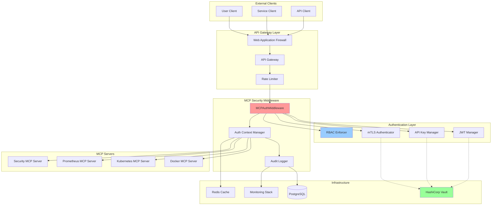
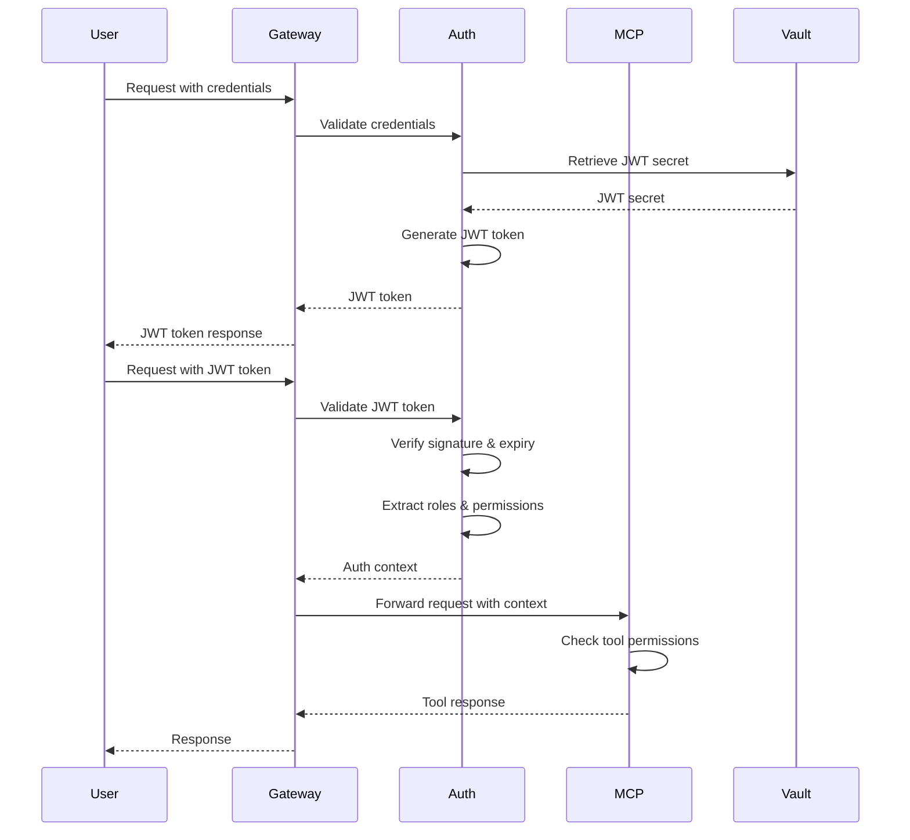
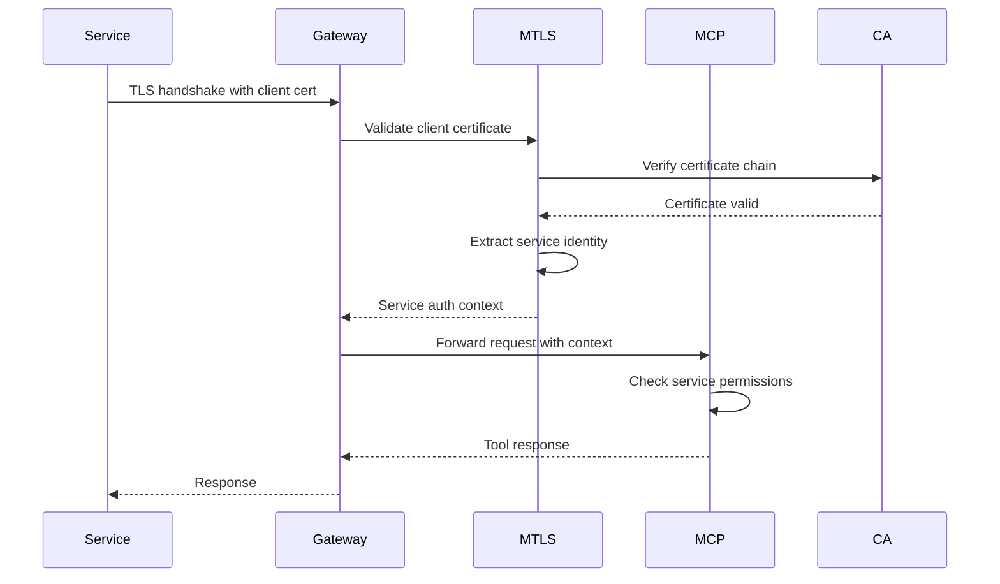
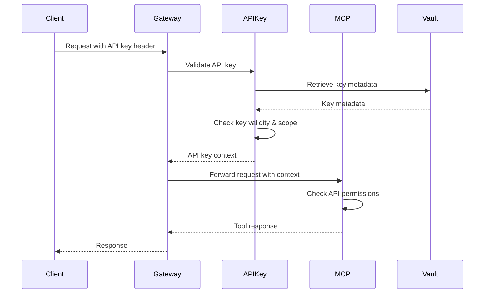
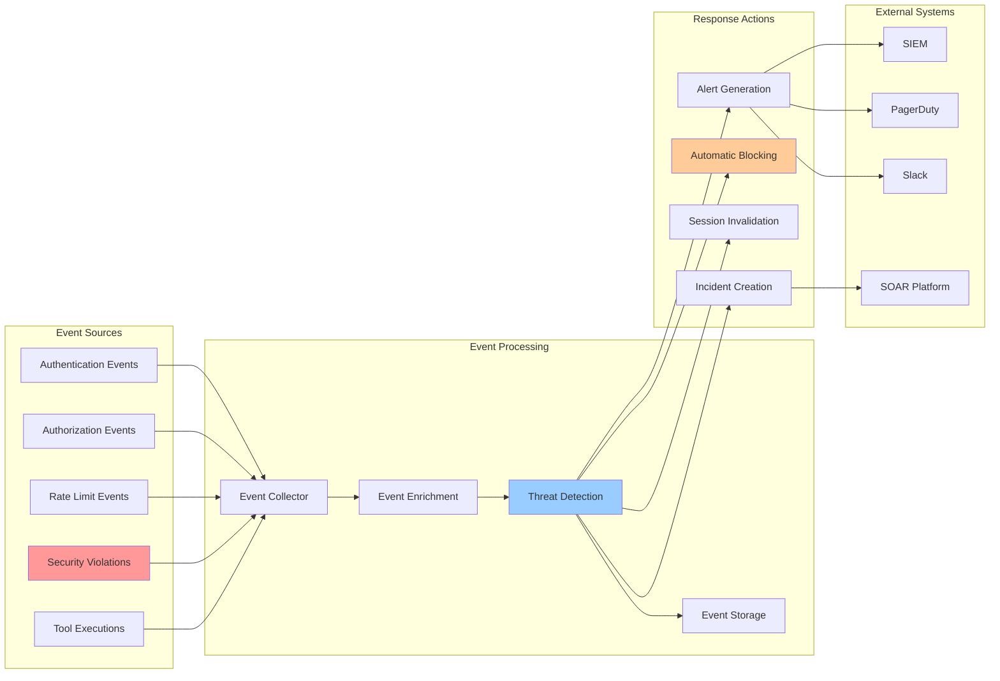

# MCP Security Architecture

## Table of Contents
1. [Overview](#overview)
2. [Security Architecture Diagram](#security-architecture-diagram)
3. [Authentication Flow](#authentication-flow)
4. [Tool Permission Matrix](#tool-permission-matrix)
5. [Service-to-Service Authentication (mTLS)](#service-to-service-authentication-mtls)
6. [API Gateway Integration](#api-gateway-integration)
7. [Rate Limiting and DDoS Protection](#rate-limiting-and-ddos-protection)
8. [Security Event Flow](#security-event-flow)
9. [Monitoring and Alerting Integration](#monitoring-and-alerting-integration)
10. [Implementation Examples](#implementation-examples)

## Overview

The MCP (Model Context Protocol) Security Architecture provides comprehensive protection for all MCP servers and tools through multiple layers of security:

- **Authentication**: JWT tokens, API keys, and mTLS certificates
- **Authorization**: Role-based access control (RBAC) with fine-grained permissions
- **Rate Limiting**: Per-user and per-tool rate limiting with circuit breakers
- **Audit Logging**: Complete audit trail of all security events
- **Encryption**: TLS 1.3 for all communications, with mTLS for service-to-service
- **Secret Management**: Integration with HashiCorp Vault for secure secret storage

## Security Architecture Diagram



## Authentication Flow

### 1. User Authentication Flow (JWT)



### 2. Service Authentication Flow (mTLS)



### 3. API Key Authentication Flow



## Tool Permission Matrix

### Role-Based Permissions

| Tool | Admin | Operator | Readonly | Guest | Service Account |
|------|-------|----------|----------|-------|-----------------|
| **Infrastructure Tools** |
| execute_command | ✅ Execute, Read | ✅ Execute, Read | ❌ | ❌ | ✅ (Limited) |
| make_command | ✅ Execute, Read | ✅ Execute, Read | ❌ | ❌ | ✅ (Limited) |
| write_file | ✅ Write, Read | ✅ Write, Read | ❌ | ❌ | ❌ |
| **Docker Tools** |
| docker_build | ✅ Execute, Read | ✅ Execute, Read | ❌ | ❌ | ✅ |
| docker_run | ✅ Execute, Read | ✅ Execute, Read | ❌ | ❌ | ✅ |
| docker_ps | ✅ Read | ✅ Read | ✅ Read | ❌ | ✅ Read |
| **Kubernetes Tools** |
| kubectl_apply | ✅ Execute, Read | ✅ Execute, Read | ❌ | ❌ | ✅ |
| kubectl_get | ✅ Read | ✅ Read | ✅ Read | ❌ | ✅ Read |
| kubectl_delete | ✅ Delete, Read | ❌ | ❌ | ❌ | ❌ |
| **Security Tools** |
| npm_audit | ✅ Read | ✅ Read | ✅ Read | ❌ | ✅ Read |
| python_safety_check | ✅ Read | ✅ Read | ✅ Read | ❌ | ✅ Read |
| **Communication Tools** |
| send_notification | ✅ Execute | ✅ Execute | ❌ | ❌ | ✅ |
| post_message | ✅ Execute | ✅ Execute | ❌ | ❌ | ✅ |
| **Monitoring Tools** |
| prometheus_query | ✅ Read | ✅ Read | ✅ Read | ❌ | ✅ Read |
| **Storage Tools** |
| s3_upload_file | ✅ Write, Read | ✅ Write, Read | ❌ | ❌ | ✅ |
| s3_list_buckets | ✅ Read | ✅ Read | ✅ Read | ❌ | ✅ Read |

### Permission String Format

```
resource:action
```

Examples:
- `mcp.docker:execute` - Execute Docker tools
- `mcp.kubernetes.apply:execute` - Execute kubectl apply specifically
- `infrastructure:*` - All actions on infrastructure tools
- `*:read` - Read access to all resources

## Service-to-Service Authentication (mTLS)

### Certificate Structure

```yaml
# Service Certificate Configuration
services:
  docker-server:
    subject:
      CN: docker-server.mcp.local
      O: MCP Services
      OU: Infrastructure
    san:
      - docker-server.mcp.local
      - docker-server.claude-deployment.svc.cluster.local
    key_usage:
      - digital_signature
      - key_encipherment
    extended_key_usage:
      - client_auth
      - server_auth
```

### mTLS Configuration Example

```python
# Server-side mTLS configuration
ssl_context = ssl.create_default_context(ssl.Purpose.CLIENT_AUTH)
ssl_context.load_cert_chain(
    certfile='/etc/mcp/certs/server.crt',
    keyfile='/etc/mcp/certs/server.key'
)
ssl_context.load_verify_locations('/etc/mcp/certs/ca.crt')
ssl_context.verify_mode = ssl.CERT_REQUIRED

# Client-side mTLS configuration
client_context = ssl.create_default_context(ssl.Purpose.SERVER_AUTH)
client_context.load_cert_chain(
    certfile='/etc/mcp/certs/client.crt',
    keyfile='/etc/mcp/certs/client.key'
)
client_context.load_verify_locations('/etc/mcp/certs/ca.crt')
```

### Service Registry

```python
# Register services with their certificates
service_registry.register_service(
    service_name="docker-server",
    api_key="srv_docker_key_123",
    cert_path="/etc/mcp/certs/docker-server.crt",
    permissions=[
        "mcp.docker:*",
        "infrastructure:execute",
        "monitoring:write"
    ]
)
```

## API Gateway Integration

### Kong Gateway Configuration

```yaml
# Kong service configuration for MCP
services:
  - name: mcp-gateway
    url: http://mcp-manager:8000
    plugins:
      - name: jwt
        config:
          key_claim_name: iss
          secret_is_base64: false
          cookie_names:
            - mcp_jwt_token
      - name: key-auth
        config:
          key_names:
            - X-API-Key
            - apikey
      - name: mtls-auth
        config:
          ca_certificates:
            - /etc/kong/certs/ca.crt
          skip_consumer_lookup: false
      - name: rate-limiting
        config:
          minute: 60
          hour: 1000
          policy: local
      - name: request-transformer
        config:
          add:
            headers:
              - X-MCP-Gateway:kong
              - X-Request-ID:$(uuid)
```

### NGINX Configuration

```nginx
# NGINX configuration for MCP API Gateway
upstream mcp_backend {
    server mcp-manager-1:8000 weight=5;
    server mcp-manager-2:8000 weight=5;
    keepalive 32;
}

server {
    listen 443 ssl http2;
    server_name api.mcp.claude-deployment.com;
    
    # SSL configuration
    ssl_certificate /etc/nginx/certs/server.crt;
    ssl_certificate_key /etc/nginx/certs/server.key;
    ssl_client_certificate /etc/nginx/certs/ca.crt;
    ssl_verify_client optional;
    ssl_protocols TLSv1.3;
    ssl_ciphers 'TLS_AES_256_GCM_SHA384:TLS_CHACHA20_POLY1305_SHA256';
    
    # Security headers
    add_header X-Content-Type-Options nosniff;
    add_header X-Frame-Options DENY;
    add_header X-XSS-Protection "1; mode=block";
    add_header Strict-Transport-Security "max-age=31536000; includeSubDomains" always;
    
    # Rate limiting zones
    limit_req_zone $binary_remote_addr zone=mcp_limit:10m rate=10r/s;
    limit_req_zone $http_x_api_key zone=api_limit:10m rate=100r/s;
    
    location /mcp/ {
        # Apply rate limiting
        limit_req zone=mcp_limit burst=20 nodelay;
        limit_req zone=api_limit burst=100 nodelay;
        
        # Authentication
        if ($ssl_client_verify != SUCCESS) {
            set $auth_header $http_authorization;
        }
        if ($ssl_client_verify = SUCCESS) {
            set $auth_header "";
        }
        
        # Proxy settings
        proxy_pass http://mcp_backend;
        proxy_http_version 1.1;
        proxy_set_header Upgrade $http_upgrade;
        proxy_set_header Connection "upgrade";
        proxy_set_header Host $host;
        proxy_set_header X-Real-IP $remote_addr;
        proxy_set_header X-Forwarded-For $proxy_add_x_forwarded_for;
        proxy_set_header X-Forwarded-Proto $scheme;
        proxy_set_header X-SSL-Client-Cert $ssl_client_cert;
        proxy_set_header X-SSL-Client-Verify $ssl_client_verify;
        proxy_set_header Authorization $auth_header;
        
        # Timeouts
        proxy_connect_timeout 30s;
        proxy_send_timeout 120s;
        proxy_read_timeout 120s;
    }
}
```

## Rate Limiting and DDoS Protection

### Multi-Layer Rate Limiting Strategy

```python
# Rate limiting configuration
RATE_LIMIT_CONFIG = {
    # Global limits
    "global": {
        "requests_per_minute": 1000,
        "requests_per_hour": 50000,
        "burst_size": 100
    },
    
    # Per-user limits
    "per_user": {
        "requests_per_minute": 60,
        "requests_per_hour": 1000,
        "burst_size": 10
    },
    
    # Per-tool limits
    "per_tool": {
        "execute_command": {
            "requests_per_minute": 5,
            "requests_per_hour": 50,
            "burst_size": 2
        },
        "docker_build": {
            "requests_per_minute": 2,
            "requests_per_hour": 20,
            "burst_size": 1
        },
        "kubectl_apply": {
            "requests_per_minute": 10,
            "requests_per_hour": 100,
            "burst_size": 5
        }
    },
    
    # Service account limits (higher)
    "service_accounts": {
        "requests_per_minute": 200,
        "requests_per_hour": 10000,
        "burst_size": 50
    }
}
```

### DDoS Protection Configuration

```yaml
# CloudFlare DDoS Protection Rules
ddos_rules:
  - name: mcp_api_protection
    expression: |
      (http.request.uri.path contains "/mcp/") and
      (rate() > 100)
    action: challenge
    
  - name: mcp_tool_protection
    expression: |
      (http.request.uri.path contains "/mcp/tools/call") and
      (rate() > 20)
    action: block
    duration: 600  # 10 minutes
    
  - name: suspicious_patterns
    expression: |
      (http.request.uri contains "../../") or
      (http.request.uri contains "%2e%2e") or
      (http.request.headers["content-length"][0] > 10485760)
    action: block

# AWS WAF Rules
waf_rules:
  - name: MCPRateLimitRule
    priority: 1
    statement:
      rate_based_statement:
        limit: 2000
        aggregate_key_type: IP
    action:
      block: {}
      
  - name: MCPGeoBlockRule
    priority: 2
    statement:
      geo_match_statement:
        country_codes: ["CN", "RU", "KP"]  # Example blocked countries
    action:
      block: {}
```

### Circuit Breaker Configuration

```python
# Circuit breaker configuration for MCP tools
CIRCUIT_BREAKER_CONFIG = {
    "default": {
        "failure_threshold": 5,
        "recovery_timeout": 60,
        "expected_exception": MCPToolExecutionError,
        "fallback_function": lambda: {"error": "Service temporarily unavailable"}
    },
    
    "critical_tools": {
        "failure_threshold": 3,
        "recovery_timeout": 30,
        "expected_exception": (MCPToolExecutionError, TimeoutError),
        "fallback_function": lambda: {"error": "Critical service unavailable", "retry_after": 30}
    },
    
    "non_critical_tools": {
        "failure_threshold": 10,
        "recovery_timeout": 120,
        "expected_exception": MCPToolExecutionError,
        "fallback_function": None  # No fallback, just fail
    }
}
```

## Security Event Flow



### Security Event Types

```python
# Security event definitions
SECURITY_EVENTS = {
    "authentication_failed": {
        "severity": "warning",
        "threshold": 5,  # Alert after 5 failures
        "window": 300,   # 5 minutes
        "action": "alert"
    },
    
    "authorization_denied": {
        "severity": "warning",
        "threshold": 10,
        "window": 300,
        "action": "alert"
    },
    
    "rate_limit_exceeded": {
        "severity": "info",
        "threshold": 20,
        "window": 300,
        "action": "log"
    },
    
    "suspicious_pattern": {
        "severity": "high",
        "threshold": 1,
        "window": 60,
        "action": "block_and_alert"
    },
    
    "privilege_escalation_attempt": {
        "severity": "critical",
        "threshold": 1,
        "window": 60,
        "action": "block_user_and_alert"
    },
    
    "invalid_certificate": {
        "severity": "high",
        "threshold": 3,
        "window": 300,
        "action": "block_ip"
    }
}
```

### Event Processing Pipeline

```python
class SecurityEventProcessor:
    """Process security events and trigger responses."""
    
    async def process_event(self, event: SecurityEvent):
        # 1. Enrich event with context
        enriched_event = await self.enrich_event(event)
        
        # 2. Check against threat patterns
        threat_score = await self.calculate_threat_score(enriched_event)
        
        # 3. Store event
        await self.store_event(enriched_event, threat_score)
        
        # 4. Check thresholds and trigger actions
        if threat_score > 0.8:
            await self.trigger_critical_response(enriched_event)
        elif threat_score > 0.5:
            await self.trigger_warning_response(enriched_event)
        
        # 5. Update user/IP reputation
        await self.update_reputation(enriched_event)
    
    async def trigger_critical_response(self, event: EnrichedSecurityEvent):
        """Handle critical security events."""
        # Block user/IP immediately
        await self.block_source(event.source_ip, event.user_id)
        
        # Invalidate all sessions
        await self.invalidate_user_sessions(event.user_id)
        
        # Create incident
        incident_id = await self.create_incident(event, priority="P1")
        
        # Alert security team
        await self.alert_security_team(event, incident_id)
        
        # Trigger automated response
        await self.trigger_soar_playbook("critical_security_response", event)
```

## Monitoring and Alerting Integration

### Prometheus Metrics

```python
# MCP Security Metrics
mcp_auth_attempts_total = Counter(
    'mcp_auth_attempts_total',
    'Total authentication attempts',
    ['method', 'status']
)

mcp_auth_failures_total = Counter(
    'mcp_auth_failures_total',
    'Total authentication failures',
    ['method', 'reason']
)

mcp_authorization_checks_total = Counter(
    'mcp_authorization_checks_total',
    'Total authorization checks',
    ['resource', 'action', 'status']
)

mcp_rate_limit_hits_total = Counter(
    'mcp_rate_limit_hits_total',
    'Total rate limit hits',
    ['user_type', 'resource']
)

mcp_security_events_total = Counter(
    'mcp_security_events_total',
    'Total security events',
    ['event_type', 'severity']
)

mcp_active_sessions = Gauge(
    'mcp_active_sessions',
    'Number of active sessions',
    ['session_type']
)

mcp_tool_execution_duration = Histogram(
    'mcp_tool_execution_duration_seconds',
    'Tool execution duration',
    ['server', 'tool', 'status'],
    buckets=(0.1, 0.5, 1.0, 2.0, 5.0, 10.0, 30.0)
)
```

### Alert Rules

```yaml
# Prometheus alert rules for MCP security
groups:
  - name: mcp_security_alerts
    rules:
      - alert: MCPAuthenticationFailureHigh
        expr: rate(mcp_auth_failures_total[5m]) > 0.1
        for: 2m
        labels:
          severity: warning
          component: mcp_security
        annotations:
          summary: "High authentication failure rate"
          description: "Authentication failure rate is {{ $value | humanizePercentage }}"
          
      - alert: MCPUnauthorizedAccessSpike
        expr: rate(mcp_authorization_checks_total{status="denied"}[5m]) > 0.5
        for: 1m
        labels:
          severity: critical
          component: mcp_security
        annotations:
          summary: "Spike in unauthorized access attempts"
          description: "{{ $value }} unauthorized access attempts per second"
          
      - alert: MCPRateLimitBreached
        expr: rate(mcp_rate_limit_hits_total[5m]) > 10
        for: 1m
        labels:
          severity: warning
          component: mcp_security
        annotations:
          summary: "High rate of rate limit violations"
          description: "{{ $value }} rate limit hits per second"
          
      - alert: MCPSecurityEventCritical
        expr: mcp_security_events_total{severity="critical"} > 0
        for: 0s
        labels:
          severity: critical
          component: mcp_security
        annotations:
          summary: "Critical security event detected"
          description: "Critical security event of type {{ $labels.event_type }}"
```

### Grafana Dashboard Configuration

```json
{
  "dashboard": {
    "title": "MCP Security Dashboard",
    "panels": [
      {
        "title": "Authentication Success Rate",
        "targets": [
          {
            "expr": "rate(mcp_auth_attempts_total{status='success'}[5m]) / rate(mcp_auth_attempts_total[5m])"
          }
        ],
        "type": "graph"
      },
      {
        "title": "Authorization Denials by Resource",
        "targets": [
          {
            "expr": "rate(mcp_authorization_checks_total{status='denied'}[5m])"
          }
        ],
        "type": "heatmap"
      },
      {
        "title": "Rate Limit Violations",
        "targets": [
          {
            "expr": "rate(mcp_rate_limit_hits_total[5m])"
          }
        ],
        "type": "graph"
      },
      {
        "title": "Security Events by Type",
        "targets": [
          {
            "expr": "sum by (event_type) (rate(mcp_security_events_total[5m]))"
          }
        ],
        "type": "piechart"
      },
      {
        "title": "Active Sessions",
        "targets": [
          {
            "expr": "mcp_active_sessions"
          }
        ],
        "type": "stat"
      },
      {
        "title": "Tool Execution Latency (P95)",
        "targets": [
          {
            "expr": "histogram_quantile(0.95, rate(mcp_tool_execution_duration_bucket[5m]))"
          }
        ],
        "type": "graph"
      }
    ]
  }
}
```

## Implementation Examples

### 1. Securing an MCP Server

```python
from src.mcp.protocols import MCPServer
from src.mcp.security.enhanced_auth_integration import (
    authenticated_mcp_server,
    get_mcp_authenticator,
    require_tool_permission
)

@authenticated_mcp_server(get_mcp_authenticator())
class SecureDockerMCPServer(MCPServer):
    """Docker MCP server with authentication."""
    
    def __init__(self):
        super().__init__(name="docker", version="1.0.0")
        
        # Define tool-specific permissions
        self.tool_permissions = {
            "docker_build": "mcp.docker.build:execute",
            "docker_run": "mcp.docker.run:execute",
            "docker_ps": "mcp.docker.ps:read",
            "docker_stop": "mcp.docker.stop:execute",
            "docker_remove": "mcp.docker.remove:delete"
        }
    
    @require_tool_permission("mcp.docker.build:execute")
    async def docker_build(self, path: str, tag: str, **kwargs):
        """Build Docker image with security checks."""
        # Validate inputs
        if ".." in path or path.startswith("/"):
            raise ValueError("Invalid path")
        
        # Check Dockerfile security
        await self._scan_dockerfile(path)
        
        # Build image
        result = await self._docker_client.build(path, tag, **kwargs)
        
        # Scan built image
        await self._scan_image(tag)
        
        return result
    
    @require_tool_permission("mcp.docker.run:execute")
    async def docker_run(self, image: str, command: List[str] = None, **kwargs):
        """Run Docker container with security constraints."""
        # Apply security constraints
        security_opts = kwargs.get("security_opts", [])
        security_opts.extend([
            "no-new-privileges:true",
            "apparmor:docker-default"
        ])
        kwargs["security_opts"] = security_opts
        
        # Limit resources
        if "mem_limit" not in kwargs:
            kwargs["mem_limit"] = "1g"
        if "cpu_quota" not in kwargs:
            kwargs["cpu_quota"] = 50000  # 50% CPU
        
        # Drop capabilities
        cap_drop = kwargs.get("cap_drop", [])
        cap_drop.extend(["ALL"])
        kwargs["cap_drop"] = cap_drop
        
        # Add only necessary capabilities
        cap_add = kwargs.get("cap_add", [])
        kwargs["cap_add"] = cap_add
        
        return await self._docker_client.run(image, command, **kwargs)
```

### 2. Implementing Custom Authentication

```python
class CustomMCPAuthenticator:
    """Custom authenticator with OAuth2 support."""
    
    def __init__(self, oauth2_provider):
        self.oauth2_provider = oauth2_provider
        self.base_authenticator = get_mcp_authenticator()
    
    async def authenticate_oauth2(self, access_token: str) -> MCPAuthContext:
        """Authenticate using OAuth2 token."""
        # Verify token with provider
        user_info = await self.oauth2_provider.verify_token(access_token)
        
        if not user_info:
            raise AuthenticationError("Invalid OAuth2 token")
        
        # Map OAuth2 claims to MCP roles
        roles = self._map_oauth2_roles(user_info.get("roles", []))
        
        # Create MCP auth context
        context = MCPAuthContext(
            user_id=user_info["sub"],
            session_id=hashlib.sha256(access_token.encode()).hexdigest()[:16],
            roles=roles,
            permissions=self._calculate_permissions(roles),
            metadata={
                "auth_method": "oauth2",
                "provider": self.oauth2_provider.name,
                "email": user_info.get("email")
            }
        )
        
        return context
    
    def _map_oauth2_roles(self, oauth_roles: List[str]) -> List[str]:
        """Map OAuth2 roles to MCP roles."""
        role_mapping = {
            "admin": "mcp_admin",
            "developer": "mcp_operator",
            "viewer": "mcp_readonly"
        }
        
        mcp_roles = []
        for oauth_role in oauth_roles:
            if oauth_role in role_mapping:
                mcp_roles.append(role_mapping[oauth_role])
        
        return mcp_roles or ["mcp_guest"]
```

### 3. Implementing Rate Limiting

```python
class MCPRateLimiter:
    """Advanced rate limiter for MCP operations."""
    
    def __init__(self, redis_client):
        self.redis = redis_client
        self.config = RATE_LIMIT_CONFIG
    
    async def check_rate_limit(
        self,
        user_id: str,
        resource: str,
        user_type: str = "user"
    ) -> tuple[bool, dict]:
        """Check if request is within rate limits."""
        # Get applicable limits
        if user_type == "service_account":
            limits = self.config["service_accounts"]
        else:
            limits = self.config["per_user"]
        
        # Check tool-specific limits
        if resource in self.config["per_tool"]:
            tool_limits = self.config["per_tool"][resource]
            limits = {k: min(limits.get(k, v), v) for k, v in tool_limits.items()}
        
        # Check each limit
        now = time.time()
        for period, limit in [
            ("minute", limits["requests_per_minute"]),
            ("hour", limits["requests_per_hour"])
        ]:
            key = f"rate_limit:{user_id}:{resource}:{period}"
            window_start = now - (60 if period == "minute" else 3600)
            
            # Remove old entries
            await self.redis.zremrangebyscore(key, 0, window_start)
            
            # Count requests in window
            count = await self.redis.zcard(key)
            
            if count >= limit:
                return False, {
                    "limit": limit,
                    "period": period,
                    "current": count,
                    "retry_after": 60 if period == "minute" else 3600
                }
            
            # Add current request
            await self.redis.zadd(key, {str(uuid.uuid4()): now})
            await self.redis.expire(key, 3600)  # Expire after 1 hour
        
        return True, {"allowed": True}
```

### 4. Security Event Handler

```python
class MCPSecurityEventHandler:
    """Handle security events for MCP operations."""
    
    def __init__(self, audit_logger, alert_manager):
        self.audit_logger = audit_logger
        self.alert_manager = alert_manager
        self.event_counters = defaultdict(lambda: defaultdict(int))
    
    async def handle_security_event(self, event: SecurityEvent):
        """Process security event and trigger appropriate actions."""
        # Log event
        await self.audit_logger.log_security_event(
            event_type=event.type,
            severity=event.severity,
            user_id=event.user_id,
            details=event.details
        )
        
        # Update counters
        self.event_counters[event.type][event.user_id] += 1
        
        # Check thresholds
        event_config = SECURITY_EVENTS.get(event.type, {})
        threshold = event_config.get("threshold", float("inf"))
        window = event_config.get("window", 300)
        
        # Get recent event count
        count = await self._get_event_count(event.type, event.user_id, window)
        
        if count >= threshold:
            action = event_config.get("action", "log")
            await self._execute_action(action, event)
    
    async def _execute_action(self, action: str, event: SecurityEvent):
        """Execute security action based on event."""
        if action == "alert":
            await self.alert_manager.send_alert(
                title=f"Security Event: {event.type}",
                severity=event.severity,
                details=event.details
            )
        
        elif action == "block_and_alert":
            # Block user
            await self._block_user(event.user_id, duration=3600)
            
            # Send alert
            await self.alert_manager.send_alert(
                title=f"User blocked: {event.user_id}",
                severity="high",
                details=f"Blocked due to {event.type}"
            )
        
        elif action == "block_user_and_alert":
            # Permanent block
            await self._block_user(event.user_id, permanent=True)
            
            # Invalidate all sessions
            await self._invalidate_user_sessions(event.user_id)
            
            # Critical alert
            await self.alert_manager.send_critical_alert(
                title=f"CRITICAL: User permanently blocked",
                details=event.details,
                notify_security_team=True
            )
```

## Security Best Practices

1. **Always use TLS 1.3** for all MCP communications
2. **Rotate secrets regularly** using HashiCorp Vault
3. **Implement defense in depth** with multiple security layers
4. **Monitor all security events** and respond quickly
5. **Use least privilege principle** for all permissions
6. **Regularly audit** access logs and permissions
7. **Keep security patches updated** for all components
8. **Test security controls** regularly with penetration testing
9. **Have an incident response plan** ready
10. **Train teams** on security best practices

## Conclusion

The MCP Security Architecture provides comprehensive protection through:

- **Multi-factor authentication** supporting JWT, API keys, and mTLS
- **Fine-grained authorization** with RBAC and tool-specific permissions
- **Rate limiting and DDoS protection** at multiple layers
- **Complete audit trail** of all security events
- **Real-time monitoring and alerting** integration
- **Automated security responses** for critical events

This architecture ensures that MCP servers and tools are protected against unauthorized access, abuse, and security threats while maintaining high performance and availability.