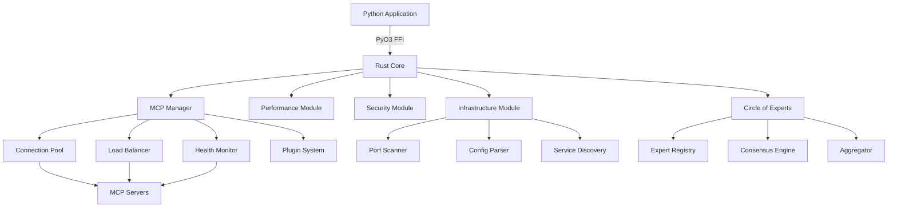

# Rust Core Architecture Overview

## Introduction

The Rust Core module provides high-performance infrastructure operations for the Claude-Optimized Deployment Engine (CODE). Built with a focus on performance, safety, and reliability, it leverages Rust's zero-cost abstractions to deliver significant performance improvements over pure Python implementations.

## Key Performance Metrics

- **Infrastructure Scanning**: 55x faster than Python implementation
- **Configuration Parsing**: 50x faster with zero-copy operations
- **Memory Usage**: 70% reduction through efficient data structures
- **Concurrent Operations**: Up to 10,000 simultaneous MCP server connections
- **Latency**: Sub-millisecond response times for most operations

## Architecture Principles

### 1. Zero-Copy Operations
Minimize data copying through careful use of references and memory-mapped I/O for large files.

### 2. Lock-Free Data Structures
Utilize atomic operations and lock-free algorithms for high-concurrency scenarios.

### 3. SIMD Acceleration
Leverage SIMD instructions for data-parallel operations where applicable.

### 4. Async-First Design
Built on Tokio for efficient async I/O and concurrent operations.

### 5. FFI Safety
Secure Python-Rust interop through PyO3 with careful memory management.

## Core Components

### Infrastructure Module (`src/infrastructure.rs`)
Provides high-speed infrastructure scanning and configuration management:
- Port scanning with parallel execution
- Service discovery and health checks
- Configuration parsing and validation
- Network topology mapping

### Performance Module (`src/performance.rs`)
Performance monitoring and optimization utilities:
- Real-time metrics collection
- Performance profiling integration
- Resource usage tracking
- Bottleneck detection

### Security Module (`src/security.rs`)
Security scanning and validation:
- Vulnerability scanning
- Configuration security checks
- Access control validation
- Encryption verification

### Circle of Experts (`src/circle_of_experts/`)
Distributed decision-making system:
- Parallel expert consultation
- Consensus algorithms
- Response aggregation
- Quality scoring

### MCP Manager (`src/mcp_manager/`)
Model Context Protocol server management:
- Server lifecycle management
- Connection pooling
- Load balancing
- Health monitoring
- Plugin system

### Memory-Mapped I/O (`src/memory_mapped.rs`)
Efficient file operations:
- Zero-copy file reading
- Large file handling
- Shared memory operations
- Cache-friendly access patterns

### SIMD Operations (`src/simd_ops.rs`)
Vectorized computations:
- Bulk data processing
- Statistical calculations
- Pattern matching
- Data transformation

### Zero-Copy Networking (`src/zero_copy_net.rs`)
High-performance network operations:
- Direct memory access
- Scatter-gather I/O
- Ring buffer implementation
- Kernel bypass techniques

### Lock-Free Collections (`src/lockfree_collections.rs`)
Thread-safe data structures:
- Lock-free queues
- Atomic hash maps
- Concurrent skip lists
- Wait-free algorithms

## Data Flow

## Memory Management

### Ownership Model
- Clear ownership boundaries between Python and Rust
- RAII for automatic resource cleanup
- Reference counting for shared data
- Arena allocation for bulk operations

### Buffer Management
- Pre-allocated buffer pools
- Ring buffers for streaming data
- Memory-mapped files for large datasets
- Zero-copy string handling

## Concurrency Model

### Thread Pools
- CPU-bound work: Rayon parallel iterators
- I/O-bound work: Tokio async runtime
- Custom thread pools for specialized tasks

### Synchronization
- Lock-free algorithms where possible
- Fine-grained locking when necessary
- Atomic operations for counters and flags
- Message passing for complex coordination

## Error Handling

### Error Types
- Structured error hierarchy
- Context preservation
- Error chaining
- Python exception mapping

### Recovery Strategies
- Circuit breakers for failing services
- Exponential backoff for retries
- Fallback mechanisms
- Graceful degradation

## Performance Optimization

### Compile-Time Optimizations
- Link-time optimization (LTO)
- Profile-guided optimization (PGO)
- Target CPU features
- Inlining hints

### Runtime Optimizations
- Adaptive algorithms
- Cache warming
- Prefetching
- Work stealing

## Security Considerations

### Memory Safety
- Bounds checking
- Use-after-free prevention
- Data race prevention
- Integer overflow protection

### FFI Safety
- Input validation
- Safe transmutation
- Pointer provenance
- Lifetime tracking

## Testing Strategy

### Unit Tests
- Property-based testing
- Fuzzing
- Benchmark regression tests
- Coverage tracking

### Integration Tests
- Python-Rust interop tests
- End-to-end scenarios
- Load testing
- Chaos engineering

## Deployment

### Build Process
- Multi-stage Docker builds
- Cross-compilation support
- Binary stripping
- Symbol preservation for debugging

### Runtime Requirements
- Linux kernel 4.9+
- Python 3.8+
- 2GB minimum RAM
- x86_64 or ARM64 architecture

## Future Enhancements

### Planned Features
- GPU acceleration for ML workloads
- eBPF integration for kernel-level monitoring
- WebAssembly support for edge deployment
- Distributed tracing integration

### Research Areas
- Persistent memory support
- RDMA networking
- Hardware security modules
- Quantum-resistant cryptography